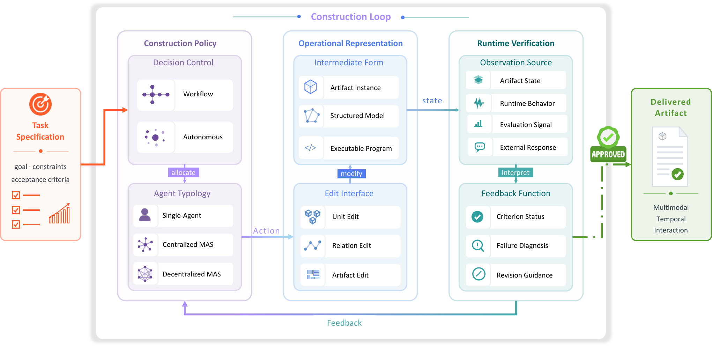

  <h1>Awesome Agentic Artifact Creation</h1>
  

    A curated list of papers on agentic systems that plan, generate, inspect,
    revise, and maintain artifacts.
  

  

    &nbsp;&nbsp;
    
  

  

    
    
    
  

---

In this project, we comprehensively survey agentic artifact creation, an
emerging paradigm in which AI agents autonomously construct and iteratively
refine artifacts through planning, tool use, feedback, and revision. These
artifacts span text, visual media, audio, video, 3D environments, software, and
interactive experiences.

This repository accompanies the
[Agentic Artifact Creation survey](https://github.com/GeminiLight/agentic-creation-survey)
and curates the related papers, systems, and benchmarks.

  

## Survey Scope

- **Textual Artifacts:** creative writing, professional documents, reports, and
  scholarly writing.
- **2D Visual Artifacts:** data visualizations, diagrams, images, posters, and
  presentations.
- **Audio Artifacts:** music composition and produced or spoken audio.
- **Video Artifacts:** expository and narrative video, plus video
  editing and repair.
- **Spatial Artifacts:** objects, scenes, worlds, CAD, and engineering
  geometry.
- **Behavioral Artifacts:** repositories, applications, websites,
  user interfaces, games, and simulations.

The application axis currently covers creative production, brand communication,
educational support, professional work, scientific research, and engineering
design. Application subdomains remain blank until a controlled vocabulary is
defined.

The catalog considers representative venues across AI, computing, design, and
domain research. The list is indicative rather than exhaustive; relevant
workshops, journals, and preprints are also considered. Representative venues
monitored by this survey include:

- **Artificial Intelligence:** AAAI, IJCAI, and ICCC.
- **Machine Learning:** NeurIPS, ICML, and ICLR.
- **Natural Language Processing:** ACL, EMNLP, NAACL, COLM, EACL, SemEval, and
  Findings tracks.
- **Computer Vision:** CVPR, ICCV, ECCV, and TPAMI.
- **Graphics and Visualization:** SIGGRAPH, SIGGRAPH Asia, and IEEE VIS/TVCG.
- **Human–Computer Interaction:** CHI, UIST, CSCW, and TOCHI.
- **Data Mining and Information Retrieval:** KDD, The Web Conference, SIGIR,
  SIGMOD, VLDB, and TKDE.
- **Software Engineering:** ICSE, FSE, ASE, and ISSTA.
- **Systems & Hardware:** DATE, DAC, and ICCAD.
- **Multimodal & Audio:** ACM MM, IEEE TMM, and ICASSP.
- **Interdisciplinary & General Science:** Nature, Science, Nature Machine
  Intelligence, and Nature Computational Science.

## Catalog Analysis

  

  

  

- **Catalog coverage:** 257 papers spanning **2023–2026**, from **41 publication sources**; 227 systems and 30 benchmarks.
- **Dual-axis coverage:** 217 papers (**84.4%**) carry both artifact and application labels; 32 are artifact-only and 8 application-only.
- **Largest artifact family:** Behavioral Artifacts — **76 papers (29.6%)**.
- **Largest application context:** Creative Production — **83 papers (32.3%)**.
- **Strongest cross-axis concentrations:** Behavioral Artifacts × Engineering Design — **30**, Video Artifacts × Creative Production — **25**, Spatial Artifacts × Engineering Design — **19**.
- **System-name coverage:** 215 of 227 systems (**94.7%**) have a verified name.

> [!NOTE]
> Counts describe this audited catalog rather than total field output. The audit
> is a structured first pass, and 2026 is an incomplete publication year.

Contributions are welcome. Please read [CONTRIBUTING.md](CONTRIBUTING.md) before
adding or reclassifying a paper.

## Content

<table>
<tr><th colspan="3"><a href="#artifact-centered-view">📦 Artifact-centered View</a></th></tr>
<tr><td colspan="3"><strong><a href="#textual-artifacts">1. Textual Artifacts</a></strong></td></tr>
<tr>
<td>&emsp;<a href="#creative-writing">1.1. Creative Writing</a></td>
<td>&emsp;<a href="#professional-documents">1.2. Professional Documents</a></td>
<td>&emsp;<a href="#scholarly-manuscripts">1.3. Scholarly Manuscripts</a></td>
</tr>
<tr><td colspan="3"><strong><a href="#2d-visual-artifacts">2. 2D Visual Artifacts</a></strong></td></tr>
<tr>
<td>&emsp;<a href="#data-visualizations">2.1. Data Visualizations</a></td>
<td>&emsp;<a href="#illustrative-graphics">2.2. Illustrative Graphics</a></td>
<td>&emsp;<a href="#visual-documents">2.3. Visual Documents</a></td>
</tr>
<tr><td colspan="3"><strong><a href="#audio-artifacts">3. Audio Artifacts</a></strong></td></tr>
<tr>
<td>&emsp;<a href="#music">3.1. Music</a></td>
<td>&emsp;<a href="#spoken-audio">3.2. Spoken Audio</a></td>
<td></td>
</tr>
<tr><td colspan="3"><strong><a href="#video-artifacts">4. Video Artifacts</a></strong></td></tr>
<tr>
<td>&emsp;<a href="#expository-videos">4.1. Expository Videos</a></td>
<td>&emsp;<a href="#narrative-videos">4.2. Narrative Videos</a></td>
<td>&emsp;<a href="#video-editing-and-repair">4.3. Video Editing and Repair</a></td>
</tr>
<tr><td colspan="3"><strong><a href="#spatial-artifacts">5. Spatial Artifacts</a></strong></td></tr>
<tr>
<td>&emsp;<a href="#3d-assets">5.1. 3D Assets</a></td>
<td>&emsp;<a href="#3d-scenes">5.2. 3D Scenes</a></td>
<td></td>
</tr>
<tr><td colspan="3"><strong><a href="#behavioral-artifacts">6. Behavioral Artifacts</a></strong></td></tr>
<tr>
<td>&emsp;<a href="#software-systems">6.1. Software Systems</a></td>
<td>&emsp;<a href="#simulation-models">6.2. Simulation Models</a></td>
<td></td>
</tr>
<tr><th colspan="3"><a href="#application-centered-view">🎯 Application-centered View</a></th></tr>
<tr>
<td>&emsp;<a href="#creative-production">A.1. Creative Production</a></td>
<td>&emsp;<a href="#brand-communication">A.2. Brand Communication</a></td>
<td>&emsp;<a href="#educational-support">A.3. Educational Support</a></td>
</tr>
<tr>
<td>&emsp;<a href="#professional-work">A.4. Professional Work</a></td>
<td>&emsp;<a href="#scientific-research">A.5. Scientific Research</a></td>
<td>&emsp;<a href="#engineering-design">A.6. Engineering Design</a></td>
</tr>
</table>

## [📦 Artifact-centered View](#content)

This primary view organizes papers by the artifact they construct.

### [Textual Artifacts](#content)

#### [Creative Writing](#content)

##### [Narratives](#content)

1. **StoryBox: Collaborative Multi-Agent Simulation for Hybrid Bottom-Up Long-Form Story Generation Using Large Language Models**

    *Zehao Chen, Rong Pan, Haoran Li*

    AAAI, 2026. [Published](https://ojs.aaai.org/index.php/AAAI/article/view/40288) · `System` · `📦 Textual Artifacts` · `🎯 Creative Production`

2. **Constella: Supporting Storywriters’ Interconnected Character Creation through LLM-Based Multi-Agents**

    *Syemin Park, Soobin Park, Youn-kyung Lim*

    ACM TOCHI, 2026. [Published](https://doi.org/10.1145/3796234) · `System` · `📦 Textual Artifacts` · `🎯 Creative Production`

3. **From Personas to Plot: Character-Grounded Multi-Agent Story Generation for Long-Form Narratives**

    *Aayush Aluru, Chloe Ho, Muhammad Hammouri, Kerry Luo, Myra Malik, Ryan Lagasse, Arjun Bahuguna, Vasu Sharma*

    arXiv, 2026. [Preprint](https://arxiv.org/abs/2607.00918) · `System` · `📦 Textual Artifacts` · `🎯 Creative Production`

4. **Exploring Creator-Centric Methods for LLM-Assisted Interactive Storytelling**

    *Yuelu Li, Siyi Wu, Lujin Zhang, Zhihan Guo, Wenchuan Lu, David Yip*

    CHI, 2026. [Published](https://doi.org/10.1145/3772318.3791362) · `System` · `📦 Textual Artifacts` · `🎯 Creative Production`

5. **BOOKWORLD: From Novels to Interactive Agent Societies for Story Creation**

    *Yiting Ran, Xintao Wang, Tian Qiu, Jiaqing Liang, Yanghua Xiao, Deqing Yang*

    ACL, 2025. [Published](https://aclanthology.org/2025.acl-long.773/) · [Code](https://github.com/alienet1109/BookWorld) · `System` · `📦 Textual Artifacts` · `🎯 Creative Production`

6. **CreAgentive: An Agent Workflow Driven Multi-Category Creative Generation Engine**

    *Yuyang Cheng, Linyue Cai, Changwei Peng, Yumiao Xu, Rongfang Bie, Yong Zhao*

    arXiv, 2025. [Preprint](https://arxiv.org/abs/2509.26461) · `System` · `📦 Textual Artifacts` · `🎯 Creative Production`

##### [Performative Texts](#content)

1. **Multi-Agent Comedy Club: Investigating Community Discussion Effects on LLM Creative Writing**

    *Shiwei Hong, Lingyao Li, Ethan Z. Rong, Chenxinran Shen, Zhicong Lu*

    arXiv, 2026. [Preprint](https://arxiv.org/abs/2602.14770) · `System` · `📦 Textual Artifacts` · `🎯 Creative Production`

2. **OpenMic: A Multi-Agent-Based Stand-Up Comedy Generation System**

    *Yuyang Wu, Hanzhong Cao, Jianhao Chen, Yufei Li*

    arXiv, 2026. [Preprint](https://arxiv.org/abs/2601.08288) · `System` · `📦 Textual Artifacts` · `🎯 Creative Production`

3. **XplaiNLP at SemEval-2026 Task 1: BVAHAHA - Benign Violation Algorithm for Humor and Harmless Absurdity**

    *Berk Bubus, Nebi Soyal, Vera Schmitt, Nils Feldhus, Veronika Solopova*

    SemEval, 2026. [Published](https://aclanthology.org/2026.semeval-1.195/) · `System` · `📦 Textual Artifacts` · `🎯 Creative Production`

4. **Refining Metrical Constraints in LLM-Generated Poetry with Feedback**

    *Manex Agirrezabal, Hugo Gonçalo Oliveira*

    ICCC, 2025. [Published](https://computationalcreativity.net/iccc25/wp-content/uploads/papers/iccc25-agirrezabal2025refining.pdf) · `System` · `📦 Textual Artifacts` · `🎯 Creative Production`

#### [Professional Documents](#content)

##### [Informational Reports](#content)

1. **Beyond Single-shot Writing: Deep Research Agents are Unreliable at Multi-turn Report Revision**

    *Bingsen Chen, Boyan Li, Ping Nie, Yuyu Zhang, Xi Ye, Chen Zhao*

    ACL, 2026. [Published](https://aclanthology.org/2026.acl-long.609/) · [Code](https://github.com/BaleChen/Mr-Dre) · `Benchmark` · `📦 Textual Artifacts` · `🎯 Scientific Research`

2. **DIAGPaper: Diagnosing Valid and Specific Weaknesses in Scientific Papers via Multi-Agent Reasoning**

    *Zhuoyang Zou, Abolfazl Ansari, Delvin Ce Zhang, Dongwon Lee, Wenpeng Yin*

    arXiv, 2026. [Preprint](https://arxiv.org/abs/2601.07611) · `System` · `📦 Textual Artifacts` · `🎯 Scientific Research`

3. **DRACO: A Cross-Domain Benchmark for Deep Research Accuracy, Completeness, and Objectivity**

    *Joey Zhong, Hao Zhang, Clare Southern, Jeremy Yang, Thomas Wang, Kate Jung, Shu Zhang, Denis Yarats, Johnny Ho, Jerry Ma*

    arXiv, 2026. [Preprint](https://arxiv.org/abs/2602.11685) · `Benchmark` · `📦 Textual Artifacts` · `🎯 Scientific Research`

4. **Towards Trustworthy Report Generation: A Deep Research Agent with Progressive Verification**

    *Yi Yuan, Xuhong Wang, Shanzhe Lei*

    arXiv, 2026. [Preprint](https://arxiv.org/abs/2604.05952) · `System` · `📦 Textual Artifacts` · `🎯 Professional Work`

5. **Benchmarking Agentic Newswriting via Journalistic Workflows**

    *Yen-Che Chien, Kuang-Da Wang, Wei-Yao Wang, Wen-Chih Peng*

    Findings of ACL, 2026. [Published](https://aclanthology.org/2026.findings-acl.1816/) · [Code](https://github.com/wywyWang/CoachAI-Projects) · `Benchmark` · `📦 Textual Artifacts` · `🎯 Professional Work`

6. **Resources for Automated Evaluation of Assistive RAG Systems that Help Readers with News Trustworthiness Assessment**

    *Dake Zhang, Mark D. Smucker, Charles L. A. Clarke*

    SIGIR, 2026. [Published](https://doi.org/10.1145/3805712.3808624) · `Benchmark` · `📦 Textual Artifacts`

7. **Simulating the Lateral Reader for News Trustworthiness Reports with an Iterative Multi-Agent RAG System**

    *Dake Zhang, Mark D. Smucker*

    SIGIR, 2026. [Published](https://doi.org/10.1145/3805712.3809973) · `System` · `📦 Textual Artifacts`

8. **Can LLMs Identify Critical Limitations within Scientific Research? A Systematic Evaluation on AI Research Papers**

    *Zhijian Xu, Yilun Zhao, Manasi Patwardhan, Lovekesh Vig, Arman Cohan*

    ACL, 2025. [Published](https://aclanthology.org/2025.acl-long.1009/) · [Code](https://github.com/yale-nlp/LimitGen) · `Benchmark` · `📦 Textual Artifacts` · `🎯 Scientific Research`

9. **Queryome: Orchestrating Retrieval, Reasoning, and Synthesis across Biomedical Literature**

    *Pranav Punuru, Nabil Ibtehaz, Swagarika Jaharlal Giri, Harsha Srirangam, Emilia A Tugolukova, Daisuke Kihara*

    bioRxiv, 2025. [Preprint](https://doi.org/10.64898/2025.12.22.696019) · `System` · `📦 Textual Artifacts` · `🎯 Scientific Research`

10. **MARG: Multi-Agent Review Generation for Scientific Papers**

    *Mike D'Arcy, Tom Hope, Larry Birnbaum, Doug Downey*

    arXiv, 2024. [Preprint](https://arxiv.org/abs/2401.04259) · `System` · `📦 Textual Artifacts` · `🎯 Scientific Research`

11. **Assisting in Writing Wikipedia-like Articles From Scratch with Large Language Models**

    *Shao, Yijia, Jiang, Yucheng, Kanell, Theodore A., Xu, Peter, Khattab, Omar, Lam, Monica S.*

    NAACL, 2024. [Published](https://aclanthology.org/2024.naacl-long.347/) · `System` · `📦 Textual Artifacts` · `🎯 Professional Work`

##### [Functional Documents](#content)

1. **FormAct: Agentic Source Editing for Rich-Format Document Generation**

    *Eugene Yu, Xingxing Zhang, Yuan Xia, Tao Ge, XWang, FNU Kartik, Vishwas Suryanarayanan, Cheng Yang, Amanda Jiang, Jiayu Ding, Xiangyu Wong, Tengchao Lv, Lei Cui, Si-Qing Chen, Furu Wei, Sujian Li*

    ICML, 2026. [Published](https://icml.cc/virtual/2026/poster/61769) · `System` · `📦 Textual Artifacts` · `🎯 Professional Work`

2. **ProfiliTable: Profiling-Driven Tabular Data Processing via Agentic Workflows**

    *Wei Liu, Yang Gu, Xi Yan, Zihan Nan, Beicheng Xu, Keyao Ding, Bin Cui, Wentao Zhang*

    KDD, 2026. [Published](https://doi.org/10.1145/3770855.3817982) · `System` · `📦 Textual Artifacts` · `🎯 Professional Work`

3. **DocAgent: A Multi-Agent System for Automated Code Documentation Generation**

    *Dayu Yang, Antoine Simoulin, Xin Qian, Xiaoyi Liu, Yuwei Cao, Zhaopu Teng, Grey Yang*

    ACL, 2025. [Published](https://aclanthology.org/2025.acl-demo.44/) · [Code](https://github.com/facebookresearch/DocAgent) · `System` · `📦 Textual Artifacts` · `🎯 Engineering Design`

4. **AgentCTG: Harnessing Multi-Agent Collaboration for Fine-Grained Precise Control in Text Generation**

    *Xinxu Zhou, Jiaqi Bai, Zhenqi Sun, Fanxiang Zeng, Yue Liu*

    arXiv, 2025. [Preprint](https://arxiv.org/abs/2509.13677) · `System` · `📦 Textual Artifacts`

5. **EduAgentQG: A Multi-Agent Workflow Framework for Personalized Question Generation**

    *Rui Jia, Min Zhang, Fengrui Liu, Bo Jiang, Kun Kuang, Zhongxiang Dai*

    arXiv, 2025. [Preprint](https://arxiv.org/abs/2511.11635) · `System` · `📦 Textual Artifacts` · `🎯 Educational Support`

6. **PAME-AI: Patient Messaging Creation and Optimization using Agentic AI**

    *Junjie Luo, Yihong Guo, Anqi Liu, Ritu Agarwal, Gordon Gao*

    arXiv, 2025. [Preprint](https://arxiv.org/abs/2509.24263) · `System` · `📦 Textual Artifacts` · `🎯 Professional Work`

7. **MADS: Multi-Agent Dialogue Simulation for Diverse Persuasion Data Generation**

    *Mingjin Li, Yu Liu, Huayi Liu, Xiang Ye, Chao Jiang, Hongguang Zhang, Yu Ruan*

    EMNLP Industry Track, 2025. [Published](https://aclanthology.org/2025.emnlp-industry.26/) · `System` · `📦 Textual Artifacts` · `🎯 Brand Communication`

8. **SheetAgent: Towards a Generalist Agent for Spreadsheet Reasoning and Manipulation via Large Language Models**

    *Yibin Chen, Yifu Yuan, Zeyu Zhang, Yan Zheng, Jinyi Liu, Fei Ni, Jianye Hao, Hangyu Mao, Fuzheng Zhang*

    The Web Conference, 2025. [Published](https://doi.org/10.1145/3696410.3714962) · [Code](https://github.com/cybisolated/SheetAgent) · `System` · `📦 Textual Artifacts` · `🎯 Professional Work`

9. **LLM-powered Multi-agent Framework for Goal-oriented Learning in Intelligent Tutoring System**

    *Tianfu Wang, Yi Zhan, Jianxun Lian, Zhengyu Hu, Nicholas Jing Yuan, Qi Zhang, Xing Xie, Hui Xiong*

    The Web Conference Companion, 2025. [Published](https://doi.org/10.1145/3701716.3715244) · [Code](https://github.com/GeminiLight/gen-mentor) · `System` · `📦 Textual Artifacts` · `🎯 Educational Support`

10. **AutoManual: Constructing Instruction Manuals by LLM Agents via Interactive Environmental Learning**

    *Minghao Chen, Yihang Li, Yanting Yang, Shiyu Yu, Binbin Lin, Xiaofei He*

    NeurIPS, 2024. [Published](https://proceedings.neurips.cc/paper_files/paper/2024/hash/0142921fad7ef9192bd87229cdafa9d4-Abstract-Conference.html) · [Code](https://github.com/minghchen/automanual) · `System` · `📦 Textual Artifacts` · `🎯 Professional Work`

#### [Scholarly Manuscripts](#content)

1. **SurGE: A Benchmark and Evaluation Framework for Scientific Survey Generation**

    *Weihang Su, Anzhe Xie, Qingyao Ai, Jianming Long, Xuanyi Chen, Jiaxin Mao, Ziyi Ye, Yiqun Liu*

    SIGIR, 2026. [Published](https://doi.org/10.1145/3805712.3808598) · `Benchmark` · `📦 Textual Artifacts` · `🎯 Scientific Research`

2. **PaperDebugger: A Plugin-Based Multi-Agent System for In-Editor Academic Writing, Review, and Editing**

    *Junyi Hou, Andre Lin Huikai, Nuo Chen, Yiwei Gong, Bingsheng He*

    The Web Conference Companion, 2026. [Published](https://doi.org/10.1145/3774905.3793122) · [Code](https://github.com/PaperDebugger/paperdebugger) · `System` · `📦 Textual Artifacts` · `🎯 Scientific Research`

3. **IdeaSynth: Iterative Research Idea Development Through Evolving and Composing Idea Facets with Literature-Grounded Feedback**

    *Kevin Pu, K. J. Kevin Feng, Tovi Grossman, Tom Hope, Bhavana Dalvi Mishra, Matt Latzke, Jonathan Bragg, Joseph Chee Chang, Pao Siangliulue*

    CHI, 2025. [Published](https://doi.org/10.1145/3706598.3714057) · `System` · `📦 Textual Artifacts` · `🎯 Scientific Research`

4. **ResearchAgent: Iterative Research Idea Generation over Scientific Literature with Large Language Models**

    *Jinheon Baek, Sujay Kumar Jauhar, Silviu Cucerzan, Sung Ju Hwang*

    NAACL, 2025. [Published](https://aclanthology.org/2025.naacl-long.342/) · `System` · `📦 Textual Artifacts` · `🎯 Scientific Research`

5. **MLR-Bench: Evaluating AI Agents on Open-Ended Machine Learning Research**

    *Hui Chen, Miao Xiong, Yujie Lu, Wei Han, Ailin Deng, Yufei He, Jiaying Wu, Yibo Li, Yue Liu, Bryan Hooi*

    NeurIPS, 2025. [Published](https://proceedings.neurips.cc/paper_files/paper/2025/hash/ab8dd000d6f87f40061a73f8bca7fae4-Abstract-Datasets_and_Benchmarks_Track.html) · [Code](https://github.com/chchenhui/mlrbench) · `Benchmark` · `📦 Textual Artifacts` · `🎯 Scientific Research`

6. **The AI Scientist: Towards Fully Automated Open-Ended Scientific Discovery**

    *Chris Lu, Cong Lu, Robert Tjarko Lange, Jakob Foerster, Jeff Clune, David Ha*

    arXiv, 2024. [Preprint](https://arxiv.org/abs/2408.06292) · [Code](https://github.com/SakanaAI/AI-Scientist) · `System` · `📦 Textual Artifacts` · `🎯 Scientific Research`

### [2D Visual Artifacts](#content)

1. **DrawAI: Agentic Benchmark and Workflow for Making Raster Images Editable**

    *Pu Cao, Qingye Kong, Xuedan Yin, Xuekun Zhao, Rupeng Yan, Qing Song, Yao Zhang, Lu Yang*

    arXiv, 2026. [Preprint](https://arxiv.org/abs/2608.00548) · `System` · `📦 2D Visual Artifacts`

#### [Data Visualizations](#content)

1. **DV-World: Benchmarking Data Visualization Agents in Real-World Scenarios**

    *Jinxiang Meng, Shaoping Huang, Fangyu Lei, Jingyu Guo, Haoxiang Liu, Jiahao Su, Sihan Wang, Yao Wang, Enrui Wang, Ye Yang, Hongze Chai, Jinming Lyu, Anbang Yu, Huangjing Zhang, Yitong Zhang, Yiming Huang, Zeyao Ma, Shizhu He, Jun Zhao, Kang Liu*

    ICML, 2026. [Published](https://icml.cc/virtual/2026/poster/61444) · [Code](https://github.com/DA-Open/DV-World) · `Benchmark` · `📦 2D Visual Artifacts` · `🎯 Professional Work`

2. **MultiVis-Agent: A Multi-Agent Framework with Logic Rules for Reliable and Comprehensive Cross-Modal Data Visualization**

    *Jinwei Lu, Yuanfeng Song, Chen Zhang, Raymond Chi-Wing Wong*

    SIGMOD, 2026. [Published](https://doi.org/10.1145/3786670) · `System` · `📦 2D Visual Artifacts` · `🎯 Professional Work`

3. **A2P-Vis: an Analyzer-to-Presenter Agentic Pipeline for Visual Insights Generation and Reporting**

    *Shuyu Gan, Renxiang Wang, James Mooney, Dongyeop Kang*

    arXiv, 2025. [Preprint](https://arxiv.org/abs/2512.22101) · `System` · `📦 2D Visual Artifacts` · `🎯 Professional Work`

4. **CoDA: Agentic Systems for Collaborative Data Visualization**

    *Zichen Chen, Jiefeng Chen, Sercan Ö. Arık, Misha Sra, Tomas Pfister, Jinsung Yoon*

    arXiv, 2025. [Preprint](https://arxiv.org/abs/2510.03194) · `System` · `📦 2D Visual Artifacts` · `🎯 Professional Work`

5. **Jupybara: Operationalizing a Design Space for Actionable Data Analysis and Storytelling with LLMs**

    *Huichen Will Wang, Larry Birnbaum, Vidya Setlur*

    CHI, 2025. [Published](https://doi.org/10.1145/3706598.3713913) · `System` · `📦 2D Visual Artifacts` · `🎯 Professional Work`

6. **DataWink: Reusing and Adapting SVG-based Visualization Examples with Large Multimodal Models**

    *Liwenhan Xie, Yanna Lin, Can Liu, Huamin Qu, Xinhuan Shu*

    IEEE TVCG, 2025. [Published](https://doi.org/10.1109/TVCG.2025.3634635) · `System` · `📦 2D Visual Artifacts` · `🎯 Professional Work`

7. **PlotGen: Multi-Agent LLM-based Scientific Data Visualization via Multimodal Retrieval Feedback**

    *Kanika Goswami, Puneet Mathur, Ryan Rossi, Franck Dernoncourt*

    The Web Conference Companion, 2025. [Published](https://doi.org/10.1145/3701716.3716888) · `System` · `📦 2D Visual Artifacts` · `🎯 Scientific Research`

8. **MatPlotAgent: Method and Evaluation for LLM-Based Agentic Scientific Data Visualization**

    *Zhiyu Yang, Zihan Zhou, Shuo Wang, Xin Cong, Xu Han, Yukun Yan, Zhenghao Liu, Zhixing Tan, Pengyuan Liu, Dong Yu, Zhiyuan Liu, Xiaodong Shi, Maosong Sun*

    Findings of ACL, 2024. [Published](https://aclanthology.org/2024.findings-acl.701/) · [Code](https://github.com/thunlp/MatPlotAgent) · `System` · `📦 2D Visual Artifacts` · `🎯 Scientific Research`

9. **LightVA: Lightweight Visual Analytics With LLM Agent-Based Task Planning and Execution**

    *Yuheng Zhao, Junjie Wang, Linbin Xiang, Xiaowen Zhang, Zifei Guo, Cagatay Turkay, Yu Zhang, Siming Chen*

    IEEE TVCG, 2024. [Published](https://doi.org/10.1109/TVCG.2024.3496112) · `System` · `📦 2D Visual Artifacts` · `🎯 Professional Work`

#### [Illustrative Graphics](#content)

##### [Images](#content)

1. **Agent Banana: High-Fidelity Image Editing with Agentic Thinking and Tooling**

    *Ruijie Ye, Jiayi Zhang, Zhuoxin Liu, Zihao Zhu, Siyuan Yang, Li Li, Tianfu Fu, Franck Dernoncourt, Yue Zhao, Jiacheng Zhu, Ryan Rossi, Wenhao Chai, Zhengzhong Tu*

    arXiv, 2026. [Preprint](https://arxiv.org/abs/2602.09084) · [Code](https://github.com/taco-group/agent-banana) · `System` · `📦 2D Visual Artifacts` · `🎯 Creative Production`

2. **CAMEO: A Conditional and Quality-Aware Multi-Agent Image Editing Orchestrator**

    *Yuhan Pu, Hao Zheng, Ziqian Mo, Zirui Pang, Hill Zhang, Tianyi Fan, Shuhong Wu, Jiaheng Wei*

    arXiv, 2026. [Preprint](https://arxiv.org/abs/2604.03156) · `System` · `📦 2D Visual Artifacts`

3. **CanvasAgent: Enabling Complex Image Creation and Editing via Visual Tool Orchestration**

    *Hairui Zhu, Yiying Yang, Tengjin Weng, Ziyu Lu, Xiao Yao, Xiaoyang Ye, Lin Ma, Wenhao Jiang*

    arXiv, 2026. [Preprint](https://arxiv.org/abs/2607.05465) · `System` · `📦 2D Visual Artifacts` · `🎯 Creative Production`

4. **ReDesign: Recovering Editable Design Structures from Images via Agentic Decomposition**

    *Jooyeol Yun, Jintae Park, Hyesu Lim, Junha Hyung, Hyungjin Chung, Jaegul Choo*

    arXiv, 2026. [Preprint](https://arxiv.org/abs/2607.25565) · `System` · `📦 2D Visual Artifacts` · `🎯 Creative Production`

5. **Agentic Retoucher for Text-To-Image Generation**

    *Shaocheng Shen, Jianfeng Liang, Chunlei Cai, Cong Geng, Huiyu Duan, Xiaoyun Zhang, Qiang Hu, Guangtao Zhai*

    CVPR, 2026. [Published](https://openaccess.thecvf.com/content/CVPR2026/html/Shen_Agentic_Retoucher_for_Text-To-Image_Generation_CVPR_2026_paper.html) · `System` · `📦 2D Visual Artifacts` · `🎯 Creative Production`

6. **FaSTA\*: Fast-Slow Toolpath Agent with Subroutine Mining for Efficient Multi-turn Image Editing**

    *Advait Gupta, Rishie Raj, Dang Nguyen, Tianyi Zhou*

    ICLR, 2026. [Published](https://iclr.cc/virtual/2026/poster/10006536) · `System` · `📦 2D Visual Artifacts` · `🎯 Creative Production`

7. **CEARI: Co-Evolutionary Agents for Reassembling and Inpainting Puzzles with Gaps and Missing Pieces**

    *Xingke Song, Jianxu Shangguan, Yiran Li, Jialu Zhang, Jianfeng Ren, Ruibin Bai, Xin Chen, Xudong Jiang*

    ACM MM, 2025. [Published](https://doi.org/10.1145/3746027.3754695) · `System` · `📦 2D Visual Artifacts`

8. **GraphicBench: A Planning Benchmark for Graphic Design with Language Agents**

    *Dayeon Ki, Tianyi Zhou, Marine Carpuat, Gang Wu, Puneet Mathur, Viswanathan Swaminathan*

    arXiv, 2025. [Preprint](https://arxiv.org/abs/2504.11571) · `Benchmark` · `📦 2D Visual Artifacts` · `🎯 Creative Production`

9. **Mirror in the Model: Ad Banner Image Generation via Reflective Multi-LLM and Multi-modal Agents**

    *Zhao Wang, Bowen Chen, Yotaro Shimose, Sota Moriyama, Heng Wang, Shingo Takamatsu*

    arXiv, 2025. [Preprint](https://arxiv.org/abs/2507.03326) · `System` · `📦 2D Visual Artifacts` · `🎯 Brand Communication`

10. **SketchAgent: Language-Driven Sequential Sketch Generation**

    *Yael Vinker, Tamar Rott Shaham, Kristine Zheng, Alex Zhao, Judith E. Fan, Antonio Torralba*

    CVPR, 2025. [Published](https://doi.org/10.1109/CVPR52734.2025.02175) · `System` · `📦 2D Visual Artifacts` · `🎯 Creative Production`

11. **BannerAgency: Advertising Banner Design with Multimodal LLM Agents**

    *Heng Wang, Yotaro Shimose, Shingo Takamatsu*

    EMNLP, 2025. [Published](https://aclanthology.org/2025.emnlp-main.214/) · [Code](https://github.com/sony/BannerAgency) · `System` · `📦 2D Visual Artifacts` · `🎯 Brand Communication`

12. **T2I-Copilot: A Training-Free Multi-Agent Text-to-Image System for Enhanced Prompt Interpretation and Interactive Generation**

    *Chieh-Yun Chen, Min Shi, Gong Zhang, Humphrey Shi*

    ICCV, 2025. [Published](https://doi.org/10.1109/ICCV51701.2025.01803) · [Code](https://github.com/SHI-Labs/T2I-Copilot) · `System` · `📦 2D Visual Artifacts` · `🎯 Creative Production`

13. **4KAgent: Agentic Any Image to 4K Super-Resolution**

    *Yushen Zuo, Qi Zheng, Mingyang Wu, Xinrui Jiang, Renjie Li, Jian Wang, Yide Zhang, Gengchen Mai, Lihong Wang, James Y Zou, Xiaoyu Wang, Ming-Hsuan Yang, Zhengzhong Tu*

    NeurIPS, 2025. [Published](https://proceedings.neurips.cc/paper_files/paper/2025/hash/f0075fe4e59652cf43148dcfab8d3c93-Abstract-Conference.html) · [Code](https://github.com/taco-group/4KAgent) · `System` · `📦 2D Visual Artifacts`

14. **CREA: A Collaborative Multi-Agent Framework for Creative Image Editing and Generation**

    *Kavana Venkatesh, Connor Dunlop, Pinar Yanardag*

    NeurIPS, 2025. [Published](https://proceedings.neurips.cc/paper_files/paper/2025/hash/fa41e9d5dfcc97cd9eed99f001aa28e5-Abstract-Conference.html) · [Code](https://github.com/ConnorDunlop/CREA) · `System` · `📦 2D Visual Artifacts` · `🎯 Creative Production`

15. **G-Refine: A General Quality Refiner for Text-to-Image Generation**

    *Chunyi Li, Haoning Wu, Hongkun Hao, Zicheng Zhang, Tengchuan Kou, Chaofeng Chen, Lei Bai, Xiaohong Liu, Weisi Lin, Guangtao Zhai*

    ACM MM, 2024. [Published](https://doi.org/10.1145/3664647.3681152) · [Code](https://github.com/Q-Future/Q-Refine) · `System` · `📦 2D Visual Artifacts` · `🎯 Creative Production`

16. **Learning Realistic Sketching: A Dual-agent Reinforcement Learning Approach**

    *Ji Qiu, Peng Lu, Xujun Peng, Wenhao Guo, Zhaoran Zhao, XiangTao Dong*

    ACM MM, 2024. [Published](https://doi.org/10.1145/3664647.3680759) · `System` · `📦 2D Visual Artifacts` · `🎯 Creative Production`

17. **GenArtist: Multimodal LLM as an Agent for Unified Image Generation and Editing**

    *Zhenyu Wang, Aoxue Li, Zhenguo Li, Xihui Liu*

    NeurIPS, 2024. [Published](https://proceedings.neurips.cc/paper_files/paper/2024/hash/e7c786024ca718f2487712bfe9f51030-Abstract-Conference.html) · [Code](https://github.com/zhenyuw16/GenArtist) · `System` · `📦 2D Visual Artifacts` · `🎯 Creative Production`

18. **Stroke-based Neural Painting and Stylization with Dynamically Predicted Painting Region**

    *Teng Hu, Ran Yi, Haokun Zhu, Liang Liu, Jinlong Peng, Yabiao Wang, Chengjie Wang, Lizhuang Ma*

    ACM MM, 2023. [Published](https://doi.org/10.1145/3581783.3611766) · [Code](https://github.com/sjtuplayer/Compositional_Neural_Painter) · `System` · `📦 2D Visual Artifacts` · `🎯 Creative Production`

##### [Diagrams](#content)

1. **SciFlow-Bench: Evaluating Structure-Aware Scientific Diagram Generation via Inverse Parsing**

    *Tong Zhang, Honglin Lin, Zhou Liu, Chong Chen, Wentao Zhang*

    ACL, 2026. [Published](https://aclanthology.org/2026.acl-long.807/) · `Benchmark` · `📦 2D Visual Artifacts` · `🎯 Scientific Research`

2. **AutoFigure-Edit: Generating Editable Scientific Illustrations via Reference-Guided Styling**

    *Zhen Lin, Qiujie Xie, Minjun Zhu, Shichen Li, Qiyao Sun, Enhao Gu, Yiran Ding, Ke Sun, Fang Guo, Panzhong Lu, Zhiyuan Ning, Yixuan Weng, Yue Zhang*

    ACL System Demonstrations, 2026. [Published](https://aclanthology.org/2026.acl-demo.6/) · [Code](https://github.com/ResearAI/AutoFigure-Edit) · `System` · `📦 2D Visual Artifacts` · `🎯 Scientific Research`

3. **Crafter: A Multi-Agent Harness for Editable Scientific Figure Generation from Diverse Inputs**

    *Haozhe Zhao, Shuzheng Si, Zhenhailong Wang, Zheng Wang, Liang Chen, Xiaotong Li, Zhixiang Liang, Maosong Sun, Minjia Zhang*

    arXiv, 2026. [Preprint](https://arxiv.org/abs/2605.30611) · [Code](https://github.com/HaozheZhao/Crafter) · `System` · `📦 2D Visual Artifacts` · `🎯 Scientific Research`

4. **EvoDiagram: Agentic Editable Diagram Creation via Design Expertise Evolution**

    *Tianfu Wang, Leilei Ding, Ziyang Tao, Yi Zhan, Zhiyuan Ma, Wei Wu, Yuxuan Lei, Yuan Feng, Junyang Wang, Yin Wu, Yizhao Xu, Hongyuan Zhu, Qi Liu, Nicholas Jing Yuan, Yanyong Zhang, Hui Xiong*

    arXiv, 2026. [Preprint](https://arxiv.org/abs/2604.09568) · `System` · `📦 2D Visual Artifacts`

5. **GenAI-DrawIO-Creator: A Framework for Automated Diagram Generation**

    *Jinze Yu, Dayuan Jiang*

    arXiv, 2026. [Preprint](https://arxiv.org/abs/2601.05162) · `System` · `📦 2D Visual Artifacts`

6. **PCBSchemaGen: Reward-Guided LLM Code Synthesis for Printed Circuit Boards (PCB) Schematic Design with Structured Verification**

    *Huanghaohe Zou, Peng Han, Emad Nazerian, Mafu Zhang, Zhicheng Guo, Alex Q. Huang*

    arXiv, 2026. [Preprint](https://arxiv.org/abs/2602.00510) · `System` · `📦 2D Visual Artifacts` · `🎯 Engineering Design`

7. **SAGE: Structured Agentic Graph Editing for Software Diagrams**

    *Tyler Sivertsen, Neal Singh, James C. Davis*

    arXiv, 2026. [Preprint](https://arxiv.org/abs/2607.01102) · `System` · `📦 2D Visual Artifacts` · `🎯 Engineering Design`

8. **SciFig: Towards Automating Editable Figure Generation for Scientific Papers**

    *Siyuan Huang, Yifan Zhou, Yutong Gao, Zi Yin, Juyang Bai, Xinxin Liu, Rama Chellappa, Chun Pong Lau, Cheng Peng, Sayan Nag, Shraman Pramanick*

    arXiv, 2026. [Preprint](https://arxiv.org/abs/2601.04390) · `System` · `📦 2D Visual Artifacts` · `🎯 Scientific Research`

9. **AutoFigure: Generating and Refining Publication-Ready Scientific Illustrations**

    *Minjun Zhu, Zhen Lin, Yixuan Weng, Panzhong Lu, et al.*

    ICLR, 2026. [Published](https://openreview.net/forum?id=5N3z9JQJKq) · [Code](https://github.com/ResearAI/AutoFigure) · `System` · `📦 2D Visual Artifacts` · `🎯 Scientific Research`

10. **PaperBanana: Automating Academic Illustration for AI Scientists**

    *Dawei Zhu, Rui Meng, Yale Song, Xiyu Wei, Sujian Li, Tomas Pfister, Jinsung Yoon*

    ICML, 2026. [Published](https://icml.cc/virtual/2026/poster/65206) · [Code](https://github.com/dwzhu-pku/PaperBanana) · `System` · `📦 2D Visual Artifacts` · `🎯 Scientific Research`

11. **From Pixels to Paths: A Multi-Agent Framework for Editable Scientific Illustration**

    *Jianwen Sun, Fanrui Zhang, Yukang Feng, Chuanhao Li, Zizhen Li, Jiaxin Ai, Yifan Chang, Yu Dai, Kaipeng Zhang*

    arXiv, 2025. [Preprint](https://arxiv.org/abs/2510.27452) · `System` · `📦 2D Visual Artifacts` · `🎯 Scientific Research`

12. **From Words to Structured Visuals: A Benchmark and Framework for Text-to-Diagram Generation and Editing**

    *Jingxuan Wei, Cheng Tan, Qi Chen, Gaowei Wu, et al.*

    CVPR, 2025. [Published](https://openaccess.thecvf.com/content/CVPR2025/html/Wei_From_Words_to_Structured_Visuals_A_Benchmark_and_Framework_for_CVPR_2025_paper.html) · [Code](https://github.com/DiagramAgent/DiagramAgent_official) · `Benchmark` · `📦 2D Visual Artifacts`

13. **SciSketch: An Open-source Framework for Automated Schematic Diagram Generation in Scientific Papers**

    *Zihang Wang, Yilun Zhao, Kaiyan Zhang, Chen Zhao, Manasi Patwardhan, Arman Cohan*

    EMNLP System Demonstrations, 2025. [Published](https://aclanthology.org/2025.emnlp-demos.28/) · `System` · `📦 2D Visual Artifacts` · `🎯 Scientific Research`

14. **SketchAgent: Generating Structured Diagrams from Hand-Drawn Sketches**

    *Cheng Tan, Qi Chen, Jingxuan Wei, et al.*

    IJCAI, 2025. [Published](https://doi.org/10.24963/ijcai.2025/214) · `System` · `📦 2D Visual Artifacts`

#### [Visual Documents](#content)

##### [Posters](#content)

1. **AutoPP: Towards Automated Product Poster Generation and Optimization**

    *Jiahao Fan, Yuxin Qin, Wei Feng, Yanyin Chen, et al.*

    AAAI, 2026. [Published](https://doi.org/10.1609/aaai.v40i5.37377) · `System` · `📦 2D Visual Artifacts` · `🎯 Brand Communication`

2. **PosterForest: Hierarchical Multi-Agent Collaboration for Scientific Poster Generation**

    *Jiho Choi, Seojeong Park, Seongjong Song, Hyunjung Shim*

    ACL, 2026. [Published](https://aclanthology.org/2026.acl-long.15/) · `System` · `📦 2D Visual Artifacts` · `🎯 Scientific Research`

3. **PosterMELD: Multi-Agent Paper-to-Poster Generation for Controllable Design Diversity with Editable Print-Ready Outputs**

    *Haojie Hu, Chenhao Dang, Yaojia Liu, Hengrui Kang, Conghui He, Weijia Li*

    arXiv, 2026. [Preprint](https://arxiv.org/abs/2608.02218) · [Code](https://github.com/Shannon4Science/PosterMELD) · `System` · `📦 2D Visual Artifacts` · `🎯 Scientific Research`

4. **P2P: Automated Paper-to-Poster Generation and Fine-Grained Benchmark**

    *Tao Sun, Enhao Pan, Zhengkai Yang, Kaixin Sui, Jiajun Shi, Xianfu Cheng, Tongliang Li, Wenhao Huang, Ge Zhang, Jian Yang, Zhoujun Li*

    ICLR, 2026. [Published](https://openreview.net/pdf/9479107515b2f45e615a7b7d5c49fe69d678c264.pdf) · [Code](https://github.com/multimodal-art-projection/P2P) · `Benchmark` · `📦 2D Visual Artifacts` · `🎯 Scientific Research`

5. **PosterAgent: Agentic Poster Generation via Stage-Aware Reinforcement Learning**

    *Zhuocheng Yu, Feng Zhang, Sujian Li, Kai Jia*

    ICML, 2026. [Published](https://icml.cc/virtual/2026/poster/62650) · `System` · `📦 2D Visual Artifacts` · `🎯 Creative Production`

6. **Paper2Poster: Towards Multimodal Poster Automation from Scientific Papers**

    *Wei Pang, Kevin Qinghong Lin, Xiangru Jian, Xi He, Philip Torr*

    NeurIPS, 2025. [Published](https://openreview.net/forum?id=p0E74lpRBD) · [Code](https://github.com/Paper2Poster/Paper2Poster) · `System` · `📦 2D Visual Artifacts` · `🎯 Scientific Research`

##### [Presentations](#content)

1. **DeepPresenter: Environment-Grounded Reflection for Agentic Presentation Generation**

    *Hao Zheng, Guozhao Mo, Xinru Yan, et al.*

    arXiv, 2026. [Preprint](https://arxiv.org/abs/2602.22839) · `System` · `📦 2D Visual Artifacts`

2. **Narrative-Driven Paper-to-Slide Generation via ArcDeck**

    *Tarik Can Ozden, Sachidanand VS, Furkan Horoz, Ozgur Kara, Junho Kim, James Matthew Rehg*

    arXiv, 2026. [Preprint](https://arxiv.org/abs/2604.11969) · [Code](https://github.com/RehgLab/ArcDeck) · `System` · `📦 2D Visual Artifacts` · `🎯 Scientific Research`

3. **SlidesGen-Bench: Evaluating Slides Generation via Computational and Quantitative Metrics**

    *Yunqiao Yang, Wenbo Li, Houxing Ren, Zimu Lu, Ke Wang, Zhiyuan Huang, Zhuofan Zong, Mingjie Zhan, Hongsheng Li*

    arXiv, 2026. [Preprint](https://arxiv.org/abs/2601.09487) · [Code](https://github.com/YunqiaoYang/SlidesGen-Bench) · `Benchmark` · `📦 2D Visual Artifacts`

4. **SlideBot: A Multi-Agent Framework for Generating Informative, Reliable, Multi-Modal Presentations**

    *Eric Xie, Danielle Waterfield, Michael Kennedy, Aidong Zhang*

    EAAI, 2026. [Published](https://doi.org/10.1609/aaai.v40i48.42124) · `System` · `📦 2D Visual Artifacts` · `🎯 Educational Support`

5. **Presenting a Paper is an Art: Self-Improvement Aesthetic Agents for Academic Presentations**

    *Chengzhi Liu, Yuzhe YANG, Kaiwen Zhou, Zhen Zhang, Yue Fan, Yanan Xie, Peng Qi, Xin Wang*

    ICLR, 2026. [Published](https://iclr.cc/virtual/2026/poster/10011206) · `System` · `📦 2D Visual Artifacts` · `🎯 Scientific Research`

6. **DECKBench: Benchmarking Multi-Agent Frameworks for Academic Slide Generation and Editing**

    *Daesik Jang, Morgan Lindsay Heisler, Linzi Xing, Yifei Li, Edward Wang, Ying Xiong, Yong Zhang, Zhenan Fan*

    KDD, 2026. [Published](https://doi.org/10.1145/3770855.3817525) · `Benchmark` · `📦 2D Visual Artifacts` · `🎯 Scientific Research`

7. **Auto-Slides: An Interactive Multi-Agent System for Creating and Customizing Research Presentations**

    *Yuheng Yang, Wenjia Jiang, Yang Wang, Yi Song, Yiwei Wang, Chi Zhang*

    arXiv, 2025. [Preprint](https://arxiv.org/abs/2509.11062) · `System` · `📦 2D Visual Artifacts` · `🎯 Educational Support`

8. **SlideGen: Collaborative Multimodal Agents for Scientific Slide Generation**

    *Xin Liang, Xiang Zhang, Yiwei Xu, Siqi Sun, Chenyu You*

    arXiv, 2025. [Preprint](https://arxiv.org/abs/2512.04529) · `System` · `📦 2D Visual Artifacts` · `🎯 Scientific Research`

9. **PPTAgent: Generating and Evaluating Presentations Beyond Text-to-Slides**

    *Hao Zheng, Xinyan Guan, Hao Kong, Wenkai Zhang, Jia Zheng, Weixiang Zhou, Hongyu Lin, Yaojie Lu, Xianpei Han, Le Sun*

    EMNLP, 2025. [Published](https://aclanthology.org/2025.emnlp-main.728/) · [Code](https://github.com/icip-cas/PPTAgent) · `Benchmark` · `📦 2D Visual Artifacts`

10. **PreGenie: An Agentic Framework for High-quality Visual Presentation Generation**

    *Xiaojie Xu, Xinli Xu, Sirui Chen, Haoyu Chen, Fan Zhang, Ying-Cong Chen*

    Findings of EMNLP, 2025. [Published](https://aclanthology.org/2025.findings-emnlp.165/) · `System` · `📦 2D Visual Artifacts`

### [Audio Artifacts](#content)

1. **Audio-Oscar: A Multi-Agent System for Complex Audio Scene Generation, Orchestration, and Refinement**

    *Yifan Duan, Qixiang Xu, Hengtao Wu, Zhanxun Liu, Wenhao Guan, Junxi Liu, Ziyang Ma, Kelu Xu, Xie Chen*

    arXiv, 2026. [Preprint](https://arxiv.org/abs/2606.07397) · [Code](https://github.com/ziye26/Audio-Oscar) · `System` · `📦 Audio Artifacts` · `🎯 Creative Production`

2. **SoundscapeAgent: Agentic Soundscape Construction for Controllable Synthesis and Scalable Audio-Language Supervision**

    *Hao Zhang, Yiwen Zhao, Yixuan Zhang, Yiwen Shao, Steve Yves*

    arXiv, 2026. [Preprint](https://arxiv.org/abs/2607.21857) · [Code](https://haozhang6720.github.io/SoundscapeAgentDemoPage/) · `System` · `📦 Audio Artifacts` · `🎯 Creative Production`

3. **Feedback-Driven Retrieval-Augmented Audio Generation with Large Audio Language Models**

    *Junqi Zhao, Chenxing Li, Jinzheng Zhao, Rilin Chen, Dong Yu, Mark D. Plumbley, Wenwu Wang*

    ICASSP, 2026. [Published](https://doi.org/10.1109/ICASSP55912.2026.11462219) · `System` · `📦 Audio Artifacts` · `🎯 Creative Production`

4. **AudioGenie: A Training-Free Multi-Agent Framework for Diverse Multimodality-to-Multiaudio Generation**

    *Yan Rong, Jinting Wang, Guangzhi Lei, Shan Yang, Li Liu*

    ACM MM, 2025. [Published](https://doi.org/10.1145/3746027.3755758) · [Code](https://github.com/ryysayhi/AudioGenie) · `System` · `📦 Audio Artifacts` · `🎯 Creative Production`

5. **Orchestrating Audio: Multi-Agent Framework for Long-Video Audio Synthesis**

    *Yehang Zhang, Xinli Xu, Xiaojie Xu, Doudou Zhang, Li Liu, Ying-Cong Chen*

    EMNLP, 2025. [Published](https://aclanthology.org/2025.emnlp-main.1133/) · [Code](https://github.com/ZYH-Lightyear/LVAS) · `System` · `📦 Audio Artifacts` · `🎯 Creative Production`

6. **WavCraft: Audio Editing and Generation with Large Language Models**

    *Jinhua Liang, Huan Zhang, Haohe Liu, Yin Cao, Qiuqiang Kong, Xubo Liu, Wenwu Wang, Mark D. Plumbley, Huy Phan, Emmanouil Benetos*

    ICLR Workshop, 2024. [Published](https://openreview.net/forum?id=xJw7x2ZBex) · [Code](https://github.com/JinhuaLiang/WavCraft) · `System` · `📦 Audio Artifacts` · `🎯 Creative Production`

#### [Music](#content)

1. **Libretto: Giving LLM Agents a Sense of Musical Structure**

    *Yichen Xu*

    arXiv, 2026. [Preprint](https://arxiv.org/abs/2606.22708) · [Code](https://github.com/Xyc-arch/Libretto) · `System` · `📦 Audio Artifacts` · `🎯 Creative Production`

2. **RIME: Enabling Large-Scale Agentic Music Post-Production**

    *Noah Schaffer, Nikhil Singh*

    arXiv, 2026. [Preprint](https://arxiv.org/abs/2607.19605) · `Benchmark` · `📦 Audio Artifacts` · `🎯 Creative Production`

3. **CoComposer: LLM Multi-agent Collaborative Music Composition**

    *Peiwen Xing, Aske Plaat, Niki van Stein*

    arXiv, 2025. [Preprint](https://arxiv.org/abs/2509.00132) · `System` · `📦 Audio Artifacts` · `🎯 Creative Production`

4. **MusicSwarm: Biologically Inspired Intelligence for Music Composition**

    *Markus J. Buehler*

    arXiv, 2025. [Preprint](https://arxiv.org/abs/2509.11973) · `System` · `📦 Audio Artifacts` · `🎯 Creative Production`

5. **WeaveMuse: An Open Agentic System for Multimodal Music Understanding and Generation**

    *Emmanouil Karystinaios*

    arXiv, 2025. [Preprint](https://arxiv.org/abs/2509.11183) · `System` · `📦 Audio Artifacts` · `🎯 Creative Production`

#### [Spoken Audio](#content)

1. **AI4Reading: Chinese Audiobook Interpretation System Based on Multi-Agent Collaboration**

    *Minjiang Huang, Jipeng Qiang, Yi Zhu, Chaowei Zhang, Xiangyu Zhao, Kui Yu*

    ACL System Demonstrations, 2025. [Published](https://aclanthology.org/2025.acl-demo.21/) · `System` · `📦 Audio Artifacts` · `🎯 Educational Support`

### [Video Artifacts](#content)

1. **ParticleGen: A Multi-Agent System for Particle Effects Generation**

    *Junhao Zhuge, Junyi Yang, Yuqing Wang, Kangzhan Wang, Sipeng Yang, Xiaogang Jin*

    arXiv, 2026. [Preprint](https://arxiv.org/abs/2608.00629) · `System` · `📦 Video Artifacts` · `🎯 Creative Production`

2. **PhysAgent: Reflective Agentic Physics Control for Physically Plausible Video Generation**

    *Qirui Li, Jinkun Hao, Yibo Li, Ran Yi, Paul L. Rosin, Yu-Kun Lai*

    arXiv, 2026. [Preprint](https://arxiv.org/abs/2607.16355) · `System` · `📦 Video Artifacts` · `🎯 Creative Production`

3. **VideoCoCo: Code-as-CoT for Physically-Consistent Video Generation via an Agentic Dual-Engine System**

    *Haodong Li, Tianfei Ren, Xiaoxiao Ma, Chunmei Qing, Zhen Fang, Sipeng He, Ziyu Guo, Haoyu Wu, Juanxi Tian, Yihang Zou, Ruichuan An, Dongzhi Jiang, Boxue Yang, Ji Xie, Xu Huang, Wenhao Yan, Jialv Zou, Zhengrong Yue, Yaxin Luo, Xiaotong Li, Yuzhu Wang, Junyan Ye, Jinjing Zhao, Zehui Chen, Lin Chen, Renye Yan, Feng Zhao, Pheng-Ann Heng*

    arXiv, 2026. [Preprint](https://arxiv.org/abs/2607.27380) · `System` · `📦 Video Artifacts` · `🎯 Creative Production`

#### [Expository Videos](#content)

1. **Beyond End-to-End Video Models: An LLM-Based Multi-Agent System for Educational Video Generation**

    *Lingyong Yan, Jiulong Wu, Dong Xie, Weixian Shi, Deguo Xia, Jizhou Huang*

    arXiv, 2026. [Preprint](https://arxiv.org/abs/2602.11790) · [Code](https://github.com/RobitsG/LASEV) · `System` · `📦 Video Artifacts` · `🎯 Educational Support`

2. **ManimAgent: Self-Evolving Multimodal Agents for Visual Education**

    *Wenjia Jiang, Zongyuan Cai, Yuanhang Shao, Chenru Wang, Boyan Han, Zhixue Song, Keyu Chen, Shengwei An, Xu Yang, Zhou Yang*

    arXiv, 2026. [Preprint](https://arxiv.org/abs/2606.30296) · `System` · `📦 Video Artifacts` · `🎯 Educational Support`

3. **Code2Video: A Code-centric Paradigm for Educational Video Creation**

    *Yanzhe Chen, Kevin Qinghong Lin, Mike Zheng Shou*

    ICML, 2026. [Published](https://icml.cc/virtual/2026/poster/65050) · [Code](https://github.com/showlab/Code2Video) · `System` · `📦 Video Artifacts` · `🎯 Educational Support`

4. **VideoAgent: Personalized Synthesis of Scientific Videos**

    *Xiao Liang, Bangxin Li, Zixuan Chen, Hanyue Zheng, Zhi Ma, Di Wang, Cong Tian, Quan Wang*

    ICMR, 2026. [Published](https://doi.org/10.1145/3805622.3810801) · `System` · `📦 Video Artifacts` · `🎯 Scientific Research`

5. **ATVG: Agentic System for Factually Grounded Travel Advertisement Video Generation**

    *Byung Eun Jeon, Xiao Bai, Wen Zhang, Jinchao Li*

    SIGIR, 2026. [Published](https://doi.org/10.1145/3805712.3808387) · `System` · `📦 Video Artifacts` · `🎯 Brand Communication`

6. **Paper2Video: Automatic Video Generation from Scientific Papers**

    *Zeyu Zhu, Kevin Qinghong Lin, Mike Zheng Shou*

    arXiv, 2025. [Preprint](https://arxiv.org/abs/2510.05096) · [Code](https://github.com/showlab/Paper2Video) · `System` · `📦 Video Artifacts` · `🎯 Scientific Research`

7. **MapStory: Prototyping Editable Map Animations with LLM Agents**

    *Aditya Gunturu, Ben Pearman, Keiichi Ihara, Morteza Faraji, Bryan Wang, Rubaiat Habib Kazi, Ryo Suzuki*

    UIST, 2025. [Published](https://doi.org/10.1145/3746059.3747664) · `System` · `📦 Video Artifacts` · `🎯 Professional Work`

#### [Narrative Videos](#content)

1. **CoMA: Compositional Human Motion Generation with Multi-modal Agents**

    *Shanlin Sun, Jiaqi Xu, Gabriel de Araujo, Shenghan Zhou, Hanwen Zhang, Ziheng Huang, Chenyu You, Xiaohui Xie*

    AAAI, 2026. [Published](https://doi.org/10.1609/aaai.v40i11.37878) · `System` · `📦 Video Artifacts` · `🎯 Creative Production`

2. **FantasyHSI: Video-Generation-Centric 4D Human Synthesis in Any Scene Through a Graph-Based Multi-Agent Framework**

    *Lingzhou Mu, Qiang Wang, Fan Jiang, Mengchao Wang, Mu Xu, Kai Zhang*

    AAAI, 2026. [Published](https://doi.org/10.1609/aaai.v40i10.37758) · `System` · `📦 Video Artifacts` · `🎯 Creative Production`

3. **GENMAC: Compositional Text-to-Video Generation with Multi-Agent Collaboration**

    *Kaiyi Huang, Yukun Huang, Xuefei Ning, Zinan Lin, Yu Wang, Xihui Liu*

    AAAI, 2026. [Published](https://doi.org/10.1609/aaai.v40i7.37418) · [Code](https://github.com/Karine-Huang/GenMAC) · `System` · `📦 Video Artifacts` · `🎯 Creative Production`

4. **Authoring for Living Worlds: Tool-Constrained LLM Agents for Executable Multi-Actor Scenarios**

    *Nicolae Cudlenco, Mihai Masala, Marius Leordeanu*

    arXiv, 2026. [Preprint](https://arxiv.org/abs/2604.10383) · `System` · `📦 Video Artifacts` · `🎯 Creative Production`

5. **BrandFusion: A Multi-Agent Framework for Seamless Brand Integration in Text-to-Video Generation**

    *Zihao Zhu, Ruotong Wang, Siwei Lyu, Min Zhang, Baoyuan Wu*

    arXiv, 2026. [Preprint](https://arxiv.org/abs/2603.02816) · `System` · `📦 Video Artifacts` · `🎯 Brand Communication`

6. **FilmWorld: Agentic Novel-to-Film Generation through Dynamic Cinematic World Modeling**

    *Jialong Zuo, Haotong Zuo, Shiwei Zhang, Xiang Wang, Chen Li, Nong Sang, Changxin Gao, Xiang Bai*

    arXiv, 2026. [Preprint](https://arxiv.org/abs/2607.19038) · `System` · `📦 Video Artifacts` · `🎯 Creative Production`

7. **MUSE: A Multi-agent Framework for Unconstrained Story Envisioning via Closed-Loop Cognitive Orchestration**

    *Wenzhang Sun, Zhenyu Wang, Zhangchi Hu, Chunfeng Wang, Hao Li, Wei Chen*

    arXiv, 2026. [Preprint](https://arxiv.org/abs/2602.03028) · `System` · `📦 Video Artifacts` · `🎯 Creative Production`

8. **SCMAPR: Self-Correcting Multi-Agent Prompt Refinement for Complex-Scenario Text-to-Video Generation**

    *Chengyi Yang, Pengzhen Li, Jiayin Qi, Aimin Zhou, Ji Wu, Ji Liu*

    arXiv, 2026. [Preprint](https://arxiv.org/abs/2604.05489) · `System` · `📦 Video Artifacts` · `🎯 Creative Production`

9. **VideoMemory: Toward Consistent Video Generation via Memory Integration**

    *Jinsong Zhou, Yihua Du, Xinli Xu, Luozhou Wang, Zijie Zhuang, Yehang Zhang, Shuaibo Li, Xiaojun Hu, Bolan Su, Ying-cong Chen*

    arXiv, 2026. [Preprint](https://arxiv.org/abs/2601.03655) · `System` · `📦 Video Artifacts` · `🎯 Creative Production`

10. **HAMLET: A Hierarchical and Adaptive Multi-Agent Framework for Live Embodied Theatrics**

    *Shufan Jiang, Sizhou Chen, Chi Zhang, Xiao-Lei Zhang, Xuelong Li*

    ICLR, 2026. [Published](https://openreview.net/forum?id=MKwW04UHW1) · [Code](https://github.com/Tsumugii24/HAMLET) · `System` · `📦 Video Artifacts` · `🎯 Creative Production`

11. **Gen4Track: A Tuning-free Data Augmentation Framework via Self-correcting Diffusion Model for Vision-Language Tracking**

    *Jiawei Ge, Xinyu Zhang, Jiuxin Cao, Xuelin Zhu, Weijia Liu, Qingqing Gao, Biwei Cao, Kun Wang, Chang Liu, Bo Liu, Chen Feng, Ioannis Patras*

    ACM MM, 2025. [Published](https://doi.org/10.1145/3746027.3754956) · `System` · `📦 Video Artifacts` · `🎯 Scientific Research`

12. **AutoMV: An Automatic Multi-Agent System for Music Video Generation**

    *Xiaoxuan Tang, Xinping Lei, Chaoran Zhu, Shiyun Chen, Ruibin Yuan, Yizhi Li, Changjae Oh, Ge Zhang, Wenhao Huang, Emmanouil Benetos, Yang Liu, Jiaheng Liu, Yinghao Ma*

    arXiv, 2025. [Preprint](https://arxiv.org/abs/2512.12196) · [Code](https://github.com/multimodal-art-projection/AutoMV) · `System` · `📦 Video Artifacts` · `🎯 Creative Production`

13. **Hollywood Town: Long-Video Generation via Cross-Modal Multi-Agent Orchestration**

    *Zheng Wei, Mingchen Li, Zeqian Zhang, Ruibin Yuan, Pan Hui, Huamin Qu, James Evans, Maneesh Agrawala, Anyi Rao*

    arXiv, 2025. [Preprint](https://arxiv.org/abs/2510.22431) · `System` · `📦 Video Artifacts` · `🎯 Creative Production`

14. **PersonaVlog: Personalized Multimodal Vlog Generation with Multi-Agent Collaboration and Iterative Self-Correction**

    *Xiaolu Hou, Bing Ma, Jiaxiang Cheng, Xuhua Ren, Kai Yu, Wenyue Li, Tianxiang Zheng, Qinglin Lu*

    arXiv, 2025. [Preprint](https://arxiv.org/abs/2508.13602) · `System` · `📦 Video Artifacts` · `🎯 Creative Production`

15. **VISTA: A Test-Time Self-Improving Video Generation Agent**

    *Do Xuan Long, Xingchen Wan, Hootan Nakhost, Chen-Yu Lee, Tomas Pfister, Sercan Ö. Arık*

    arXiv, 2025. [Preprint](https://arxiv.org/abs/2510.15831) · `System` · `📦 Video Artifacts` · `🎯 Creative Production`

16. **AniMaker: Multi-Agent Animated Storytelling with MCTS-Driven Clip Generation**

    *Haoyuan Shi, Yunxin Li, Xinyu Chen, Longyue Wang, Baotian Hu, Min Zhang*

    SIGGRAPH Asia, 2025. [Published](https://doi.org/10.1145/3757377.3764009) · [Code](https://github.com/HITsz-TMG/Anim-Director) · `System` · `📦 Video Artifacts` · `🎯 Creative Production`

17. **AniME: Adaptive Multi-Agent Planning for Long Animation Generation**

    *Lisai Zhang, Baohan Xu, Siqian Yang, Mingyu Yin, Jing Liu, Chao Xu, Siqi Wang, Yidi Wu, Yuxin Hong, Zihao Zhang, Yanzhang Liang, Yudong Jiang*

    SIGGRAPH Asia, 2025. [Published](https://doi.org/10.1145/3757374.3771455) · `System` · `📦 Video Artifacts` · `🎯 Creative Production`

18. **StoryAgent: Customized Storytelling Video Generation via Multi-Agent Collaboration**

    *Panwen Hu, Jin Jiang, Jianqi Chen, Mingfei Han, Shengcai Liao, Xiaojun Chang, Xiaodan Liang*

    arXiv, 2024. [Preprint](https://arxiv.org/abs/2411.04925) · `System` · `📦 Video Artifacts` · `🎯 Creative Production`

#### [Video Editing and Repair](#content)

1. **GLANCE: A Global-Local Coordination Multi-Agent Framework for Music-Grounded Non-Linear Video Editing**

    *Zihao Lin, Haibo Wang, Zhiyang Xu, Siyao Dai, Huanjie Dong, Xiaohan Wang, Yolo Y. Tang, Yixin Wang, Qifan Wang, Lifu Huang*

    arXiv, 2026. [Preprint](https://arxiv.org/abs/2604.05076) · `System` · `📦 Video Artifacts` · `🎯 Creative Production`

2. **Self-Correcting Text-to-Video Generation with Misalignment Detection and Localized Refinement**

    *Daeun Lee, Jaehong Yoon, Jaemin Cho, Mohit Bansal*

    Findings of ACL, 2026. [Published](https://aclanthology.org/2026.findings-acl.1817/) · `System` · `📦 Video Artifacts` · `🎯 Creative Production`

3. **From Shots to Stories: LLM-Assisted Video Editing with Unified Language Representations**

    *Yuzhi Li, Haojun Xu, Feng Tian*

    arXiv, 2025. [Preprint](https://arxiv.org/abs/2505.12237) · `System` · `📦 Video Artifacts` · `🎯 Creative Production`

4. **UniVA: Universal Video Agent towards Open-Source Next-Generation Video Generalist**

    *Zhengyang Liang, Daoan Zhang, Huichi Zhou, Rui Huang, Bobo Li, Yuechen Zhang, Shengqiong Wu, Xiaohan Wang, Jiebo Luo, Lizi Liao, Hao Fei*

    arXiv, 2025. [Preprint](https://arxiv.org/abs/2511.08521) · [Code](https://github.com/univa-agent/univa) · `System` · `📦 Video Artifacts` · `🎯 Creative Production`

5. **EditDuet: A Multi-Agent System for Video Non-Linear Editing**

    *Marcelo Sandoval-Castañeda, Bryan Russell, Josef Sivic, Gregory Shakhnarovich, Fabian Caba Heilbron*

    SIGGRAPH, 2025. [Published](https://doi.org/10.1145/3721238.3730761) · `System` · `📦 Video Artifacts` · `🎯 Creative Production`

6. **A Reinforcement Learning-Based Automatic Video Editing Method Using Pre-trained Vision-Language Model**

    *Panwen Hu, Nan Xiao, Feifei Li, Yongquan Chen, Rui Huang*

    ACM MM, 2023. [Published](https://doi.org/10.1145/3581783.3611878) · `System` · `📦 Video Artifacts` · `🎯 Creative Production`

### [Spatial Artifacts](#content)

#### [3D Assets](#content)

##### [Visual Assets](#content)

1. **3Dify: a Framework for Procedural 3D-CG Generation Assisted by LLMs Using MCP and RAG**

    *Shun-ichiro Hayashi, Daichi Mukunoki, Tetsuya Hoshino, Satoshi Ohshima, Takahiro Katagiri*

    arXiv, 2025. [Preprint](https://arxiv.org/abs/2510.04536) · `System` · `📦 Spatial Artifacts` · `🎯 Creative Production`

2. **LL3M: Large Language 3D Modelers**

    *Sining Lu, Guan Chen, Nam Anh Dinh, Itai Lang, Ari Holtzman, Rana Hanocka*

    arXiv, 2025. [Preprint](https://arxiv.org/abs/2508.08228) · [Code](https://github.com/threedle/ll3m) · `System` · `📦 Spatial Artifacts` · `🎯 Creative Production`

3. **SmartAvatar: Text- and Image-Guided Human Avatar Generation with VLM AI Agents**

    *Alexander Huang-Menders, Xinhang Liu, Andy Xu, Yuyao Zhang, Chi-Keung Tang, Yu-Wing Tai*

    arXiv, 2025. [Preprint](https://arxiv.org/abs/2506.04606) · `System` · `📦 Spatial Artifacts` · `🎯 Creative Production`

4. **ShapeCraft: LLM Agents for Structured, Textured and Interactive 3D Modeling**

    *Shuyuan Zhang, ChenHan Jiang, Zuoou Li, Jiankang Deng*

    NeurIPS, 2025. [Published](https://proceedings.neurips.cc/paper_files/paper/2025/hash/5e2217482fa75556f1970be809acd3f8-Abstract-Conference.html) · `System` · `📦 Spatial Artifacts` · `🎯 Creative Production`

##### [Parametric Models](#content)

1. **ArtisanCAD: An Industrial-Level CAD Agent with Expert-Grounded Knowledge Distillation**

    *Yunhan Xu, Qifeng Wu, Xunjin Li, Yuanwei Bin, Qingsong Yao, Jianghang Gu, Guan Wang, Weihao Lv, Huiyu Yang, Wenfa Luo, Jiao Xiang, Yuntian Chen, Shiyi Chen*

    arXiv, 2026. [Preprint](https://arxiv.org/abs/2607.05750) · `System` · `📦 Spatial Artifacts` · `🎯 Engineering Design`

2. **CADIR: A Cross-Backend Editable Intermediate Representation for Agentic CAD Generation**

    *Yu Liu, Jingzhe Ni, Yiming Chen, Junqi Huang, Ruofeng Tong, Min Tang, Peng Du*

    arXiv, 2026. [Preprint](https://arxiv.org/abs/2608.00891) · [Code](https://github.com/NiJingzhe/SimpleCADAPI) · `System` · `📦 Spatial Artifacts` · `🎯 Engineering Design`

3. **TurboAgent: An LLM-Driven Autonomous Multi-Agent Framework for Turbomachinery Aerodynamic Design**

    *Juan Du, Yueteng Wu, Pan Zhao, Yuze Liu, Min Zhang, Xiaobin Xu, Xinglong Zhang*

    arXiv, 2026. [Preprint](https://arxiv.org/abs/2604.06747) · `System` · `📦 Spatial Artifacts` · `🎯 Engineering Design`

4. **Seek-CAD: A Self-refined Generative Modeling for 3D Parametric CAD Using Local Inference via DeepSeek**

    *Xueyang Li, Jiahao Li, Yu Song, Yunzhong Lou, Xiangdong Zhou*

    ICLR, 2026. [Published](https://openreview.net/forum?id=PzIc2TxhwN) · `System` · `📦 Spatial Artifacts` · `🎯 Engineering Design`

5. **Debate2Create: Robot Co-design via Multi-Agent LLM Debate**

    *Kevin Qiu, Marek Cygan*

    ICML, 2026. [Published](https://icml.cc/virtual/2026/poster/66635) · `System` · `📦 Spatial Artifacts` · `🎯 Engineering Design`

6. **SPADA: A Verifiable Test-Driven Agent for Controllable Parametric CAD Assembly Generation**

    *Keyou Zheng, Xuyang Su, Jiewu Leng*

    ICML, 2026. [Published](https://icml.cc/virtual/2026/poster/62308) · `System` · `📦 Spatial Artifacts` · `🎯 Engineering Design`

7. **CADDesigner: Conceptual CAD Model Generation with a General-Purpose Agent**

    *Fengxiao Fan, Jingzhe Ni, Xiaolong Yin, Sirui Wang, Xingyu Lu, Qiang Zou, Ruofeng Tong, Min Tang, Peng Du*

    arXiv, 2025. [Preprint](https://arxiv.org/abs/2508.01031) · `System` · `📦 Spatial Artifacts` · `🎯 Engineering Design`

8. **Generative AI for CAD Automation: Leveraging Large Language Models for 3D Modelling**

    *Sumit Kumar, Sarthak Kapoor, Harsh Vardhan, Yao Zhao*

    arXiv, 2025. [Preprint](https://arxiv.org/abs/2508.00843) · `System` · `📦 Spatial Artifacts` · `🎯 Engineering Design`

#### [3D Scenes](#content)

##### [Spatial Worlds](#content)

1. **MUSE: Agentic 3D Scene Authoring via Memory-Grounded Incremental Requirement Satisfaction**

    *Ruijie Xu, Xinnan Zhu, Jiayu Ying, Daoguo Dong, Yuzhou Ji, Xin Tan*

    arXiv, 2026. [Preprint](https://arxiv.org/abs/2606.14168) · `System` · `📦 Spatial Artifacts`

2. **SAGE: Scalable Agentic 3D Scene Generation for Embodied AI**

    *Hongchi Xia, Xuan Li, Zhaoshuo Li, Qianli Ma, Jiashu Xu, Ming-Yu Liu, Yin Cui, Tsung-Yi Lin, Wei-Chiu Ma, Shenlong Wang, Shuran Song, Fangyin Wei*

    arXiv, 2026. [Preprint](https://arxiv.org/abs/2602.10116) · [Code](https://github.com/NVlabs/sage) · `System` · `📦 Spatial Artifacts` · `🎯 Engineering Design`

3. **StoryBlender: Inter-Shot Consistent and Editable 3D Storyboard with Spatial-temporal Dynamics**

    *Bingliang Li, Zhenhong Sun, Jiaming Bian, Yuehao Wu, Yifu Wang, Hongdong Li, Yatao Bian, Huadong Mo, Daoyi Dong*

    arXiv, 2026. [Preprint](https://arxiv.org/abs/2604.03315) · `System` · `📦 Spatial Artifacts` · `🎯 Creative Production`

4. **WorldAgents: Can Foundation Image Models be Agents for 3D World Models?**

    *Ziya Erkoç, Angela Dai, Matthias Nießner*

    arXiv, 2026. [Preprint](https://arxiv.org/abs/2603.19708) · `System` · `📦 Spatial Artifacts` · `🎯 Creative Production`

5. **Scenethesis: A Language and Vision Agentic Framework for 3D Scene Generation**

    *Lu Ling, Chen-Hsuan Lin, Tsung-Yi Lin, Yifan Ding, Yu Zeng, Yichen Sheng, Yunhao Ge, Ming-Yu Liu, Aniket Bera, Zhaoshuo Li*

    ICLR, 2026. [Published](https://openreview.net/forum?id=SzhezVoaNB) · `System` · `📦 Spatial Artifacts` · `🎯 Creative Production`

6. **Code2Worlds: Empowering Coding LLMs for 4D World Generation**

    *Yi Zhang, Yunshuang Wang, Zeyu Zhang, Hao Tang*

    ICML, 2026. [Published](https://icml.cc/virtual/2026/poster/64546) · [Code](https://github.com/AIGeeksGroup/Code2Worlds) · `System` · `📦 Spatial Artifacts` · `🎯 Engineering Design`

7. **SceneSmith: Agentic Generation of Simulation-Ready Indoor Scenes**

    *Nicholas Pfaff, Thomas Cohn, Sergey Zakharov, Rick Cory, Russ Tedrake*

    ICML, 2026. [Published](https://icml.cc/virtual/2026/poster/63465) · [Code](https://github.com/nepfaff/scenesmith) · `System` · `📦 Spatial Artifacts` · `🎯 Engineering Design`

8. **Agentic 3D Scene Generation with Spatially Contextualized VLMs**

    *Xinhang Liu, Yu-Wing Tai, Chi-Keung Tang*

    arXiv, 2025. [Preprint](https://arxiv.org/abs/2505.20129) · `System` · `📦 Spatial Artifacts` · `🎯 Engineering Design`

9. **RAISECity: A Multimodal Agent Framework for Reality-Aligned 3D World Generation at City-Scale**

    *Shengyuan Wang, Zhiheng Zheng, Yu Shang, Lixuan He, Yangcheng Yu, Fan Hangyu, Jie Feng, Qingmin Liao, Yong Li*

    arXiv, 2025. [Preprint](https://arxiv.org/abs/2511.18005) · [Code](https://github.com/tsinghua-fib-lab/UrbanWorld2.0) · `System` · `📦 Spatial Artifacts` · `🎯 Engineering Design`

10. **RoomPlanner: Explicit Layout Planner for Easier LLM-Driven 3D Room Generation**

    *Wenzhuo Sun, Mingjian Liang, Wenxuan Song, Xuelian Cheng, Zongyuan Ge*

    arXiv, 2025. [Preprint](https://arxiv.org/abs/2511.17048) · `System` · `📦 Spatial Artifacts`

11. **WorldCraft: Photo-Realistic 3D World Creation and Customization via LLM Agents**

    *Xinhang Liu, Chi-Keung Tang, Yu-Wing Tai*

    arXiv, 2025. [Preprint](https://arxiv.org/abs/2502.15601) · `System` · `📦 Spatial Artifacts` · `🎯 Creative Production`

12. **SceneWeaver: All-in-One 3D Scene Synthesis with an Extensible and Self-Reflective Agent**

    *Yandan Yang, Baoxiong Jia, Shujie Zhang, Siyuan Huang*

    NeurIPS, 2025. [Published](https://proceedings.neurips.cc/paper_files/paper/2025/hash/cd2b3c429c8a2ca57656970e010b4b60-Abstract-Conference.html) · `System` · `📦 Spatial Artifacts` · `🎯 Engineering Design`

13. **Edit3D: Elevating 3D Scene Editing with Attention-Driven Multi-Turn Interactivity**

    *Peng Zhou, Dunbo Cai, Yujian Du, Runqing Zhang, Bingbing Ni, Jie Qin, Ling Qian*

    ACM MM, 2024. [Published](https://doi.org/10.1145/3664647.3681289) · [Code](https://github.com/PeterouZh/Edit3D) · `System` · `📦 Spatial Artifacts` · `🎯 Creative Production`

14. **iControl3D: An Interactive System for Controllable 3D Scene Generation**

    *Xingyi Li, Yizheng Wu, Jun Cen, Juewen Peng, Kewei Wang, Ke Xian, Zhe Wang, Zhiguo Cao, Guosheng Lin*

    ACM MM, 2024. [Published](https://doi.org/10.1145/3664647.3680557) · [Code](https://github.com/xingyi-li/iControl3D) · `System` · `📦 Spatial Artifacts` · `🎯 Creative Production`

15. **SceneCraft: An LLM Agent for Synthesizing 3D Scenes as Blender Code**

    *Ziniu Hu, Ahmet Iscen, Aashi Jain, Thomas Kipf, Yisong Yue, David A Ross, Cordelia Schmid, Alireza Fathi*

    ICML, 2024. [Published](https://proceedings.mlr.press/v235/hu24g.html) · `System` · `📦 Spatial Artifacts` · `🎯 Creative Production`

##### [Engineered Models](#content)

1. **Agentic Designer: Progressive Multi-Agent Collaboration for Structure-Aware Interior Layout Generation**

    *Zhijing Yang, Haocheng Lin, Zhihua Xu, Haojie Li, Keze Wang, Liang Lin, Tianshui Chen*

    arXiv, 2026. [Preprint](https://arxiv.org/abs/2607.20866) · `System` · `📦 Spatial Artifacts` · `🎯 Engineering Design`

2. **PhyScensis: Physics-Augmented LLM Agents for Complex Physical Scene Arrangement**

    *Yian Wang, Han Yang, Minghao Guo, Xiaowen Qiu, Johnson (Tsun-Hsuan) Wang, Wojciech Matusik, Joshua B Tenenbaum, Chuang Gan*

    ICLR, 2026. [Published](https://iclr.cc/virtual/2026/poster/10008728) · `System` · `📦 Spatial Artifacts` · `🎯 Engineering Design`

3. **MapAgent: An Industrial-Grade Agentic Framework for City-scale Lane-level Map Generation**

    *Deguo Xia, Zihan Li, Haochen Zhao, Dong Xie, Yuyao Kong, Xiyan Liu, Jizhou Huang, Mengmeng Yang, Diange Yang*

    KDD, 2026. [Published](https://doi.org/10.1145/3770855.3818443) · `System` · `📦 Spatial Artifacts` · `🎯 Engineering Design`

4. **Sketch2BIM: A Multi-Agent Human-AI Collaborative Pipeline to Convert Hand-Drawn Floor Plans to 3D BIM**

    *Abir Khan Ratul, Sanjay Acharjee, Somin Park, Md Nazmus Sakib*

    arXiv, 2025. [Preprint](https://arxiv.org/abs/2510.20838) · `System` · `📦 Spatial Artifacts` · `🎯 Engineering Design`

5. **Interactive Interior Design Recommendation via Coarse-to-fine Multimodal Reinforcement Learning**

    *He Zhang, Ying Sun, Weiyu Guo, Yafei Liu, Haonan Lu, Xiaodong Lin, Hui Xiong*

    ACM MM, 2023. [Published](https://doi.org/10.1145/3581783.3612420) · `System` · `📦 Spatial Artifacts` · `🎯 Engineering Design`

### [Behavioral Artifacts](#content)

#### [Software Systems](#content)

1. **ReFuGe: Feature Generation for Prediction Tasks on Relational Databases with LLM Agents**

    *Kyungho Kim, Geon Lee, Juyeon Kim, Dongwon Choi, Shinhwan Kang, Kijung Shin*

    The Web Conference, 2026. [Published](https://www2026.thewebconf.org/accepted/short-papers.html) · [Code](https://github.com/K-Kyungho/REFUGE) · `System` · `📦 Behavioral Artifacts`

2. **Flow: Modularized Agentic Workflow Automation**

    *Boye Niu, Yiliao Song, Kai Lian, Yifan Shen, Yu Yao, Kun Zhang, Tongliang Liu*

    ICLR, 2025. [Published](https://iclr.cc/virtual/2025/poster/28132) · `System` · `📦 Behavioral Artifacts`

3. **Cognify: Supercharging Gen-AI Workflows With Hierarchical Autotuning**

    *Zijian He, Reyna Abhyankar, Vikranth Srivatsa, Yiying Zhang*

    KDD, 2025. [Published](https://doi.org/10.1145/3711896.3736884) · [Code](https://github.com/GenseeAI/cognify) · `System` · `📦 Behavioral Artifacts`

4. **ToolSQL: A Tool-Assisted Agent for SQL Verification and Refinement**

    *Zhongyuan Wang, Richong Zhang, Zhijie Nie, Jaein Kim*

    KDD, 2025. [Published](https://doi.org/10.1145/3711896.3737159) · `System` · `📦 Behavioral Artifacts`

##### [Software Repositories](#content)

1. **CodeFlowBench: A Multi-turn, Iterative Benchmark for Complex Code Generation**

    *Sizhe Wang, Zhengren Wang, Dongsheng Ma, Yongan Yu, Rui Ling, Zhiyu Li, Feiyu Xiong, Wentao Zhang*

    ACL, 2026. [Published](https://aclanthology.org/2026.acl-long.201/) · `Benchmark` · `📦 Behavioral Artifacts` · `🎯 Professional Work`

2. **BackendForge: Benchmarking Agentic End-to-End Code Generation with Backend Services**

    *Yuzhe Guo, Mengzhou Wu, Yuan Cao, Jialei Wei, Dezhi Ran, Wei Yang, Tao Xie*

    arXiv, 2026. [Preprint](https://arxiv.org/abs/2607.11042) · `Benchmark` · `📦 Behavioral Artifacts` · `🎯 Professional Work`

3. **ComfySearch: Autonomous Exploration and Reasoning for ComfyUI Workflows**

    *Jinwei Su, Qizhen Lan, Zeyu Wang, et al.*

    arXiv, 2026. [Preprint](https://arxiv.org/abs/2601.04060) · `System` · `📦 Behavioral Artifacts` · `🎯 Creative Production`

4. **ReVeal: Self-Evolving Code Agents via Reliable Self-Verification**

    *Yiyang Jin, Kunzhao Xu, Hang Li, Xueting Han, Yanmin Zhou, Cheng Li, Jing Bai*

    ICLR, 2026. [Published](https://iclr.cc/virtual/2026/poster/10007284) · [Code](https://ReVeal.github.io/) · `System` · `📦 Behavioral Artifacts` · `🎯 Engineering Design`

5. **MARS: Modular Agent with Reflective Search for Automated AI Research**

    *Jiefeng Chen, Bhavana Dalvi Mishra, Jaehyun Nam, Rui Meng, Tomas Pfister, Jinsung Yoon*

    ICML, 2026. [Published](https://icml.cc/virtual/2026/poster/61408) · `System` · `📦 Behavioral Artifacts` · `🎯 Scientific Research`

6. **NEMO: Execution-Aware Optimization Modeling via Autonomous Coding Agents**

    *Yang Song, Anoushka Vyas, Zirui Wei, Sina Pakazad, Henrik Ohlsson, Graham Neubig*

    ICML, 2026. [Published](https://icml.cc/virtual/2026/poster/66684) · `System` · `📦 Behavioral Artifacts` · `🎯 Professional Work`

7. **NL2Repo-Bench: Towards Long-Horizon Repository Generation Evaluation of Coding Agents**

    *Jingzhe Ding, Shengda Long, Changxin Pu, Ge Zhang, et al.*

    ICML, 2026. [Published](https://icml.cc/virtual/2026/poster/60772) · `Benchmark` · `📦 Behavioral Artifacts` · `🎯 Professional Work`

8. **Beyond Maintenance: A Benchmark and Multi-Agent Framework for Repository-Usage Code Generation**

    *Kaitao Lin, Songwen Gong, Adam Jatowt, Jiexin Wang, Yi Cai*

    SIGIR, 2026. [Published](https://doi.org/10.1145/3805712.3808589) · `System` · `📦 Behavioral Artifacts` · `🎯 Engineering Design`

9. **CodeCRDT: Observation-Driven Coordination for Multi-Agent LLM Code Generation**

    *Sergey Pugachev*

    arXiv, 2025. [Preprint](https://arxiv.org/abs/2510.18893) · `System` · `📦 Behavioral Artifacts`

10. **Paper2Agent: Reimagining Research Papers As Interactive and Reliable AI Agents**

    *Jiacheng Miao, Joe R. Davis, Yaohui Zhang, Jonathan K. Pritchard, James Zou*

    arXiv, 2025. [Preprint](https://arxiv.org/abs/2509.06917) · [Code](https://github.com/jmiao24/Paper2Agent) · `System` · `📦 Behavioral Artifacts` · `🎯 Scientific Research`

11. **DatawiseAgent: A Notebook-Centric LLM Agent Framework for Adaptive and Robust Data Science Automation**

    *Ziming You, Yumiao Zhang, Dexuan Xu, Yiwei Lou, Yandong Yan, Wei Wang, Huamin Zhang, Yu Huang*

    EMNLP, 2025. [Published](https://aclanthology.org/2025.emnlp-main.58/) · `System` · `📦 Behavioral Artifacts` · `🎯 Professional Work`

12. **AFlow: Automating Agentic Workflow Generation**

    *Jiayi Zhang, Jinyu Xiang, Zhaoyang Yu, Fengwei Teng, XiongHui Chen, Jiaqi Chen, Mingchen Zhuge, Xin Cheng, Sirui Hong, Jinlin Wang, Bingnan Zheng, Bang Liu, Yuyu Luo, Chenglin Wu*

    ICLR, 2025. [Published](https://iclr.cc/virtual/2025/poster/27691) · [Code](https://github.com/geekan/MetaGPT) · `System` · `📦 Behavioral Artifacts` · `🎯 Engineering Design`

13. **Automated Design of Agentic Systems**

    *Shengran Hu, Cong Lu, Jeff Clune*

    ICLR, 2025. [Published](https://iclr.cc/virtual/2025/poster/28073) · [Code](https://github.com/ShengranHu/ADAS) · `System` · `📦 Behavioral Artifacts` · `🎯 Engineering Design`

14. **ScienceAgentBench: Toward Rigorous Assessment of Language Agents for Data-Driven Scientific Discovery**

    *Ziru Chen, Shijie Chen, Yuting Ning, Qianheng Zhang, Boshi Wang, Botao Yu, Yifei Li, Zeyi Liao, Chen Wei, Zitong Lu, Vishal Dey, Mingyi Xue, Frazier N. Baker, Benjamin Burns, Daniel Adu-Ampratwum, Xuhui Huang, Xia Ning, Song Gao, Yu Su, Huan Sun*

    ICLR, 2025. [Published](https://iclr.cc/virtual/2025/poster/32108) · [Code](https://github.com/OSU-NLP-Group/ScienceAgentBench) · `Benchmark` · `📦 Behavioral Artifacts` · `🎯 Scientific Research`

15. **Self-Evolving Multi-Agent Collaboration Networks for Software Development**

    *Yue Hu, Yuzhu Cai, Yaxin Du, Xinyu Zhu, Xiangrui Liu, Zijie Yu, Yuchen Hou, Shuo Tang, Siheng Chen*

    ICLR, 2025. [Published](https://iclr.cc/virtual/2025/poster/31011) · `System` · `📦 Behavioral Artifacts` · `🎯 Engineering Design`

16. **SWE-Search: Enhancing Software Agents with Monte Carlo Tree Search and Iterative Refinement**

    *Antonis Antoniades, Albert Örwall, Kexun Zhang, Yuxi Xie, Anirudh Goyal, William Wang*

    ICLR, 2025. [Published](https://iclr.cc/virtual/2025/poster/30299) · [Code](https://github.com/aorwall/moatless-tree-search) · `System` · `📦 Behavioral Artifacts` · `🎯 Engineering Design`

17. **AutoML-Agent: A Multi-Agent LLM Framework for Full-Pipeline AutoML**

    *Patara Trirat, Wonyong Jeong, Sung Ju Hwang*

    ICML, 2025. [Published](https://proceedings.mlr.press/v267/trirat25a.html) · [Code](https://github.com/DeepAuto-AI/automl-agent) · `System` · `📦 Behavioral Artifacts` · `🎯 Scientific Research`

18. **PaperBench: Evaluating AI’s Ability to Replicate AI Research**

    *Giulio Starace, Oliver Jaffe, Dane Sherburn, James Aung, Jun Shern Chan, Leon Maksin, Rachel Dias, Evan Mays, Benjamin Kinsella, Wyatt Thompson, Johannes Heidecke, Amelia Glaese, Tejal Patwardhan*

    ICML, 2025. [Published](https://proceedings.mlr.press/v267/starace25a.html) · [Code](https://github.com/openai/preparedness) · `Benchmark` · `📦 Behavioral Artifacts` · `🎯 Scientific Research`

19. **PatchPilot: A Cost-Efficient Software Engineering Agent with Early Attempts on Formal Verification**

    *Hongwei Li, Yuheng Tang, Shiqi Wang, Wenbo Guo*

    ICML, 2025. [Published](https://proceedings.mlr.press/v267/li25cf.html) · [Code](https://github.com/ucsb-mlsec/PatchPilot) · `System` · `📦 Behavioral Artifacts` · `🎯 Engineering Design`

20. **Lessons Learned: A Multi-Agent Framework for Code LLMs to Learn and Improve**

    *Yuanzhe Liu, Ryan Deng, Tim Kaler, Xuhao Chen, Charles Leiserson, Yao Ma, Jie Chen*

    NeurIPS, 2025. [Published](https://proceedings.neurips.cc/paper_files/paper/2025/hash/9d5d8162d91727959aa1a47e5d15dd50-Abstract-Conference.html) · `System` · `📦 Behavioral Artifacts` · `🎯 Engineering Design`

21. **RF-Agent: Automated Reward Function Design via Language Agent Tree Search**

    *Ning Gao, Xiuhui Zhang, Xingyu Jiang, Mukang You, Mohan Zhang, Yue Deng*

    NeurIPS, 2025. [Published](https://proceedings.neurips.cc/paper_files/paper/2025/hash/fb9f53edbfd80b3a543f7963b63363ff-Abstract-Conference.html) · [Code](https://github.com/deng-ai-lab/RF-Agent) · `System` · `📦 Behavioral Artifacts` · `🎯 Engineering Design`

22. **CodeAgent: Enhancing Code Generation with Tool-Integrated Agent Systems for Real-World Repo-Level Coding Challenges**

    *Kechi Zhang, Jia Li, Ge Li, Xianjie Shi, Zhi Jin*

    ACL, 2024. [Published](https://aclanthology.org/2024.acl-long.737/) · `System` · `📦 Behavioral Artifacts`

23. **De-fine: Decomposing and Refining Visual Programs with Auto-Feedback**

    *Minghe Gao, Juncheng Li, Hao Fei, Liang Pang, Wei Ji, Guoming Wang, Zheqi Lv, Wenqiao Zhang, Siliang Tang, Yueting Zhuang*

    ACM MM, 2024. [Published](https://doi.org/10.1145/3664647.3681082) · `System` · `📦 Behavioral Artifacts` · `🎯 Engineering Design`

24. **AgentCoder: Multi-Agent-based Code Generation with Iterative Testing and Optimisation**

    *Dong Huang, Jie M. Zhang, Michael Luck, Qingwen Bu, Yuhao Qing, Heming Cui*

    arXiv, 2024. [Preprint](https://arxiv.org/abs/2312.13010) · [Code](https://github.com/huangd1999/AgentCoder) · `System` · `📦 Behavioral Artifacts`

25. **DrugAgent: Automating AI-aided Drug Discovery Programming through LLM Multi-Agent Collaboration**

    *Sizhe Liu, Yizhou Lu, Siyu Chen, Xiyang Hu, Jieyu Zhao, Yingzhou Lu, Yue Zhao*

    arXiv, 2024. [Preprint](https://arxiv.org/abs/2411.15692) · `System` · `📦 Behavioral Artifacts` · `🎯 Scientific Research`

26. **CodeChain: Towards Modular Code Generation Through Chain of Self-revisions with Representative Sub-modules**

    *Hung Le, Hailin Chen, Amrita Saha, Akash Gokul, Doyen Sahoo, Shafiq Joty*

    ICLR, 2024. [Published](https://iclr.cc/virtual/2024/poster/17529) · [Code](https://github.com/SalesforceAIResearch/CodeChain) · `System` · `📦 Behavioral Artifacts` · `🎯 Engineering Design`

27. **L2MAC: Large Language Model Automatic Computer for Extensive Code Generation**

    *Samuel Holt, Max Ruiz Luyten, Mihaela van der Schaar*

    ICLR, 2024. [Published](https://iclr.cc/virtual/2024/poster/19096) · [Code](https://github.com/samholt/L2MAC) · `System` · `📦 Behavioral Artifacts` · `🎯 Engineering Design`

28. **SWE-bench: Can Language Models Resolve Real-world Github Issues?**

    *Carlos E Jimenez, John Yang, Alexander Wettig, Shunyu Yao, Kexin Pei, Ofir Press, Karthik Narasimhan*

    ICLR, 2024. [Published](https://iclr.cc/virtual/2024/poster/18505) · [Code](https://github.com/SWE-bench/SWE-bench) · `Benchmark` · `📦 Behavioral Artifacts` · `🎯 Engineering Design`

29. **DS-Agent: Automated Data Science by Empowering Large Language Models with Case-Based Reasoning**

    *Siyuan Guo, Cheng Deng, Ying Wen, Hechang Chen, Yi Chang, Jun Wang*

    ICML, 2024. [Published](https://proceedings.mlr.press/v235/guo24b.html) · [Code](https://github.com/guosyjlu/DS-Agent) · `System` · `📦 Behavioral Artifacts` · `🎯 Scientific Research`

30. **MLAgentBench: Evaluating Language Agents on Machine Learning Experimentation**

    *Qian Huang, Jian Vora, Percy Liang, Jure Leskovec*

    ICML, 2024. [Published](https://proceedings.mlr.press/v235/huang24y.html) · [Code](https://github.com/snap-stanford/mlagentbench) · `Benchmark` · `📦 Behavioral Artifacts` · `🎯 Scientific Research`

31. **INDICT: Code Generation with Internal Dialogues of Critiques for Both Security and Helpfulness**

    *Hung Le, Yingbo Zhou, Caiming Xiong, Silvio Savarese, Doyen Sahoo*

    NeurIPS, 2024. [Published](https://proceedings.neurips.cc/paper_files/paper/2024/hash/9b812ee4b831c21e14156ced8659197c-Abstract-Conference.html) · `System` · `📦 Behavioral Artifacts` · `🎯 Engineering Design`

32. **SWE-agent: Agent-Computer Interfaces Enable Automated Software Engineering**

    *John Yang, Carlos E. Jimenez, Alexander Wettig, Kilian Lieret, Shunyu Yao, Karthik Narasimhan, Ofir Press*

    NeurIPS, 2024. [Published](https://proceedings.neurips.cc/paper_files/paper/2024/hash/5a7c947568c1b1328ccc5230172e1e7c-Abstract-Conference.html) · [Code](https://github.com/SWE-agent/SWE-agent) · `System` · `📦 Behavioral Artifacts` · `🎯 Engineering Design`

33. **InterCode: Standardizing and Benchmarking Interactive Coding with Execution Feedback**

    *John Yang, Akshara Prabhakar, Karthik Narasimhan, Shunyu Yao*

    NeurIPS, 2023. [Published](https://proceedings.neurips.cc/paper_files/paper/2023/hash/4b175d846fb008d540d233c188379ff9-Abstract-Datasets_and_Benchmarks.html) · [Code](https://github.com/princeton-nlp/intercode) · `Benchmark` · `📦 Behavioral Artifacts` · `🎯 Engineering Design`

##### [Web Applications](#content)

1. **InfiniteWeb: Scalable Web Environment Synthesis for GUI Agent Training**

    *Ziyun Zhang, Zezhou Wang, Xiaoyi Zhang, Zongyu Guo, Jiahao Li, Bin Li, Yan Lu*

    ACL, 2026. [Published](https://aclanthology.org/2026.acl-long.1313/) · `System` · `📦 Behavioral Artifacts` · `🎯 Engineering Design`

2. **Demonstrating ViviDoc: Generating Interactive Documents through Human-Agent Collaboration**

    *Yinghao Tang, Yupeng Xie, Yingchaojie Feng, Tingfeng Lan, Wei Chen*

    ACL System Demonstrations, 2026. [Published](https://aclanthology.org/2026.acl-demo.79/) · `System` · `📦 Behavioral Artifacts` · `🎯 Educational Support`

3. **Paper2Web: Let's Make Your Paper Alive!**

    *Yuhang Chen, Tianpeng Lv, Yao Wan, Philip S. Yu, Dongping Chen*

    ACL System Demonstrations, 2026. [Published](https://aclanthology.org/2026.acl-demo.57/) · [Code](https://github.com/YuhangChen1/Paper2All) · `System` · `📦 Behavioral Artifacts` · `🎯 Scientific Research`

4. **Vision-Guided Iterative Refinement for Frontend Code Generation**

    *Hannah Sansford, Derek H. C. Law, Wei Liu, Abhishek Tripathi, Niresh Agarwal, Gerrit J. J. van den Burg*

    arXiv, 2026. [Preprint](https://arxiv.org/abs/2604.05839) · `System` · `📦 Behavioral Artifacts`

5. **WebDesignIter: Co-Evolving Design Knowledge for Repository-Level Front-End Code Generation**

    *Zheng Pei, Mingwei Liu, Zhenxi Chen, Zihao Wang, Yanlin Wang*

    arXiv, 2026. [Preprint](https://arxiv.org/abs/2607.10621) · `System` · `📦 Behavioral Artifacts` · `🎯 Professional Work`

6. **DuetUI: A Bidirectional Context Loop for Human-Agent Co-Generation of Task-Oriented Interfaces**

    *Yuan Xu, Shaowen Xiang, Yizhi Song, Ruoting Sun, Xin Tong*

    CHI, 2026. [Published](https://dl.acm.org/doi/10.1145/3772318.3790441) · `System` · `📦 Behavioral Artifacts`

7. **DashChat: Interactive Authoring of Performance Dashboard Design Prototypes through Conversation with LLM-Powered Agents**

    *Siqi Shen, Ziyue Lin, Honghui Mei, Wanchen Liu, Chengye Xin, Wenzhuo Dai, Siming Chen, Xiao Wen, Xingyu Lan*

    CHI EA, 2026. [Published](https://dl.acm.org/doi/10.1145/3772363.3798634) · `System` · `📦 Behavioral Artifacts` · `🎯 Professional Work`

8. **Human-Agent Collaborative Paper-to-Page Crafting**

    *Qianli Ma, Siyu Wang, Yilin Chen, Yinhao Tang, Yixiang Yang, Chang Guo, Bingjie Gao, Zhening Xing, Yanan Sun, Zhipeng Zhang*

    Findings of ACL, 2026. [Published](https://aclanthology.org/2026.findings-acl.1988/) · [Code](https://github.com/AutoLab-SAI-SJTU/AutoPage) · `System` · `📦 Behavioral Artifacts` · `🎯 Scientific Research`

9. **WebGen-Agent: Enhancing Interactive Website Generation with Multi-Level Feedback and Step-Level Reinforcement Learning**

    *Zimu Lu, Houxing Ren, Yunqiao Yang, Ke Wang, Zhuofan Zong, Junting Pan, Mingjie Zhan, Hongsheng Li*

    ICLR, 2026. [Published](https://openreview.net/forum?id=fE14yWa68Z) · [Code](https://github.com/mnluzimu/WebGen-Agent) · `System` · `📦 Behavioral Artifacts`

10. **AutoWebWorld: Synthesizing Infinite Verifiable Web Environments via Finite State Machines**

    *Yifan Wu, Yiran Peng, Yiyu Chen, Jianhao Ruan, Zijie Zhuang, Cheng Yang, Jiayi Zhang, Man Chen, Yenchi Tseng, Zhaoyang Yu, Liang Chen, Yuyao Zhai, Bang Liu, Chenglin Wu, Yuyu Luo*

    ICML, 2026. [Published](https://openreview.net/forum?id=jBPFdqmOck) · `System` · `📦 Behavioral Artifacts` · `🎯 Engineering Design`

11. **FullStack-Agent: Enhancing Agentic Full-Stack Web Coding via Development-Oriented Testing and Repository Back-Translation**

    *Zimu Lu, Houxing Ren, Yunqiao Yang, Ke Wang, Zhuofan Zong, Mingjie Zhan, Hongsheng Li*

    ICML, 2026. [Published](https://icml.cc/virtual/2026/poster/60686) · `System` · `📦 Behavioral Artifacts` · `🎯 Engineering Design`

12. **UI2Code^N: UI-to-Code Generation as Interactive Visual Optimization**

    *ZHEN YANG, Wenyi Hong, Mingde Xu, Xinyue Fan, Weihan Wang, Jiale Cheng, Xiaotao Gu, Jie Tang*

    ICML, 2026. [Published](https://icml.cc/virtual/2026/poster/66252) · [Code](https://github.com/zai-org/UI2Code_N) · `System` · `📦 Behavioral Artifacts` · `🎯 Engineering Design`

13. **Vision2Web: A Hierarchical Benchmark for Visual Website Development with Agent Verification**

    *Zehai He, Wenyi Hong, Zhen Yang, Ziyang Pan, Mingdao Liu, Xiaotao Gu, Jie Tang*

    ICML, 2026. [Published](https://openreview.net/forum?id=lJpXXwhRRF) · [Code](https://github.com/zai-org/Vision2Web) · `Benchmark` · `📦 Behavioral Artifacts`

14. **Compiling Large Multi-Modal Requirement Documents into Runnable Software Systems: From an Agentic Test-Driven Perspective**

    *Weiyu Kong, Yun Lin, Xiwen Teoh, Duc-Minh Nguyen, Ruofei Ren, Jiaxin Chang, Haoxu Hu, Haoyu Chen*

    ISSTA, 2026. [Published](https://conf.researchr.org/track/issta-2026/issta-2026-research-papers) · `System` · `📦 Behavioral Artifacts`

15. **Component-based Reusable UI Code Generation for Complex Websites via Semantic Segmentation and Fine-grained Feedback**

    *Jingyu Xiao, Jiantong Qin, Shuoqi Li, Man Ho Lam, Yuxuan Wan, Jen-tse Huang, Yintong Huo, Michael R. Lyu*

    KDD, 2026. [Published](https://doi.org/10.1145/3770855.3817689) · [Code](https://github.com/WebPAI/ComUICoder) · `System` · `📦 Behavioral Artifacts` · `🎯 Engineering Design`

16. **ProductWebGen: Benchmarking Multimodal Product Webpage Generation**

    *Zhihong Liu, Siqi Kou, Zheng Li, Ye Ma, Quan Chen, Peng Jiang, Kai Yu, Zhijie Deng*

    KDD, 2026. [Published](https://doi.org/10.1145/3770855.3817507) · [Code](https://github.com/SJTU-DENG-Lab/ProductWebGen) · `Benchmark` · `📦 Behavioral Artifacts` · `🎯 Brand Communication`

17. **Computer-Use Agents as Judges for Generative User Interface**

    *Kevin Qinghong Lin, Siyuan Hu, Linjie Li, et al.*

    arXiv, 2025. [Preprint](https://arxiv.org/abs/2511.15567) · [Code](https://github.com/showlab/AUI) · `System` · `📦 Behavioral Artifacts`

18. **WebVIA: A Web-based Vision-Language Agentic Framework for Interactive and Verifiable UI-to-Code Generation**

    *Mingde Xu, Zhen Yang, Wenyi Hong, et al.*

    arXiv, 2025. [Preprint](https://arxiv.org/abs/2511.06251) · [Code](https://github.com/zheny2751-dotcom/WebVIA) · `System` · `📦 Behavioral Artifacts`

19. **WebCode2M: A Real-World Dataset for Code Generation from Webpage Designs**

    *Yi Gui, Zhen Li, Yao Wan, Yemin Shi, Hongyu Zhang, Bohua Chen, Yi Su, Dongping Chen, Siyuan Wu, Xing Zhou, Wenbin Jiang, Hai Jin, Xiangliang Zhang*

    The Web Conference, 2025. [Published](https://doi.org/10.1145/3696410.3714889) · [Code](https://github.com/CGCL-codes/naturalcc/tree/main/examples/webcode2m) · `Benchmark` · `📦 Behavioral Artifacts` · `🎯 Engineering Design`

##### [Games](#content)

1. **Infinite Worlds with Versatile Interactions**

    *Zelin Gao, Qiuyu Wang, Jiapeng Zhu, Jingye Chen, Zichen Liu, Qingyan Bai, Jiahao Wang, Yufeng Yuan, Hanlin Wang, Yichong Lu, Ka Leong Cheng, Haojie Zhang, Jian Gao, Tianrui Feng, Yuzheng Liu, Yao Yao, Yinghao Xu, Xing Zhu, Yujun Shen, Hao Ouyang*

    arXiv, 2026. [Preprint](https://arxiv.org/abs/2607.07534) · [Code](https://github.com/robbyant/lingbot-world-v2) · `System` · `📦 Behavioral Artifacts` · `🎯 Creative Production`

2. **OpenGame: Open Agentic Coding for Games**

    *Yilei Jiang, Jinyuan Hu, Qianyin Xiao, Yaozhi Zheng, Ruize Ma, Kaituo Feng, Jiaming Han, Tianshuo Peng, Kaixuan Fan, Manyuan Zhang, Xiangyu Yue*

    arXiv, 2026. [Preprint](https://arxiv.org/abs/2604.18394) · [Code](https://github.com/leigest519/OpenGame) · `System` · `📦 Behavioral Artifacts` · `🎯 Creative Production`

3. **AutoUE: Automated Generation of 3D Games in Unreal Engine via Multi-Agent Systems**

    *Lei Yin, Wentao Cheng, Zhida Qin, Tianyu Huang, Yidong Li, Gangyi Ding*

    Findings of ACL, 2026. [Published](https://aclanthology.org/2026.findings-acl.111/) · `System` · `📦 Behavioral Artifacts` · `🎯 Creative Production`

4. **V-GameGym: Visual Game Generation for Code Large Language Models**

    *Wei Zhang, Jian Yang, Renshuai Tao, Linzheng Chai, Shuyue Guo, Jiajun Wu, Xiaoming Chen, Ganqu Cui, Ning Ding, Xander Xu, Hu Wei, Bowen Zhou*

    Findings of ACL, 2026. [Published](https://aclanthology.org/2026.findings-acl.276/) · [Code](https://github.com/alibaba/SKYLENAGE-GameCodeGym) · `Benchmark` · `📦 Behavioral Artifacts` · `🎯 Creative Production`

5. **90% Faster, 100% Code-Free: MLLM-Driven Zero-Code 3D Game Development**

    *Yuxuan Wan, Runxin Yang, Shuqing Li, Michael R. Lyu*

    FSE, 2026. [Published](https://conf.researchr.org/details/fse-2026/fse-2026-ideas-visions-and-reflections/41/90-Faster-100-Code-Free-MLLM-Driven-Zero-Code-3D-Game-Development) · `System` · `📦 Behavioral Artifacts` · `🎯 Creative Production`

6. **GameDevBench: Evaluating Agentic Capabilities Through Game Development**

    *Wayne Chi, Yixiong Fang, Arnav Yayavaram, Siddharth Yayavaram, Seth Karten, Qiuhong Anna Wei, Runkun Chen, Alexander Wang, Valerie Chen, Ameet Talwalkar, Chris Donahue*

    ICML, 2026. [Published](https://icml.cc/virtual/2026/poster/64919) · [Code](https://github.com/waynchi/gamedevbench) · `Benchmark` · `📦 Behavioral Artifacts` · `🎯 Creative Production`

7. **ProxyWar: Dynamic Assessment of LLM Code Generation in Game Arenas**

    *Xinyu Wang, Wenjun Peng, Qi Wu*

    ICSE, 2026. [Published](https://conf.researchr.org/details/icse-2026/icse-2026-research-track/178/ProxyWar-Dynamic-Assessment-of-LLM-Code-Generation-in-Game-Arenas) · `Benchmark` · `📦 Behavioral Artifacts` · `🎯 Creative Production`

8. **Multi-Agent Game Generation and Evaluation via Audio-Visual Recordings**

    *Alexia Jolicoeur-Martineau*

    arXiv, 2025. [Preprint](https://arxiv.org/abs/2508.00632) · [Code](https://github.com/SamsungSAILMontreal/AVR-Eval-Agent) · `System` · `📦 Behavioral Artifacts` · `🎯 Creative Production`

9. **STORY2GAME: Generating (Almost) Everything in an Interactive Fiction Game**

    *Eric Zhou, Shreyas Basavatia, Moontashir Siam, Zexin Chen, Mark O. Riedl*

    arXiv, 2025. [Preprint](https://arxiv.org/abs/2505.03547) · `System` · `📦 Behavioral Artifacts` · `🎯 Creative Production`

#### [Simulation Models](#content)

##### [Virtual World Simulators](#content)

1. **LogicEnvGen: Task-Logic Driven Generation of Diverse Simulated Environments for Embodied AI**

    *Jianan Wang, Siyang Zhang, Bin Li, Juan Chen, Jingtao Qi, Zhuo Zhang, Chen Qian*

    arXiv, 2026. [Preprint](https://arxiv.org/abs/2601.13556) · `System` · `📦 Behavioral Artifacts` · `🎯 Scientific Research`

2. **Code World Models for General Game Playing**

    *Wolfgang Lehrach, Daniel Hennes, Miguel Lazaro-Gredilla, Xinghua Lou, Carter Wendelken, Zun Li, Antoine Dedieu, Jordi Grau-Moya, Marc Lanctot, Atil Iscen, John Schultz, Marcus Chiam, Ian Gemp, Piotr Zielinski, Satinder Singh, Kevin P. Murphy*

    ICLR, 2026. [Published](https://openreview.net/forum?id=1UoB7IWiku) · `System` · `📦 Behavioral Artifacts`

3. **Agent World Model: Infinity Synthetic Environments for Agentic Reinforcement Learning**

    *Zhaoyang Wang, Canwen Xu, Boyi Liu, Yite Wang, Siwei Han, Zhewei Yao, Huaxiu Yao, Yuxiong He*

    ICML, 2026. [Published](https://icml.cc/virtual/2026/poster/64306) · [Code](https://github.com/Snowflake-Labs/agent-world-model) · `System` · `📦 Behavioral Artifacts` · `🎯 Scientific Research`

4. **Agent2World: Learning to Generate Symbolic World Models via Adaptive Multi-Agent Feedback**

    *Mengkang Hu, Bowei Xia, Yuran Wu, Ailing Yu, Yude Zou, Qiguang Chen, Shijian Wang, Jiarui Jin, Kexin Li, Wenxiang Jiao, Yuan Lu, Ping Luo*

    arXiv, 2025. [Preprint](https://arxiv.org/abs/2512.22336) · [Code](https://github.com/DeepExperience/agent2world) · `System` · `📦 Behavioral Artifacts` · `🎯 Engineering Design`

5. **WorldCoder, a Model-Based LLM Agent: Building World Models by Writing Code and Interacting with the Environment**

    *Hao Tang, Darren Key, Kevin Ellis*

    NeurIPS, 2024. [Published](https://proceedings.neurips.cc/paper_files/paper/2024/hash/820c61a0cd419163ccbd2c33b268816e-Abstract-Conference.html) · [Code](https://github.com/haotang1995/WorldCoder) · `System` · `📦 Behavioral Artifacts` · `🎯 Engineering Design`

##### [Physical World Models](#content)

1. **Agentic Real2Sim: Physics-based World Modeling with Vision-Language Agents**

    *Guanxiong Chen, Qianjun Xia, Jiawei Peng, Heng Zhang, Bole Ma, Justin Qian, Ziyi Jiao, Bingyang Zhou, Luoxin Ye, Kaifeng Zhang, Kunyi Wang, Weijia Zeng, Yunuo Chen, Pengzhi Yang, Ziqiu Zeng, Huamin Wang, Chao Liu, Alan Yuille, Fan Shi, Changxi Zheng, Yunzhu Li, Chenfanfu Jiang, Peter Yichen Chen*

    arXiv, 2026. [Preprint](https://arxiv.org/abs/2607.19190) · `System` · `📦 Behavioral Artifacts` · `🎯 Engineering Design`

2. **Coding Agent Is Good As World Simulator**

    *Hongyu Wang, Jingquan Wang, Bocheng Zou, Radu Serban, Dan Negrut*

    arXiv, 2026. [Preprint](https://arxiv.org/abs/2605.14398) · `System` · `📦 Behavioral Artifacts` · `🎯 Engineering Design`

3. **Perceptual Self-Reflection in Agentic Physics Simulation Code Generation**

    *Prashant Shende, Bradley Camburn*

    arXiv, 2026. [Preprint](https://arxiv.org/abs/2602.12311) · `System` · `📦 Behavioral Artifacts` · `🎯 Engineering Design`

4. **Sketch2Simulation: Automating Flowsheet Generation via Multi Agent Large Language Models**

    *Abdullah Bahamdan, Emma Pajak, John D. Hedengren, Antonio del Rio Chanona*

    arXiv, 2026. [Preprint](https://arxiv.org/abs/2603.24629) · `System` · `📦 Behavioral Artifacts` · `🎯 Engineering Design`

5. **AgenticTCAD: A LLM-based Multi-Agent Framework for Automated TCAD Code Generation and Device Optimization**

    *Guangxi Fan, Tianliang Ma, Xuguang Sun, Xun Wang, Kain Lu Low, Leilai Shao*

    DATE, 2026. [Published](https://ieeexplore.ieee.org/document/11539536) · `System` · `📦 Behavioral Artifacts` · `🎯 Engineering Design`

6. **SOCIA-∇: Textual Gradient Meets Multi-Agent Orchestration for Automated Simulator Generation**

    *Yuncheng Hua, Sion Weatherhead, Mehdi Jafari, Hao Xue, Flora D. Salim*

    arXiv, 2025. [Preprint](https://arxiv.org/abs/2510.18551) · `System` · `📦 Behavioral Artifacts` · `🎯 Engineering Design`

## [🎯 Application-centered View](#content)

This alternate view re-indexes application-classified papers by their use context. Papers classified on both axes therefore appear in both views.

### [Creative Production](#content)

1. **CoMA: Compositional Human Motion Generation with Multi-modal Agents**

    *Shanlin Sun, Jiaqi Xu, Gabriel de Araujo, Shenghan Zhou, Hanwen Zhang, Ziheng Huang, Chenyu You, Xiaohui Xie*

    AAAI, 2026. [Published](https://doi.org/10.1609/aaai.v40i11.37878) · `System` · `📦 Video Artifacts` · `🎯 Creative Production`

2. **FantasyHSI: Video-Generation-Centric 4D Human Synthesis in Any Scene Through a Graph-Based Multi-Agent Framework**

    *Lingzhou Mu, Qiang Wang, Fan Jiang, Mengchao Wang, Mu Xu, Kai Zhang*

    AAAI, 2026. [Published](https://doi.org/10.1609/aaai.v40i10.37758) · `System` · `📦 Video Artifacts` · `🎯 Creative Production`

3. **GENMAC: Compositional Text-to-Video Generation with Multi-Agent Collaboration**

    *Kaiyi Huang, Yukun Huang, Xuefei Ning, Zinan Lin, Yu Wang, Xihui Liu*

    AAAI, 2026. [Published](https://doi.org/10.1609/aaai.v40i7.37418) · [Code](https://github.com/Karine-Huang/GenMAC) · `System` · `📦 Video Artifacts` · `🎯 Creative Production`

4. **StoryBox: Collaborative Multi-Agent Simulation for Hybrid Bottom-Up Long-Form Story Generation Using Large Language Models**

    *Zehao Chen, Rong Pan, Haoran Li*

    AAAI, 2026. [Published](https://ojs.aaai.org/index.php/AAAI/article/view/40288) · `System` · `📦 Textual Artifacts` · `🎯 Creative Production`

5. **Constella: Supporting Storywriters’ Interconnected Character Creation through LLM-Based Multi-Agents**

    *Syemin Park, Soobin Park, Youn-kyung Lim*

    ACM TOCHI, 2026. [Published](https://doi.org/10.1145/3796234) · `System` · `📦 Textual Artifacts` · `🎯 Creative Production`

6. **Agent Banana: High-Fidelity Image Editing with Agentic Thinking and Tooling**

    *Ruijie Ye, Jiayi Zhang, Zhuoxin Liu, Zihao Zhu, Siyuan Yang, Li Li, Tianfu Fu, Franck Dernoncourt, Yue Zhao, Jiacheng Zhu, Ryan Rossi, Wenhao Chai, Zhengzhong Tu*

    arXiv, 2026. [Preprint](https://arxiv.org/abs/2602.09084) · [Code](https://github.com/taco-group/agent-banana) · `System` · `📦 2D Visual Artifacts` · `🎯 Creative Production`

7. **Audio-Oscar: A Multi-Agent System for Complex Audio Scene Generation, Orchestration, and Refinement**

    *Yifan Duan, Qixiang Xu, Hengtao Wu, Zhanxun Liu, Wenhao Guan, Junxi Liu, Ziyang Ma, Kelu Xu, Xie Chen*

    arXiv, 2026. [Preprint](https://arxiv.org/abs/2606.07397) · [Code](https://github.com/ziye26/Audio-Oscar) · `System` · `📦 Audio Artifacts` · `🎯 Creative Production`

8. **Authoring for Living Worlds: Tool-Constrained LLM Agents for Executable Multi-Actor Scenarios**

    *Nicolae Cudlenco, Mihai Masala, Marius Leordeanu*

    arXiv, 2026. [Preprint](https://arxiv.org/abs/2604.10383) · `System` · `📦 Video Artifacts` · `🎯 Creative Production`

9. **CanvasAgent: Enabling Complex Image Creation and Editing via Visual Tool Orchestration**

    *Hairui Zhu, Yiying Yang, Tengjin Weng, Ziyu Lu, Xiao Yao, Xiaoyang Ye, Lin Ma, Wenhao Jiang*

    arXiv, 2026. [Preprint](https://arxiv.org/abs/2607.05465) · `System` · `📦 2D Visual Artifacts` · `🎯 Creative Production`

10. **ComfySearch: Autonomous Exploration and Reasoning for ComfyUI Workflows**

    *Jinwei Su, Qizhen Lan, Zeyu Wang, et al.*

    arXiv, 2026. [Preprint](https://arxiv.org/abs/2601.04060) · `System` · `📦 Behavioral Artifacts` · `🎯 Creative Production`

11. **FilmWorld: Agentic Novel-to-Film Generation through Dynamic Cinematic World Modeling**

    *Jialong Zuo, Haotong Zuo, Shiwei Zhang, Xiang Wang, Chen Li, Nong Sang, Changxin Gao, Xiang Bai*

    arXiv, 2026. [Preprint](https://arxiv.org/abs/2607.19038) · `System` · `📦 Video Artifacts` · `🎯 Creative Production`

12. **From Personas to Plot: Character-Grounded Multi-Agent Story Generation for Long-Form Narratives**

    *Aayush Aluru, Chloe Ho, Muhammad Hammouri, Kerry Luo, Myra Malik, Ryan Lagasse, Arjun Bahuguna, Vasu Sharma*

    arXiv, 2026. [Preprint](https://arxiv.org/abs/2607.00918) · `System` · `📦 Textual Artifacts` · `🎯 Creative Production`

13. **GLANCE: A Global-Local Coordination Multi-Agent Framework for Music-Grounded Non-Linear Video Editing**

    *Zihao Lin, Haibo Wang, Zhiyang Xu, Siyao Dai, Huanjie Dong, Xiaohan Wang, Yolo Y. Tang, Yixin Wang, Qifan Wang, Lifu Huang*

    arXiv, 2026. [Preprint](https://arxiv.org/abs/2604.05076) · `System` · `📦 Video Artifacts` · `🎯 Creative Production`

14. **Infinite Worlds with Versatile Interactions**

    *Zelin Gao, Qiuyu Wang, Jiapeng Zhu, Jingye Chen, Zichen Liu, Qingyan Bai, Jiahao Wang, Yufeng Yuan, Hanlin Wang, Yichong Lu, Ka Leong Cheng, Haojie Zhang, Jian Gao, Tianrui Feng, Yuzheng Liu, Yao Yao, Yinghao Xu, Xing Zhu, Yujun Shen, Hao Ouyang*

    arXiv, 2026. [Preprint](https://arxiv.org/abs/2607.07534) · [Code](https://github.com/robbyant/lingbot-world-v2) · `System` · `📦 Behavioral Artifacts` · `🎯 Creative Production`

15. **JarvisHub: An Open Harness for Canvas-Native Multimodal Creative Agents**

    *Yunlong Lin, Zixu Lin, Zhaohu Xing, Biqiang Li, Chenxin Li, Haonan Wang, Haitao Wu, Hengyu Liu, Jianghai Chen, Kaituo Feng, Kaixin Li, Shawn Chen, Shijue Huang, Sixiang Chen, Tsung-Yi Ho, Wenxuan Huang, Xiangyan Liu, Xiaomeng Hu, Xuanhua He, Yan Sun, Yunqing Zhao, Zhiqin Yang, Zehan Wang, Zhengyang Tang, Tianyu Pang, Xiangyu Yue*

    arXiv, 2026. [Preprint](https://arxiv.org/abs/2607.23588) · [Code](https://github.com/LYL1015/JarvisHub) · `System` · `🎯 Creative Production`

16. **Libretto: Giving LLM Agents a Sense of Musical Structure**

    *Yichen Xu*

    arXiv, 2026. [Preprint](https://arxiv.org/abs/2606.22708) · [Code](https://github.com/Xyc-arch/Libretto) · `System` · `📦 Audio Artifacts` · `🎯 Creative Production`

17. **Multi-Agent Comedy Club: Investigating Community Discussion Effects on LLM Creative Writing**

    *Shiwei Hong, Lingyao Li, Ethan Z. Rong, Chenxinran Shen, Zhicong Lu*

    arXiv, 2026. [Preprint](https://arxiv.org/abs/2602.14770) · `System` · `📦 Textual Artifacts` · `🎯 Creative Production`

18. **MUSE: A Multi-agent Framework for Unconstrained Story Envisioning via Closed-Loop Cognitive Orchestration**

    *Wenzhang Sun, Zhenyu Wang, Zhangchi Hu, Chunfeng Wang, Hao Li, Wei Chen*

    arXiv, 2026. [Preprint](https://arxiv.org/abs/2602.03028) · `System` · `📦 Video Artifacts` · `🎯 Creative Production`

19. **OpenGame: Open Agentic Coding for Games**

    *Yilei Jiang, Jinyuan Hu, Qianyin Xiao, Yaozhi Zheng, Ruize Ma, Kaituo Feng, Jiaming Han, Tianshuo Peng, Kaixuan Fan, Manyuan Zhang, Xiangyu Yue*

    arXiv, 2026. [Preprint](https://arxiv.org/abs/2604.18394) · [Code](https://github.com/leigest519/OpenGame) · `System` · `📦 Behavioral Artifacts` · `🎯 Creative Production`

20. **OpenMic: A Multi-Agent-Based Stand-Up Comedy Generation System**

    *Yuyang Wu, Hanzhong Cao, Jianhao Chen, Yufei Li*

    arXiv, 2026. [Preprint](https://arxiv.org/abs/2601.08288) · `System` · `📦 Textual Artifacts` · `🎯 Creative Production`

21. **ParticleGen: A Multi-Agent System for Particle Effects Generation**

    *Junhao Zhuge, Junyi Yang, Yuqing Wang, Kangzhan Wang, Sipeng Yang, Xiaogang Jin*

    arXiv, 2026. [Preprint](https://arxiv.org/abs/2608.00629) · `System` · `📦 Video Artifacts` · `🎯 Creative Production`

22. **PhysAgent: Reflective Agentic Physics Control for Physically Plausible Video Generation**

    *Qirui Li, Jinkun Hao, Yibo Li, Ran Yi, Paul L. Rosin, Yu-Kun Lai*

    arXiv, 2026. [Preprint](https://arxiv.org/abs/2607.16355) · `System` · `📦 Video Artifacts` · `🎯 Creative Production`

23. **ReDesign: Recovering Editable Design Structures from Images via Agentic Decomposition**

    *Jooyeol Yun, Jintae Park, Hyesu Lim, Junha Hyung, Hyungjin Chung, Jaegul Choo*

    arXiv, 2026. [Preprint](https://arxiv.org/abs/2607.25565) · `System` · `📦 2D Visual Artifacts` · `🎯 Creative Production`

24. **RIME: Enabling Large-Scale Agentic Music Post-Production**

    *Noah Schaffer, Nikhil Singh*

    arXiv, 2026. [Preprint](https://arxiv.org/abs/2607.19605) · `Benchmark` · `📦 Audio Artifacts` · `🎯 Creative Production`

25. **SCMAPR: Self-Correcting Multi-Agent Prompt Refinement for Complex-Scenario Text-to-Video Generation**

    *Chengyi Yang, Pengzhen Li, Jiayin Qi, Aimin Zhou, Ji Wu, Ji Liu*

    arXiv, 2026. [Preprint](https://arxiv.org/abs/2604.05489) · `System` · `📦 Video Artifacts` · `🎯 Creative Production`

26. **SoundscapeAgent: Agentic Soundscape Construction for Controllable Synthesis and Scalable Audio-Language Supervision**

    *Hao Zhang, Yiwen Zhao, Yixuan Zhang, Yiwen Shao, Steve Yves*

    arXiv, 2026. [Preprint](https://arxiv.org/abs/2607.21857) · [Code](https://haozhang6720.github.io/SoundscapeAgentDemoPage/) · `System` · `📦 Audio Artifacts` · `🎯 Creative Production`

27. **StoryBlender: Inter-Shot Consistent and Editable 3D Storyboard with Spatial-temporal Dynamics**

    *Bingliang Li, Zhenhong Sun, Jiaming Bian, Yuehao Wu, Yifu Wang, Hongdong Li, Yatao Bian, Huadong Mo, Daoyi Dong*

    arXiv, 2026. [Preprint](https://arxiv.org/abs/2604.03315) · `System` · `📦 Spatial Artifacts` · `🎯 Creative Production`

28. **VideoCoCo: Code-as-CoT for Physically-Consistent Video Generation via an Agentic Dual-Engine System**

    *Haodong Li, Tianfei Ren, Xiaoxiao Ma, Chunmei Qing, Zhen Fang, Sipeng He, Ziyu Guo, Haoyu Wu, Juanxi Tian, Yihang Zou, Ruichuan An, Dongzhi Jiang, Boxue Yang, Ji Xie, Xu Huang, Wenhao Yan, Jialv Zou, Zhengrong Yue, Yaxin Luo, Xiaotong Li, Yuzhu Wang, Junyan Ye, Jinjing Zhao, Zehui Chen, Lin Chen, Renye Yan, Feng Zhao, Pheng-Ann Heng*

    arXiv, 2026. [Preprint](https://arxiv.org/abs/2607.27380) · `System` · `📦 Video Artifacts` · `🎯 Creative Production`

29. **VideoMemory: Toward Consistent Video Generation via Memory Integration**

    *Jinsong Zhou, Yihua Du, Xinli Xu, Luozhou Wang, Zijie Zhuang, Yehang Zhang, Shuaibo Li, Xiaojun Hu, Bolan Su, Ying-cong Chen*

    arXiv, 2026. [Preprint](https://arxiv.org/abs/2601.03655) · `System` · `📦 Video Artifacts` · `🎯 Creative Production`

30. **WorldAgents: Can Foundation Image Models be Agents for 3D World Models?**

    *Ziya Erkoç, Angela Dai, Matthias Nießner*

    arXiv, 2026. [Preprint](https://arxiv.org/abs/2603.19708) · `System` · `📦 Spatial Artifacts` · `🎯 Creative Production`

31. **Exploring Creator-Centric Methods for LLM-Assisted Interactive Storytelling**

    *Yuelu Li, Siyi Wu, Lujin Zhang, Zhihan Guo, Wenchuan Lu, David Yip*

    CHI, 2026. [Published](https://doi.org/10.1145/3772318.3791362) · `System` · `📦 Textual Artifacts` · `🎯 Creative Production`

32. **Agentic Retoucher for Text-To-Image Generation**

    *Shaocheng Shen, Jianfeng Liang, Chunlei Cai, Cong Geng, Huiyu Duan, Xiaoyun Zhang, Qiang Hu, Guangtao Zhai*

    CVPR, 2026. [Published](https://openaccess.thecvf.com/content/CVPR2026/html/Shen_Agentic_Retoucher_for_Text-To-Image_Generation_CVPR_2026_paper.html) · `System` · `📦 2D Visual Artifacts` · `🎯 Creative Production`

33. **AutoUE: Automated Generation of 3D Games in Unreal Engine via Multi-Agent Systems**

    *Lei Yin, Wentao Cheng, Zhida Qin, Tianyu Huang, Yidong Li, Gangyi Ding*

    Findings of ACL, 2026. [Published](https://aclanthology.org/2026.findings-acl.111/) · `System` · `📦 Behavioral Artifacts` · `🎯 Creative Production`

34. **Self-Correcting Text-to-Video Generation with Misalignment Detection and Localized Refinement**

    *Daeun Lee, Jaehong Yoon, Jaemin Cho, Mohit Bansal*

    Findings of ACL, 2026. [Published](https://aclanthology.org/2026.findings-acl.1817/) · `System` · `📦 Video Artifacts` · `🎯 Creative Production`

35. **V-GameGym: Visual Game Generation for Code Large Language Models**

    *Wei Zhang, Jian Yang, Renshuai Tao, Linzheng Chai, Shuyue Guo, Jiajun Wu, Xiaoming Chen, Ganqu Cui, Ning Ding, Xander Xu, Hu Wei, Bowen Zhou*

    Findings of ACL, 2026. [Published](https://aclanthology.org/2026.findings-acl.276/) · [Code](https://github.com/alibaba/SKYLENAGE-GameCodeGym) · `Benchmark` · `📦 Behavioral Artifacts` · `🎯 Creative Production`

36. **90% Faster, 100% Code-Free: MLLM-Driven Zero-Code 3D Game Development**

    *Yuxuan Wan, Runxin Yang, Shuqing Li, Michael R. Lyu*

    FSE, 2026. [Published](https://conf.researchr.org/details/fse-2026/fse-2026-ideas-visions-and-reflections/41/90-Faster-100-Code-Free-MLLM-Driven-Zero-Code-3D-Game-Development) · `System` · `📦 Behavioral Artifacts` · `🎯 Creative Production`

37. **Feedback-Driven Retrieval-Augmented Audio Generation with Large Audio Language Models**

    *Junqi Zhao, Chenxing Li, Jinzheng Zhao, Rilin Chen, Dong Yu, Mark D. Plumbley, Wenwu Wang*

    ICASSP, 2026. [Published](https://doi.org/10.1109/ICASSP55912.2026.11462219) · `System` · `📦 Audio Artifacts` · `🎯 Creative Production`

38. **FaSTA\*: Fast-Slow Toolpath Agent with Subroutine Mining for Efficient Multi-turn Image Editing**

    *Advait Gupta, Rishie Raj, Dang Nguyen, Tianyi Zhou*

    ICLR, 2026. [Published](https://iclr.cc/virtual/2026/poster/10006536) · `System` · `📦 2D Visual Artifacts` · `🎯 Creative Production`

39. **HAMLET: A Hierarchical and Adaptive Multi-Agent Framework for Live Embodied Theatrics**

    *Shufan Jiang, Sizhou Chen, Chi Zhang, Xiao-Lei Zhang, Xuelong Li*

    ICLR, 2026. [Published](https://openreview.net/forum?id=MKwW04UHW1) · [Code](https://github.com/Tsumugii24/HAMLET) · `System` · `📦 Video Artifacts` · `🎯 Creative Production`

40. **Scenethesis: A Language and Vision Agentic Framework for 3D Scene Generation**

    *Lu Ling, Chen-Hsuan Lin, Tsung-Yi Lin, Yifan Ding, Yu Zeng, Yichen Sheng, Yunhao Ge, Ming-Yu Liu, Aniket Bera, Zhaoshuo Li*

    ICLR, 2026. [Published](https://openreview.net/forum?id=SzhezVoaNB) · `System` · `📦 Spatial Artifacts` · `🎯 Creative Production`

41. **GameDevBench: Evaluating Agentic Capabilities Through Game Development**

    *Wayne Chi, Yixiong Fang, Arnav Yayavaram, Siddharth Yayavaram, Seth Karten, Qiuhong Anna Wei, Runkun Chen, Alexander Wang, Valerie Chen, Ameet Talwalkar, Chris Donahue*

    ICML, 2026. [Published](https://icml.cc/virtual/2026/poster/64919) · [Code](https://github.com/waynchi/gamedevbench) · `Benchmark` · `📦 Behavioral Artifacts` · `🎯 Creative Production`

42. **PosterAgent: Agentic Poster Generation via Stage-Aware Reinforcement Learning**

    *Zhuocheng Yu, Feng Zhang, Sujian Li, Kai Jia*

    ICML, 2026. [Published](https://icml.cc/virtual/2026/poster/62650) · `System` · `📦 2D Visual Artifacts` · `🎯 Creative Production`

43. **ProxyWar: Dynamic Assessment of LLM Code Generation in Game Arenas**

    *Xinyu Wang, Wenjun Peng, Qi Wu*

    ICSE, 2026. [Published](https://conf.researchr.org/details/icse-2026/icse-2026-research-track/178/ProxyWar-Dynamic-Assessment-of-LLM-Code-Generation-in-Game-Arenas) · `Benchmark` · `📦 Behavioral Artifacts` · `🎯 Creative Production`

44. **XplaiNLP at SemEval-2026 Task 1: BVAHAHA - Benign Violation Algorithm for Humor and Harmless Absurdity**

    *Berk Bubus, Nebi Soyal, Vera Schmitt, Nils Feldhus, Veronika Solopova*

    SemEval, 2026. [Published](https://aclanthology.org/2026.semeval-1.195/) · `System` · `📦 Textual Artifacts` · `🎯 Creative Production`

45. **BOOKWORLD: From Novels to Interactive Agent Societies for Story Creation**

    *Yiting Ran, Xintao Wang, Tian Qiu, Jiaqing Liang, Yanghua Xiao, Deqing Yang*

    ACL, 2025. [Published](https://aclanthology.org/2025.acl-long.773/) · [Code](https://github.com/alienet1109/BookWorld) · `System` · `📦 Textual Artifacts` · `🎯 Creative Production`

46. **AudioGenie: A Training-Free Multi-Agent Framework for Diverse Multimodality-to-Multiaudio Generation**

    *Yan Rong, Jinting Wang, Guangzhi Lei, Shan Yang, Li Liu*

    ACM MM, 2025. [Published](https://doi.org/10.1145/3746027.3755758) · [Code](https://github.com/ryysayhi/AudioGenie) · `System` · `📦 Audio Artifacts` · `🎯 Creative Production`

47. **3Dify: a Framework for Procedural 3D-CG Generation Assisted by LLMs Using MCP and RAG**

    *Shun-ichiro Hayashi, Daichi Mukunoki, Tetsuya Hoshino, Satoshi Ohshima, Takahiro Katagiri*

    arXiv, 2025. [Preprint](https://arxiv.org/abs/2510.04536) · `System` · `📦 Spatial Artifacts` · `🎯 Creative Production`

48. **AnimAgents: Coordinating Multi-Stage Animation Pre-Production with Human-Multi-Agent Collaboration**

    *Wen-Fan Wang, Chien-Ting Lu, Jin Ping Ng, Yi-Ting Chiu, Ting-Ying Lee, Miaosen Wang, Bing-Yu Chen, Xiang 'Anthony' Chen*

    arXiv, 2025. [Preprint](https://arxiv.org/abs/2511.17906) · `System` · `🎯 Creative Production`

49. **AutoMV: An Automatic Multi-Agent System for Music Video Generation**

    *Xiaoxuan Tang, Xinping Lei, Chaoran Zhu, Shiyun Chen, Ruibin Yuan, Yizhi Li, Changjae Oh, Ge Zhang, Wenhao Huang, Emmanouil Benetos, Yang Liu, Jiaheng Liu, Yinghao Ma*

    arXiv, 2025. [Preprint](https://arxiv.org/abs/2512.12196) · [Code](https://github.com/multimodal-art-projection/AutoMV) · `System` · `📦 Video Artifacts` · `🎯 Creative Production`

50. **CoComposer: LLM Multi-agent Collaborative Music Composition**

    *Peiwen Xing, Aske Plaat, Niki van Stein*

    arXiv, 2025. [Preprint](https://arxiv.org/abs/2509.00132) · `System` · `📦 Audio Artifacts` · `🎯 Creative Production`

51. **CreAgentive: An Agent Workflow Driven Multi-Category Creative Generation Engine**

    *Yuyang Cheng, Linyue Cai, Changwei Peng, Yumiao Xu, Rongfang Bie, Yong Zhao*

    arXiv, 2025. [Preprint](https://arxiv.org/abs/2509.26461) · `System` · `📦 Textual Artifacts` · `🎯 Creative Production`

52. **From Shots to Stories: LLM-Assisted Video Editing with Unified Language Representations**

    *Yuzhi Li, Haojun Xu, Feng Tian*

    arXiv, 2025. [Preprint](https://arxiv.org/abs/2505.12237) · `System` · `📦 Video Artifacts` · `🎯 Creative Production`

53. **GraphicBench: A Planning Benchmark for Graphic Design with Language Agents**

    *Dayeon Ki, Tianyi Zhou, Marine Carpuat, Gang Wu, Puneet Mathur, Viswanathan Swaminathan*

    arXiv, 2025. [Preprint](https://arxiv.org/abs/2504.11571) · `Benchmark` · `📦 2D Visual Artifacts` · `🎯 Creative Production`

54. **Hollywood Town: Long-Video Generation via Cross-Modal Multi-Agent Orchestration**

    *Zheng Wei, Mingchen Li, Zeqian Zhang, Ruibin Yuan, Pan Hui, Huamin Qu, James Evans, Maneesh Agrawala, Anyi Rao*

    arXiv, 2025. [Preprint](https://arxiv.org/abs/2510.22431) · `System` · `📦 Video Artifacts` · `🎯 Creative Production`

55. **LL3M: Large Language 3D Modelers**

    *Sining Lu, Guan Chen, Nam Anh Dinh, Itai Lang, Ari Holtzman, Rana Hanocka*

    arXiv, 2025. [Preprint](https://arxiv.org/abs/2508.08228) · [Code](https://github.com/threedle/ll3m) · `System` · `📦 Spatial Artifacts` · `🎯 Creative Production`

56. **Multi-Agent Game Generation and Evaluation via Audio-Visual Recordings**

    *Alexia Jolicoeur-Martineau*

    arXiv, 2025. [Preprint](https://arxiv.org/abs/2508.00632) · [Code](https://github.com/SamsungSAILMontreal/AVR-Eval-Agent) · `System` · `📦 Behavioral Artifacts` · `🎯 Creative Production`

57. **MusicSwarm: Biologically Inspired Intelligence for Music Composition**

    *Markus J. Buehler*

    arXiv, 2025. [Preprint](https://arxiv.org/abs/2509.11973) · `System` · `📦 Audio Artifacts` · `🎯 Creative Production`

58. **PersonaVlog: Personalized Multimodal Vlog Generation with Multi-Agent Collaboration and Iterative Self-Correction**

    *Xiaolu Hou, Bing Ma, Jiaxiang Cheng, Xuhua Ren, Kai Yu, Wenyue Li, Tianxiang Zheng, Qinglin Lu*

    arXiv, 2025. [Preprint](https://arxiv.org/abs/2508.13602) · `System` · `📦 Video Artifacts` · `🎯 Creative Production`

59. **SmartAvatar: Text- and Image-Guided Human Avatar Generation with VLM AI Agents**

    *Alexander Huang-Menders, Xinhang Liu, Andy Xu, Yuyao Zhang, Chi-Keung Tang, Yu-Wing Tai*

    arXiv, 2025. [Preprint](https://arxiv.org/abs/2506.04606) · `System` · `📦 Spatial Artifacts` · `🎯 Creative Production`

60. **STORY2GAME: Generating (Almost) Everything in an Interactive Fiction Game**

    *Eric Zhou, Shreyas Basavatia, Moontashir Siam, Zexin Chen, Mark O. Riedl*

    arXiv, 2025. [Preprint](https://arxiv.org/abs/2505.03547) · `System` · `📦 Behavioral Artifacts` · `🎯 Creative Production`

61. **UniVA: Universal Video Agent towards Open-Source Next-Generation Video Generalist**

    *Zhengyang Liang, Daoan Zhang, Huichi Zhou, Rui Huang, Bobo Li, Yuechen Zhang, Shengqiong Wu, Xiaohan Wang, Jiebo Luo, Lizi Liao, Hao Fei*

    arXiv, 2025. [Preprint](https://arxiv.org/abs/2511.08521) · [Code](https://github.com/univa-agent/univa) · `System` · `📦 Video Artifacts` · `🎯 Creative Production`

62. **VISTA: A Test-Time Self-Improving Video Generation Agent**

    *Do Xuan Long, Xingchen Wan, Hootan Nakhost, Chen-Yu Lee, Tomas Pfister, Sercan Ö. Arık*

    arXiv, 2025. [Preprint](https://arxiv.org/abs/2510.15831) · `System` · `📦 Video Artifacts` · `🎯 Creative Production`

63. **WeaveMuse: An Open Agentic System for Multimodal Music Understanding and Generation**

    *Emmanouil Karystinaios*

    arXiv, 2025. [Preprint](https://arxiv.org/abs/2509.11183) · `System` · `📦 Audio Artifacts` · `🎯 Creative Production`

64. **WorldCraft: Photo-Realistic 3D World Creation and Customization via LLM Agents**

    *Xinhang Liu, Chi-Keung Tang, Yu-Wing Tai*

    arXiv, 2025. [Preprint](https://arxiv.org/abs/2502.15601) · `System` · `📦 Spatial Artifacts` · `🎯 Creative Production`

65. **SketchAgent: Language-Driven Sequential Sketch Generation**

    *Yael Vinker, Tamar Rott Shaham, Kristine Zheng, Alex Zhao, Judith E. Fan, Antonio Torralba*

    CVPR, 2025. [Published](https://doi.org/10.1109/CVPR52734.2025.02175) · `System` · `📦 2D Visual Artifacts` · `🎯 Creative Production`

66. **Orchestrating Audio: Multi-Agent Framework for Long-Video Audio Synthesis**

    *Yehang Zhang, Xinli Xu, Xiaojie Xu, Doudou Zhang, Li Liu, Ying-Cong Chen*

    EMNLP, 2025. [Published](https://aclanthology.org/2025.emnlp-main.1133/) · [Code](https://github.com/ZYH-Lightyear/LVAS) · `System` · `📦 Audio Artifacts` · `🎯 Creative Production`

67. **Refining Metrical Constraints in LLM-Generated Poetry with Feedback**

    *Manex Agirrezabal, Hugo Gonçalo Oliveira*

    ICCC, 2025. [Published](https://computationalcreativity.net/iccc25/wp-content/uploads/papers/iccc25-agirrezabal2025refining.pdf) · `System` · `📦 Textual Artifacts` · `🎯 Creative Production`

68. **T2I-Copilot: A Training-Free Multi-Agent Text-to-Image System for Enhanced Prompt Interpretation and Interactive Generation**

    *Chieh-Yun Chen, Min Shi, Gong Zhang, Humphrey Shi*

    ICCV, 2025. [Published](https://doi.org/10.1109/ICCV51701.2025.01803) · [Code](https://github.com/SHI-Labs/T2I-Copilot) · `System` · `📦 2D Visual Artifacts` · `🎯 Creative Production`

69. **CREA: A Collaborative Multi-Agent Framework for Creative Image Editing and Generation**

    *Kavana Venkatesh, Connor Dunlop, Pinar Yanardag*

    NeurIPS, 2025. [Published](https://proceedings.neurips.cc/paper_files/paper/2025/hash/fa41e9d5dfcc97cd9eed99f001aa28e5-Abstract-Conference.html) · [Code](https://github.com/ConnorDunlop/CREA) · `System` · `📦 2D Visual Artifacts` · `🎯 Creative Production`

70. **ShapeCraft: LLM Agents for Structured, Textured and Interactive 3D Modeling**

    *Shuyuan Zhang, ChenHan Jiang, Zuoou Li, Jiankang Deng*

    NeurIPS, 2025. [Published](https://proceedings.neurips.cc/paper_files/paper/2025/hash/5e2217482fa75556f1970be809acd3f8-Abstract-Conference.html) · `System` · `📦 Spatial Artifacts` · `🎯 Creative Production`

71. **EditDuet: A Multi-Agent System for Video Non-Linear Editing**

    *Marcelo Sandoval-Castañeda, Bryan Russell, Josef Sivic, Gregory Shakhnarovich, Fabian Caba Heilbron*

    SIGGRAPH, 2025. [Published](https://doi.org/10.1145/3721238.3730761) · `System` · `📦 Video Artifacts` · `🎯 Creative Production`

72. **AniMaker: Multi-Agent Animated Storytelling with MCTS-Driven Clip Generation**

    *Haoyuan Shi, Yunxin Li, Xinyu Chen, Longyue Wang, Baotian Hu, Min Zhang*

    SIGGRAPH Asia, 2025. [Published](https://doi.org/10.1145/3757377.3764009) · [Code](https://github.com/HITsz-TMG/Anim-Director) · `System` · `📦 Video Artifacts` · `🎯 Creative Production`

73. **AniME: Adaptive Multi-Agent Planning for Long Animation Generation**

    *Lisai Zhang, Baohan Xu, Siqian Yang, Mingyu Yin, Jing Liu, Chao Xu, Siqi Wang, Yidi Wu, Yuxin Hong, Zihao Zhang, Yanzhang Liang, Yudong Jiang*

    SIGGRAPH Asia, 2025. [Published](https://doi.org/10.1145/3757374.3771455) · `System` · `📦 Video Artifacts` · `🎯 Creative Production`

74. **Edit3D: Elevating 3D Scene Editing with Attention-Driven Multi-Turn Interactivity**

    *Peng Zhou, Dunbo Cai, Yujian Du, Runqing Zhang, Bingbing Ni, Jie Qin, Ling Qian*

    ACM MM, 2024. [Published](https://doi.org/10.1145/3664647.3681289) · [Code](https://github.com/PeterouZh/Edit3D) · `System` · `📦 Spatial Artifacts` · `🎯 Creative Production`

75. **G-Refine: A General Quality Refiner for Text-to-Image Generation**

    *Chunyi Li, Haoning Wu, Hongkun Hao, Zicheng Zhang, Tengchuan Kou, Chaofeng Chen, Lei Bai, Xiaohong Liu, Weisi Lin, Guangtao Zhai*

    ACM MM, 2024. [Published](https://doi.org/10.1145/3664647.3681152) · [Code](https://github.com/Q-Future/Q-Refine) · `System` · `📦 2D Visual Artifacts` · `🎯 Creative Production`

76. **iControl3D: An Interactive System for Controllable 3D Scene Generation**

    *Xingyi Li, Yizheng Wu, Jun Cen, Juewen Peng, Kewei Wang, Ke Xian, Zhe Wang, Zhiguo Cao, Guosheng Lin*

    ACM MM, 2024. [Published](https://doi.org/10.1145/3664647.3680557) · [Code](https://github.com/xingyi-li/iControl3D) · `System` · `📦 Spatial Artifacts` · `🎯 Creative Production`

77. **Learning Realistic Sketching: A Dual-agent Reinforcement Learning Approach**

    *Ji Qiu, Peng Lu, Xujun Peng, Wenhao Guo, Zhaoran Zhao, XiangTao Dong*

    ACM MM, 2024. [Published](https://doi.org/10.1145/3664647.3680759) · `System` · `📦 2D Visual Artifacts` · `🎯 Creative Production`

78. **StoryAgent: Customized Storytelling Video Generation via Multi-Agent Collaboration**

    *Panwen Hu, Jin Jiang, Jianqi Chen, Mingfei Han, Shengcai Liao, Xiaojun Chang, Xiaodan Liang*

    arXiv, 2024. [Preprint](https://arxiv.org/abs/2411.04925) · `System` · `📦 Video Artifacts` · `🎯 Creative Production`

79. **WavCraft: Audio Editing and Generation with Large Language Models**

    *Jinhua Liang, Huan Zhang, Haohe Liu, Yin Cao, Qiuqiang Kong, Xubo Liu, Wenwu Wang, Mark D. Plumbley, Huy Phan, Emmanouil Benetos*

    ICLR Workshop, 2024. [Published](https://openreview.net/forum?id=xJw7x2ZBex) · [Code](https://github.com/JinhuaLiang/WavCraft) · `System` · `📦 Audio Artifacts` · `🎯 Creative Production`

80. **SceneCraft: An LLM Agent for Synthesizing 3D Scenes as Blender Code**

    *Ziniu Hu, Ahmet Iscen, Aashi Jain, Thomas Kipf, Yisong Yue, David A Ross, Cordelia Schmid, Alireza Fathi*

    ICML, 2024. [Published](https://proceedings.mlr.press/v235/hu24g.html) · `System` · `📦 Spatial Artifacts` · `🎯 Creative Production`

81. **GenArtist: Multimodal LLM as an Agent for Unified Image Generation and Editing**

    *Zhenyu Wang, Aoxue Li, Zhenguo Li, Xihui Liu*

    NeurIPS, 2024. [Published](https://proceedings.neurips.cc/paper_files/paper/2024/hash/e7c786024ca718f2487712bfe9f51030-Abstract-Conference.html) · [Code](https://github.com/zhenyuw16/GenArtist) · `System` · `📦 2D Visual Artifacts` · `🎯 Creative Production`

82. **A Reinforcement Learning-Based Automatic Video Editing Method Using Pre-trained Vision-Language Model**

    *Panwen Hu, Nan Xiao, Feifei Li, Yongquan Chen, Rui Huang*

    ACM MM, 2023. [Published](https://doi.org/10.1145/3581783.3611878) · `System` · `📦 Video Artifacts` · `🎯 Creative Production`

83. **Stroke-based Neural Painting and Stylization with Dynamically Predicted Painting Region**

    *Teng Hu, Ran Yi, Haokun Zhu, Liang Liu, Jinlong Peng, Yabiao Wang, Chengjie Wang, Lizhuang Ma*

    ACM MM, 2023. [Published](https://doi.org/10.1145/3581783.3611766) · [Code](https://github.com/sjtuplayer/Compositional_Neural_Painter) · `System` · `📦 2D Visual Artifacts` · `🎯 Creative Production`

### [Brand Communication](#content)

1. **AutoPP: Towards Automated Product Poster Generation and Optimization**

    *Jiahao Fan, Yuxin Qin, Wei Feng, Yanyin Chen, et al.*

    AAAI, 2026. [Published](https://doi.org/10.1609/aaai.v40i5.37377) · `System` · `📦 2D Visual Artifacts` · `🎯 Brand Communication`

2. **BrandFusion: A Multi-Agent Framework for Seamless Brand Integration in Text-to-Video Generation**

    *Zihao Zhu, Ruotong Wang, Siwei Lyu, Min Zhang, Baoyuan Wu*

    arXiv, 2026. [Preprint](https://arxiv.org/abs/2603.02816) · `System` · `📦 Video Artifacts` · `🎯 Brand Communication`

3. **ProductWebGen: Benchmarking Multimodal Product Webpage Generation**

    *Zhihong Liu, Siqi Kou, Zheng Li, Ye Ma, Quan Chen, Peng Jiang, Kai Yu, Zhijie Deng*

    KDD, 2026. [Published](https://doi.org/10.1145/3770855.3817507) · [Code](https://github.com/SJTU-DENG-Lab/ProductWebGen) · `Benchmark` · `📦 Behavioral Artifacts` · `🎯 Brand Communication`

4. **ATVG: Agentic System for Factually Grounded Travel Advertisement Video Generation**

    *Byung Eun Jeon, Xiao Bai, Wen Zhang, Jinchao Li*

    SIGIR, 2026. [Published](https://doi.org/10.1145/3805712.3808387) · `System` · `📦 Video Artifacts` · `🎯 Brand Communication`

5. **Mirror in the Model: Ad Banner Image Generation via Reflective Multi-LLM and Multi-modal Agents**

    *Zhao Wang, Bowen Chen, Yotaro Shimose, Sota Moriyama, Heng Wang, Shingo Takamatsu*

    arXiv, 2025. [Preprint](https://arxiv.org/abs/2507.03326) · `System` · `📦 2D Visual Artifacts` · `🎯 Brand Communication`

6. **BannerAgency: Advertising Banner Design with Multimodal LLM Agents**

    *Heng Wang, Yotaro Shimose, Shingo Takamatsu*

    EMNLP, 2025. [Published](https://aclanthology.org/2025.emnlp-main.214/) · [Code](https://github.com/sony/BannerAgency) · `System` · `📦 2D Visual Artifacts` · `🎯 Brand Communication`

7. **MADS: Multi-Agent Dialogue Simulation for Diverse Persuasion Data Generation**

    *Mingjin Li, Yu Liu, Huayi Liu, Xiang Ye, Chao Jiang, Hongguang Zhang, Yu Ruan*

    EMNLP Industry Track, 2025. [Published](https://aclanthology.org/2025.emnlp-industry.26/) · `System` · `📦 Textual Artifacts` · `🎯 Brand Communication`

### [Educational Support](#content)

1. **Demonstrating ViviDoc: Generating Interactive Documents through Human-Agent Collaboration**

    *Yinghao Tang, Yupeng Xie, Yingchaojie Feng, Tingfeng Lan, Wei Chen*

    ACL System Demonstrations, 2026. [Published](https://aclanthology.org/2026.acl-demo.79/) · `System` · `📦 Behavioral Artifacts` · `🎯 Educational Support`

2. **Beyond End-to-End Video Models: An LLM-Based Multi-Agent System for Educational Video Generation**

    *Lingyong Yan, Jiulong Wu, Dong Xie, Weixian Shi, Deguo Xia, Jizhou Huang*

    arXiv, 2026. [Preprint](https://arxiv.org/abs/2602.11790) · [Code](https://github.com/RobitsG/LASEV) · `System` · `📦 Video Artifacts` · `🎯 Educational Support`

3. **ManimAgent: Self-Evolving Multimodal Agents for Visual Education**

    *Wenjia Jiang, Zongyuan Cai, Yuanhang Shao, Chenru Wang, Boyan Han, Zhixue Song, Keyu Chen, Shengwei An, Xu Yang, Zhou Yang*

    arXiv, 2026. [Preprint](https://arxiv.org/abs/2606.30296) · `System` · `📦 Video Artifacts` · `🎯 Educational Support`

4. **SlideBot: A Multi-Agent Framework for Generating Informative, Reliable, Multi-Modal Presentations**

    *Eric Xie, Danielle Waterfield, Michael Kennedy, Aidong Zhang*

    EAAI, 2026. [Published](https://doi.org/10.1609/aaai.v40i48.42124) · `System` · `📦 2D Visual Artifacts` · `🎯 Educational Support`

5. **Code2Video: A Code-centric Paradigm for Educational Video Creation**

    *Yanzhe Chen, Kevin Qinghong Lin, Mike Zheng Shou*

    ICML, 2026. [Published](https://icml.cc/virtual/2026/poster/65050) · [Code](https://github.com/showlab/Code2Video) · `System` · `📦 Video Artifacts` · `🎯 Educational Support`

6. **AI4Reading: Chinese Audiobook Interpretation System Based on Multi-Agent Collaboration**

    *Minjiang Huang, Jipeng Qiang, Yi Zhu, Chaowei Zhang, Xiangyu Zhao, Kui Yu*

    ACL System Demonstrations, 2025. [Published](https://aclanthology.org/2025.acl-demo.21/) · `System` · `📦 Audio Artifacts` · `🎯 Educational Support`

7. **Auto-Slides: An Interactive Multi-Agent System for Creating and Customizing Research Presentations**

    *Yuheng Yang, Wenjia Jiang, Yang Wang, Yi Song, Yiwei Wang, Chi Zhang*

    arXiv, 2025. [Preprint](https://arxiv.org/abs/2509.11062) · `System` · `📦 2D Visual Artifacts` · `🎯 Educational Support`

8. **EduAgentQG: A Multi-Agent Workflow Framework for Personalized Question Generation**

    *Rui Jia, Min Zhang, Fengrui Liu, Bo Jiang, Kun Kuang, Zhongxiang Dai*

    arXiv, 2025. [Preprint](https://arxiv.org/abs/2511.11635) · `System` · `📦 Textual Artifacts` · `🎯 Educational Support`

9. **LLM-powered Multi-agent Framework for Goal-oriented Learning in Intelligent Tutoring System**

    *Tianfu Wang, Yi Zhan, Jianxun Lian, Zhengyu Hu, Nicholas Jing Yuan, Qi Zhang, Xing Xie, Hui Xiong*

    The Web Conference Companion, 2025. [Published](https://doi.org/10.1145/3701716.3715244) · [Code](https://github.com/GeminiLight/gen-mentor) · `System` · `📦 Textual Artifacts` · `🎯 Educational Support`

### [Professional Work](#content)

1. **CodeFlowBench: A Multi-turn, Iterative Benchmark for Complex Code Generation**

    *Sizhe Wang, Zhengren Wang, Dongsheng Ma, Yongan Yu, Rui Ling, Zhiyu Li, Feiyu Xiong, Wentao Zhang*

    ACL, 2026. [Published](https://aclanthology.org/2026.acl-long.201/) · `Benchmark` · `📦 Behavioral Artifacts` · `🎯 Professional Work`

2. **BackendForge: Benchmarking Agentic End-to-End Code Generation with Backend Services**

    *Yuzhe Guo, Mengzhou Wu, Yuan Cao, Jialei Wei, Dezhi Ran, Wei Yang, Tao Xie*

    arXiv, 2026. [Preprint](https://arxiv.org/abs/2607.11042) · `Benchmark` · `📦 Behavioral Artifacts` · `🎯 Professional Work`

3. **Towards Trustworthy Report Generation: A Deep Research Agent with Progressive Verification**

    *Yi Yuan, Xuhong Wang, Shanzhe Lei*

    arXiv, 2026. [Preprint](https://arxiv.org/abs/2604.05952) · `System` · `📦 Textual Artifacts` · `🎯 Professional Work`

4. **WebDesignIter: Co-Evolving Design Knowledge for Repository-Level Front-End Code Generation**

    *Zheng Pei, Mingwei Liu, Zhenxi Chen, Zihao Wang, Yanlin Wang*

    arXiv, 2026. [Preprint](https://arxiv.org/abs/2607.10621) · `System` · `📦 Behavioral Artifacts` · `🎯 Professional Work`

5. **DashChat: Interactive Authoring of Performance Dashboard Design Prototypes through Conversation with LLM-Powered Agents**

    *Siqi Shen, Ziyue Lin, Honghui Mei, Wanchen Liu, Chengye Xin, Wenzhuo Dai, Siming Chen, Xiao Wen, Xingyu Lan*

    CHI EA, 2026. [Published](https://dl.acm.org/doi/10.1145/3772363.3798634) · `System` · `📦 Behavioral Artifacts` · `🎯 Professional Work`

6. **Benchmarking Agentic Newswriting via Journalistic Workflows**

    *Yen-Che Chien, Kuang-Da Wang, Wei-Yao Wang, Wen-Chih Peng*

    Findings of ACL, 2026. [Published](https://aclanthology.org/2026.findings-acl.1816/) · [Code](https://github.com/wywyWang/CoachAI-Projects) · `Benchmark` · `📦 Textual Artifacts` · `🎯 Professional Work`

7. **DV-World: Benchmarking Data Visualization Agents in Real-World Scenarios**

    *Jinxiang Meng, Shaoping Huang, Fangyu Lei, Jingyu Guo, Haoxiang Liu, Jiahao Su, Sihan Wang, Yao Wang, Enrui Wang, Ye Yang, Hongze Chai, Jinming Lyu, Anbang Yu, Huangjing Zhang, Yitong Zhang, Yiming Huang, Zeyao Ma, Shizhu He, Jun Zhao, Kang Liu*

    ICML, 2026. [Published](https://icml.cc/virtual/2026/poster/61444) · [Code](https://github.com/DA-Open/DV-World) · `Benchmark` · `📦 2D Visual Artifacts` · `🎯 Professional Work`

8. **FormAct: Agentic Source Editing for Rich-Format Document Generation**

    *Eugene Yu, Xingxing Zhang, Yuan Xia, Tao Ge, XWang, FNU Kartik, Vishwas Suryanarayanan, Cheng Yang, Amanda Jiang, Jiayu Ding, Xiangyu Wong, Tengchao Lv, Lei Cui, Si-Qing Chen, Furu Wei, Sujian Li*

    ICML, 2026. [Published](https://icml.cc/virtual/2026/poster/61769) · `System` · `📦 Textual Artifacts` · `🎯 Professional Work`

9. **NEMO: Execution-Aware Optimization Modeling via Autonomous Coding Agents**

    *Yang Song, Anoushka Vyas, Zirui Wei, Sina Pakazad, Henrik Ohlsson, Graham Neubig*

    ICML, 2026. [Published](https://icml.cc/virtual/2026/poster/66684) · `System` · `📦 Behavioral Artifacts` · `🎯 Professional Work`

10. **NL2Repo-Bench: Towards Long-Horizon Repository Generation Evaluation of Coding Agents**

    *Jingzhe Ding, Shengda Long, Changxin Pu, Ge Zhang, et al.*

    ICML, 2026. [Published](https://icml.cc/virtual/2026/poster/60772) · `Benchmark` · `📦 Behavioral Artifacts` · `🎯 Professional Work`

11. **ProfiliTable: Profiling-Driven Tabular Data Processing via Agentic Workflows**

    *Wei Liu, Yang Gu, Xi Yan, Zihan Nan, Beicheng Xu, Keyao Ding, Bin Cui, Wentao Zhang*

    KDD, 2026. [Published](https://doi.org/10.1145/3770855.3817982) · `System` · `📦 Textual Artifacts` · `🎯 Professional Work`

12. **MultiVis-Agent: A Multi-Agent Framework with Logic Rules for Reliable and Comprehensive Cross-Modal Data Visualization**

    *Jinwei Lu, Yuanfeng Song, Chen Zhang, Raymond Chi-Wing Wong*

    SIGMOD, 2026. [Published](https://doi.org/10.1145/3786670) · `System` · `📦 2D Visual Artifacts` · `🎯 Professional Work`

13. **A2P-Vis: an Analyzer-to-Presenter Agentic Pipeline for Visual Insights Generation and Reporting**

    *Shuyu Gan, Renxiang Wang, James Mooney, Dongyeop Kang*

    arXiv, 2025. [Preprint](https://arxiv.org/abs/2512.22101) · `System` · `📦 2D Visual Artifacts` · `🎯 Professional Work`

14. **CoDA: Agentic Systems for Collaborative Data Visualization**

    *Zichen Chen, Jiefeng Chen, Sercan Ö. Arık, Misha Sra, Tomas Pfister, Jinsung Yoon*

    arXiv, 2025. [Preprint](https://arxiv.org/abs/2510.03194) · `System` · `📦 2D Visual Artifacts` · `🎯 Professional Work`

15. **PAME-AI: Patient Messaging Creation and Optimization using Agentic AI**

    *Junjie Luo, Yihong Guo, Anqi Liu, Ritu Agarwal, Gordon Gao*

    arXiv, 2025. [Preprint](https://arxiv.org/abs/2509.24263) · `System` · `📦 Textual Artifacts` · `🎯 Professional Work`

16. **Jupybara: Operationalizing a Design Space for Actionable Data Analysis and Storytelling with LLMs**

    *Huichen Will Wang, Larry Birnbaum, Vidya Setlur*

    CHI, 2025. [Published](https://doi.org/10.1145/3706598.3713913) · `System` · `📦 2D Visual Artifacts` · `🎯 Professional Work`

17. **DatawiseAgent: A Notebook-Centric LLM Agent Framework for Adaptive and Robust Data Science Automation**

    *Ziming You, Yumiao Zhang, Dexuan Xu, Yiwei Lou, Yandong Yan, Wei Wang, Huamin Zhang, Yu Huang*

    EMNLP, 2025. [Published](https://aclanthology.org/2025.emnlp-main.58/) · `System` · `📦 Behavioral Artifacts` · `🎯 Professional Work`

18. **DataWink: Reusing and Adapting SVG-based Visualization Examples with Large Multimodal Models**

    *Liwenhan Xie, Yanna Lin, Can Liu, Huamin Qu, Xinhuan Shu*

    IEEE TVCG, 2025. [Published](https://doi.org/10.1109/TVCG.2025.3634635) · `System` · `📦 2D Visual Artifacts` · `🎯 Professional Work`

19. **SheetAgent: Towards a Generalist Agent for Spreadsheet Reasoning and Manipulation via Large Language Models**

    *Yibin Chen, Yifu Yuan, Zeyu Zhang, Yan Zheng, Jinyi Liu, Fei Ni, Jianye Hao, Hangyu Mao, Fuzheng Zhang*

    The Web Conference, 2025. [Published](https://doi.org/10.1145/3696410.3714962) · [Code](https://github.com/cybisolated/SheetAgent) · `System` · `📦 Textual Artifacts` · `🎯 Professional Work`

20. **MapStory: Prototyping Editable Map Animations with LLM Agents**

    *Aditya Gunturu, Ben Pearman, Keiichi Ihara, Morteza Faraji, Bryan Wang, Rubaiat Habib Kazi, Ryo Suzuki*

    UIST, 2025. [Published](https://doi.org/10.1145/3746059.3747664) · `System` · `📦 Video Artifacts` · `🎯 Professional Work`

21. **LightVA: Lightweight Visual Analytics With LLM Agent-Based Task Planning and Execution**

    *Yuheng Zhao, Junjie Wang, Linbin Xiang, Xiaowen Zhang, Zifei Guo, Cagatay Turkay, Yu Zhang, Siming Chen*

    IEEE TVCG, 2024. [Published](https://doi.org/10.1109/TVCG.2024.3496112) · `System` · `📦 2D Visual Artifacts` · `🎯 Professional Work`

22. **Assisting in Writing Wikipedia-like Articles From Scratch with Large Language Models**

    *Shao, Yijia, Jiang, Yucheng, Kanell, Theodore A., Xu, Peter, Khattab, Omar, Lam, Monica S.*

    NAACL, 2024. [Published](https://aclanthology.org/2024.naacl-long.347/) · `System` · `📦 Textual Artifacts` · `🎯 Professional Work`

23. **AutoManual: Constructing Instruction Manuals by LLM Agents via Interactive Environmental Learning**

    *Minghao Chen, Yihang Li, Yanting Yang, Shiyu Yu, Binbin Lin, Xiaofei He*

    NeurIPS, 2024. [Published](https://proceedings.neurips.cc/paper_files/paper/2024/hash/0142921fad7ef9192bd87229cdafa9d4-Abstract-Conference.html) · [Code](https://github.com/minghchen/automanual) · `System` · `📦 Textual Artifacts` · `🎯 Professional Work`

### [Scientific Research](#content)

1. **Beyond Single-shot Writing: Deep Research Agents are Unreliable at Multi-turn Report Revision**

    *Bingsen Chen, Boyan Li, Ping Nie, Yuyu Zhang, Xi Ye, Chen Zhao*

    ACL, 2026. [Published](https://aclanthology.org/2026.acl-long.609/) · [Code](https://github.com/BaleChen/Mr-Dre) · `Benchmark` · `📦 Textual Artifacts` · `🎯 Scientific Research`

2. **PosterForest: Hierarchical Multi-Agent Collaboration for Scientific Poster Generation**

    *Jiho Choi, Seojeong Park, Seongjong Song, Hyunjung Shim*

    ACL, 2026. [Published](https://aclanthology.org/2026.acl-long.15/) · `System` · `📦 2D Visual Artifacts` · `🎯 Scientific Research`

3. **SciFlow-Bench: Evaluating Structure-Aware Scientific Diagram Generation via Inverse Parsing**

    *Tong Zhang, Honglin Lin, Zhou Liu, Chong Chen, Wentao Zhang*

    ACL, 2026. [Published](https://aclanthology.org/2026.acl-long.807/) · `Benchmark` · `📦 2D Visual Artifacts` · `🎯 Scientific Research`

4. **AutoFigure-Edit: Generating Editable Scientific Illustrations via Reference-Guided Styling**

    *Zhen Lin, Qiujie Xie, Minjun Zhu, Shichen Li, Qiyao Sun, Enhao Gu, Yiran Ding, Ke Sun, Fang Guo, Panzhong Lu, Zhiyuan Ning, Yixuan Weng, Yue Zhang*

    ACL System Demonstrations, 2026. [Published](https://aclanthology.org/2026.acl-demo.6/) · [Code](https://github.com/ResearAI/AutoFigure-Edit) · `System` · `📦 2D Visual Artifacts` · `🎯 Scientific Research`

5. **Paper2Web: Let's Make Your Paper Alive!**

    *Yuhang Chen, Tianpeng Lv, Yao Wan, Philip S. Yu, Dongping Chen*

    ACL System Demonstrations, 2026. [Published](https://aclanthology.org/2026.acl-demo.57/) · [Code](https://github.com/YuhangChen1/Paper2All) · `System` · `📦 Behavioral Artifacts` · `🎯 Scientific Research`

6. **A Multi-Agent Human-LLM Collaborative Framework for Closed-Loop Scientific Discovery**

    *Maxwell J. Jacobson, Daniel Xie, Jackson Shen, Adil Wazeer et al.*

    arXiv, 2026. [Preprint](https://arxiv.org/abs/2604.01452) · `System` · `🎯 Scientific Research`

7. **Autonomous Laboratory Agent via Customized Domain-Specific Language Model and Modular AI Interface**

    *Zhuo Diao, Kouma Matsumoto, Linfeng Hou, Hayato Yamashita, Masayuki Abe*

    arXiv, 2026. [Preprint](https://arxiv.org/abs/2602.20669) · `System` · `🎯 Scientific Research`

8. **ChemCRAFT: Agentic Reinforcement Learning for Chemical Language Models for Molecular Design and Synthesis**

    *Hao Li, He Cao, Shenyao Peng, et al.*

    arXiv, 2026. [Preprint](https://arxiv.org/abs/2601.17687) · [Code](https://github.com/HowardLi1984/ChemCraft) · `System` · `🎯 Scientific Research`

9. **Crafter: A Multi-Agent Harness for Editable Scientific Figure Generation from Diverse Inputs**

    *Haozhe Zhao, Shuzheng Si, Zhenhailong Wang, Zheng Wang, Liang Chen, Xiaotong Li, Zhixiang Liang, Maosong Sun, Minjia Zhang*

    arXiv, 2026. [Preprint](https://arxiv.org/abs/2605.30611) · [Code](https://github.com/HaozheZhao/Crafter) · `System` · `📦 2D Visual Artifacts` · `🎯 Scientific Research`

10. **DIAGPaper: Diagnosing Valid and Specific Weaknesses in Scientific Papers via Multi-Agent Reasoning**

    *Zhuoyang Zou, Abolfazl Ansari, Delvin Ce Zhang, Dongwon Lee, Wenpeng Yin*

    arXiv, 2026. [Preprint](https://arxiv.org/abs/2601.07611) · `System` · `📦 Textual Artifacts` · `🎯 Scientific Research`

11. **DRACO: A Cross-Domain Benchmark for Deep Research Accuracy, Completeness, and Objectivity**

    *Joey Zhong, Hao Zhang, Clare Southern, Jeremy Yang, Thomas Wang, Kate Jung, Shu Zhang, Denis Yarats, Johnny Ho, Jerry Ma*

    arXiv, 2026. [Preprint](https://arxiv.org/abs/2602.11685) · `Benchmark` · `📦 Textual Artifacts` · `🎯 Scientific Research`

12. **LogicEnvGen: Task-Logic Driven Generation of Diverse Simulated Environments for Embodied AI**

    *Jianan Wang, Siyang Zhang, Bin Li, Juan Chen, Jingtao Qi, Zhuo Zhang, Chen Qian*

    arXiv, 2026. [Preprint](https://arxiv.org/abs/2601.13556) · `System` · `📦 Behavioral Artifacts` · `🎯 Scientific Research`

13. **Narrative-Driven Paper-to-Slide Generation via ArcDeck**

    *Tarik Can Ozden, Sachidanand VS, Furkan Horoz, Ozgur Kara, Junho Kim, James Matthew Rehg*

    arXiv, 2026. [Preprint](https://arxiv.org/abs/2604.11969) · [Code](https://github.com/RehgLab/ArcDeck) · `System` · `📦 2D Visual Artifacts` · `🎯 Scientific Research`

14. **PosterMELD: Multi-Agent Paper-to-Poster Generation for Controllable Design Diversity with Editable Print-Ready Outputs**

    *Haojie Hu, Chenhao Dang, Yaojia Liu, Hengrui Kang, Conghui He, Weijia Li*

    arXiv, 2026. [Preprint](https://arxiv.org/abs/2608.02218) · [Code](https://github.com/Shannon4Science/PosterMELD) · `System` · `📦 2D Visual Artifacts` · `🎯 Scientific Research`

15. **ResearchStudio-Reel: Automate the Last Mile of Research from Paper to Poster, Video, and Blog**

    *Lingao Xiao, Yalun Dai, Yangyu Huang, Qihao Zhao, Wenshan Wu, Hugo He, Ruishuo Chen, Jin Jiang, Qianli Ma, Jiahuan Zhang, Xin Zhang, Ying Xin, Yang Ou, Yan Xia, Scarlett Li, Longbo Huang, Zhipeng Zhang, Yang He, Yap Kim Hui, Yan Lu*

    arXiv, 2026. [Preprint](https://arxiv.org/abs/2607.04438) · `System` · `🎯 Scientific Research`

16. **SciFig: Towards Automating Editable Figure Generation for Scientific Papers**

    *Siyuan Huang, Yifan Zhou, Yutong Gao, Zi Yin, Juyang Bai, Xinxin Liu, Rama Chellappa, Chun Pong Lau, Cheng Peng, Sayan Nag, Shraman Pramanick*

    arXiv, 2026. [Preprint](https://arxiv.org/abs/2601.04390) · `System` · `📦 2D Visual Artifacts` · `🎯 Scientific Research`

17. **Human-Agent Collaborative Paper-to-Page Crafting**

    *Qianli Ma, Siyu Wang, Yilin Chen, Yinhao Tang, Yixiang Yang, Chang Guo, Bingjie Gao, Zhening Xing, Yanan Sun, Zhipeng Zhang*

    Findings of ACL, 2026. [Published](https://aclanthology.org/2026.findings-acl.1988/) · [Code](https://github.com/AutoLab-SAI-SJTU/AutoPage) · `System` · `📦 Behavioral Artifacts` · `🎯 Scientific Research`

18. **AutoFigure: Generating and Refining Publication-Ready Scientific Illustrations**

    *Minjun Zhu, Zhen Lin, Yixuan Weng, Panzhong Lu, et al.*

    ICLR, 2026. [Published](https://openreview.net/forum?id=5N3z9JQJKq) · [Code](https://github.com/ResearAI/AutoFigure) · `System` · `📦 2D Visual Artifacts` · `🎯 Scientific Research`

19. **P2P: Automated Paper-to-Poster Generation and Fine-Grained Benchmark**

    *Tao Sun, Enhao Pan, Zhengkai Yang, Kaixin Sui, Jiajun Shi, Xianfu Cheng, Tongliang Li, Wenhao Huang, Ge Zhang, Jian Yang, Zhoujun Li*

    ICLR, 2026. [Published](https://openreview.net/pdf/9479107515b2f45e615a7b7d5c49fe69d678c264.pdf) · [Code](https://github.com/multimodal-art-projection/P2P) · `Benchmark` · `📦 2D Visual Artifacts` · `🎯 Scientific Research`

20. **Presenting a Paper is an Art: Self-Improvement Aesthetic Agents for Academic Presentations**

    *Chengzhi Liu, Yuzhe YANG, Kaiwen Zhou, Zhen Zhang, Yue Fan, Yanan Xie, Peng Qi, Xin Wang*

    ICLR, 2026. [Published](https://iclr.cc/virtual/2026/poster/10011206) · `System` · `📦 2D Visual Artifacts` · `🎯 Scientific Research`

21. **Agent World Model: Infinity Synthetic Environments for Agentic Reinforcement Learning**

    *Zhaoyang Wang, Canwen Xu, Boyi Liu, Yite Wang, Siwei Han, Zhewei Yao, Huaxiu Yao, Yuxiong He*

    ICML, 2026. [Published](https://icml.cc/virtual/2026/poster/64306) · [Code](https://github.com/Snowflake-Labs/agent-world-model) · `System` · `📦 Behavioral Artifacts` · `🎯 Scientific Research`

22. **MARS: Modular Agent with Reflective Search for Automated AI Research**

    *Jiefeng Chen, Bhavana Dalvi Mishra, Jaehyun Nam, Rui Meng, Tomas Pfister, Jinsung Yoon*

    ICML, 2026. [Published](https://icml.cc/virtual/2026/poster/61408) · `System` · `📦 Behavioral Artifacts` · `🎯 Scientific Research`

23. **PaperBanana: Automating Academic Illustration for AI Scientists**

    *Dawei Zhu, Rui Meng, Yale Song, Xiyu Wei, Sujian Li, Tomas Pfister, Jinsung Yoon*

    ICML, 2026. [Published](https://icml.cc/virtual/2026/poster/65206) · [Code](https://github.com/dwzhu-pku/PaperBanana) · `System` · `📦 2D Visual Artifacts` · `🎯 Scientific Research`

24. **VideoAgent: Personalized Synthesis of Scientific Videos**

    *Xiao Liang, Bangxin Li, Zixuan Chen, Hanyue Zheng, Zhi Ma, Di Wang, Cong Tian, Quan Wang*

    ICMR, 2026. [Published](https://doi.org/10.1145/3805622.3810801) · `System` · `📦 Video Artifacts` · `🎯 Scientific Research`

25. **DECKBench: Benchmarking Multi-Agent Frameworks for Academic Slide Generation and Editing**

    *Daesik Jang, Morgan Lindsay Heisler, Linzi Xing, Yifei Li, Edward Wang, Ying Xiong, Yong Zhang, Zhenan Fan*

    KDD, 2026. [Published](https://doi.org/10.1145/3770855.3817525) · `Benchmark` · `📦 2D Visual Artifacts` · `🎯 Scientific Research`

26. **SurGE: A Benchmark and Evaluation Framework for Scientific Survey Generation**

    *Weihang Su, Anzhe Xie, Qingyao Ai, Jianming Long, Xuanyi Chen, Jiaxin Mao, Ziyi Ye, Yiqun Liu*

    SIGIR, 2026. [Published](https://doi.org/10.1145/3805712.3808598) · `Benchmark` · `📦 Textual Artifacts` · `🎯 Scientific Research`

27. **PaperDebugger: A Plugin-Based Multi-Agent System for In-Editor Academic Writing, Review, and Editing**

    *Junyi Hou, Andre Lin Huikai, Nuo Chen, Yiwei Gong, Bingsheng He*

    The Web Conference Companion, 2026. [Published](https://doi.org/10.1145/3774905.3793122) · [Code](https://github.com/PaperDebugger/paperdebugger) · `System` · `📦 Textual Artifacts` · `🎯 Scientific Research`

28. **Can LLMs Identify Critical Limitations within Scientific Research? A Systematic Evaluation on AI Research Papers**

    *Zhijian Xu, Yilun Zhao, Manasi Patwardhan, Lovekesh Vig, Arman Cohan*

    ACL, 2025. [Published](https://aclanthology.org/2025.acl-long.1009/) · [Code](https://github.com/yale-nlp/LimitGen) · `Benchmark` · `📦 Textual Artifacts` · `🎯 Scientific Research`

29. **Gen4Track: A Tuning-free Data Augmentation Framework via Self-correcting Diffusion Model for Vision-Language Tracking**

    *Jiawei Ge, Xinyu Zhang, Jiuxin Cao, Xuelin Zhu, Weijia Liu, Qingqing Gao, Biwei Cao, Kun Wang, Chang Liu, Bo Liu, Chen Feng, Ioannis Patras*

    ACM MM, 2025. [Published](https://doi.org/10.1145/3746027.3754956) · `System` · `📦 Video Artifacts` · `🎯 Scientific Research`

30. **From Pixels to Paths: A Multi-Agent Framework for Editable Scientific Illustration**

    *Jianwen Sun, Fanrui Zhang, Yukang Feng, Chuanhao Li, Zizhen Li, Jiaxin Ai, Yifan Chang, Yu Dai, Kaipeng Zhang*

    arXiv, 2025. [Preprint](https://arxiv.org/abs/2510.27452) · `System` · `📦 2D Visual Artifacts` · `🎯 Scientific Research`

31. **Paper2Agent: Reimagining Research Papers As Interactive and Reliable AI Agents**

    *Jiacheng Miao, Joe R. Davis, Yaohui Zhang, Jonathan K. Pritchard, James Zou*

    arXiv, 2025. [Preprint](https://arxiv.org/abs/2509.06917) · [Code](https://github.com/jmiao24/Paper2Agent) · `System` · `📦 Behavioral Artifacts` · `🎯 Scientific Research`

32. **Paper2Video: Automatic Video Generation from Scientific Papers**

    *Zeyu Zhu, Kevin Qinghong Lin, Mike Zheng Shou*

    arXiv, 2025. [Preprint](https://arxiv.org/abs/2510.05096) · [Code](https://github.com/showlab/Paper2Video) · `System` · `📦 Video Artifacts` · `🎯 Scientific Research`

33. **SlideGen: Collaborative Multimodal Agents for Scientific Slide Generation**

    *Xin Liang, Xiang Zhang, Yiwei Xu, Siqi Sun, Chenyu You*

    arXiv, 2025. [Preprint](https://arxiv.org/abs/2512.04529) · `System` · `📦 2D Visual Artifacts` · `🎯 Scientific Research`

34. **Queryome: Orchestrating Retrieval, Reasoning, and Synthesis across Biomedical Literature**

    *Pranav Punuru, Nabil Ibtehaz, Swagarika Jaharlal Giri, Harsha Srirangam, Emilia A Tugolukova, Daisuke Kihara*

    bioRxiv, 2025. [Preprint](https://doi.org/10.64898/2025.12.22.696019) · `System` · `📦 Textual Artifacts` · `🎯 Scientific Research`

35. **IdeaSynth: Iterative Research Idea Development Through Evolving and Composing Idea Facets with Literature-Grounded Feedback**

    *Kevin Pu, K. J. Kevin Feng, Tovi Grossman, Tom Hope, Bhavana Dalvi Mishra, Matt Latzke, Jonathan Bragg, Joseph Chee Chang, Pao Siangliulue*

    CHI, 2025. [Published](https://doi.org/10.1145/3706598.3714057) · `System` · `📦 Textual Artifacts` · `🎯 Scientific Research`

36. **SciSketch: An Open-source Framework for Automated Schematic Diagram Generation in Scientific Papers**

    *Zihang Wang, Yilun Zhao, Kaiyan Zhang, Chen Zhao, Manasi Patwardhan, Arman Cohan*

    EMNLP System Demonstrations, 2025. [Published](https://aclanthology.org/2025.emnlp-demos.28/) · `System` · `📦 2D Visual Artifacts` · `🎯 Scientific Research`

37. **Agent Laboratory: Using LLM Agents as Research Assistants**

    *Samuel Schmidgall, Yusheng Su, Ze Wang, Ximeng Sun, Jialian Wu, Xiaodong Yu, Jiang Liu, Michael Moor, Zicheng Liu, Emad Barsoum*

    Findings of EMNLP, 2025. [Published](https://aclanthology.org/2025.findings-emnlp.320/) · [Code](https://github.com/SamuelSchmidgall/AgentLaboratory) · `System` · `🎯 Scientific Research`

38. **ScienceAgentBench: Toward Rigorous Assessment of Language Agents for Data-Driven Scientific Discovery**

    *Ziru Chen, Shijie Chen, Yuting Ning, Qianheng Zhang, Boshi Wang, Botao Yu, Yifei Li, Zeyi Liao, Chen Wei, Zitong Lu, Vishal Dey, Mingyi Xue, Frazier N. Baker, Benjamin Burns, Daniel Adu-Ampratwum, Xuhui Huang, Xia Ning, Song Gao, Yu Su, Huan Sun*

    ICLR, 2025. [Published](https://iclr.cc/virtual/2025/poster/32108) · [Code](https://github.com/OSU-NLP-Group/ScienceAgentBench) · `Benchmark` · `📦 Behavioral Artifacts` · `🎯 Scientific Research`

39. **AutoML-Agent: A Multi-Agent LLM Framework for Full-Pipeline AutoML**

    *Patara Trirat, Wonyong Jeong, Sung Ju Hwang*

    ICML, 2025. [Published](https://proceedings.mlr.press/v267/trirat25a.html) · [Code](https://github.com/DeepAuto-AI/automl-agent) · `System` · `📦 Behavioral Artifacts` · `🎯 Scientific Research`

40. **PaperBench: Evaluating AI’s Ability to Replicate AI Research**

    *Giulio Starace, Oliver Jaffe, Dane Sherburn, James Aung, Jun Shern Chan, Leon Maksin, Rachel Dias, Evan Mays, Benjamin Kinsella, Wyatt Thompson, Johannes Heidecke, Amelia Glaese, Tejal Patwardhan*

    ICML, 2025. [Published](https://proceedings.mlr.press/v267/starace25a.html) · [Code](https://github.com/openai/preparedness) · `Benchmark` · `📦 Behavioral Artifacts` · `🎯 Scientific Research`

41. **ResearchAgent: Iterative Research Idea Generation over Scientific Literature with Large Language Models**

    *Jinheon Baek, Sujay Kumar Jauhar, Silviu Cucerzan, Sung Ju Hwang*

    NAACL, 2025. [Published](https://aclanthology.org/2025.naacl-long.342/) · `System` · `📦 Textual Artifacts` · `🎯 Scientific Research`

42. **MLR-Bench: Evaluating AI Agents on Open-Ended Machine Learning Research**

    *Hui Chen, Miao Xiong, Yujie Lu, Wei Han, Ailin Deng, Yufei He, Jiaying Wu, Yibo Li, Yue Liu, Bryan Hooi*

    NeurIPS, 2025. [Published](https://proceedings.neurips.cc/paper_files/paper/2025/hash/ab8dd000d6f87f40061a73f8bca7fae4-Abstract-Datasets_and_Benchmarks_Track.html) · [Code](https://github.com/chchenhui/mlrbench) · `Benchmark` · `📦 Textual Artifacts` · `🎯 Scientific Research`

43. **Paper2Poster: Towards Multimodal Poster Automation from Scientific Papers**

    *Wei Pang, Kevin Qinghong Lin, Xiangru Jian, Xi He, Philip Torr*

    NeurIPS, 2025. [Published](https://openreview.net/forum?id=p0E74lpRBD) · [Code](https://github.com/Paper2Poster/Paper2Poster) · `System` · `📦 2D Visual Artifacts` · `🎯 Scientific Research`

44. **PlotGen: Multi-Agent LLM-based Scientific Data Visualization via Multimodal Retrieval Feedback**

    *Kanika Goswami, Puneet Mathur, Ryan Rossi, Franck Dernoncourt*

    The Web Conference Companion, 2025. [Published](https://doi.org/10.1145/3701716.3716888) · `System` · `📦 2D Visual Artifacts` · `🎯 Scientific Research`

45. **DrugAgent: Automating AI-aided Drug Discovery Programming through LLM Multi-Agent Collaboration**

    *Sizhe Liu, Yizhou Lu, Siyu Chen, Xiyang Hu, Jieyu Zhao, Yingzhou Lu, Yue Zhao*

    arXiv, 2024. [Preprint](https://arxiv.org/abs/2411.15692) · `System` · `📦 Behavioral Artifacts` · `🎯 Scientific Research`

46. **MARG: Multi-Agent Review Generation for Scientific Papers**

    *Mike D'Arcy, Tom Hope, Larry Birnbaum, Doug Downey*

    arXiv, 2024. [Preprint](https://arxiv.org/abs/2401.04259) · `System` · `📦 Textual Artifacts` · `🎯 Scientific Research`

47. **The AI Scientist: Towards Fully Automated Open-Ended Scientific Discovery**

    *Chris Lu, Cong Lu, Robert Tjarko Lange, Jakob Foerster, Jeff Clune, David Ha*

    arXiv, 2024. [Preprint](https://arxiv.org/abs/2408.06292) · [Code](https://github.com/SakanaAI/AI-Scientist) · `System` · `📦 Textual Artifacts` · `🎯 Scientific Research`

48. **ProtAgents: Protein Discovery via Large Language Model Multi-Agent Collaborations Combining Physics and Machine Learning**

    *Alireza Ghafarollahi, Markus J. Buehler*

    Digital Discovery, 2024. [Published](https://doi.org/10.1039/D4DD00013G) · [Code](https://github.com/lamm-mit/ProtAgents) · `System` · `🎯 Scientific Research`

49. **MatPlotAgent: Method and Evaluation for LLM-Based Agentic Scientific Data Visualization**

    *Zhiyu Yang, Zihan Zhou, Shuo Wang, Xin Cong, Xu Han, Yukun Yan, Zhenghao Liu, Zhixing Tan, Pengyuan Liu, Dong Yu, Zhiyuan Liu, Xiaodong Shi, Maosong Sun*

    Findings of ACL, 2024. [Published](https://aclanthology.org/2024.findings-acl.701/) · [Code](https://github.com/thunlp/MatPlotAgent) · `System` · `📦 2D Visual Artifacts` · `🎯 Scientific Research`

50. **DS-Agent: Automated Data Science by Empowering Large Language Models with Case-Based Reasoning**

    *Siyuan Guo, Cheng Deng, Ying Wen, Hechang Chen, Yi Chang, Jun Wang*

    ICML, 2024. [Published](https://proceedings.mlr.press/v235/guo24b.html) · [Code](https://github.com/guosyjlu/DS-Agent) · `System` · `📦 Behavioral Artifacts` · `🎯 Scientific Research`

51. **MLAgentBench: Evaluating Language Agents on Machine Learning Experimentation**

    *Qian Huang, Jian Vora, Percy Liang, Jure Leskovec*

    ICML, 2024. [Published](https://proceedings.mlr.press/v235/huang24y.html) · [Code](https://github.com/snap-stanford/mlagentbench) · `Benchmark` · `📦 Behavioral Artifacts` · `🎯 Scientific Research`

### [Engineering Design](#content)

1. **InfiniteWeb: Scalable Web Environment Synthesis for GUI Agent Training**

    *Ziyun Zhang, Zezhou Wang, Xiaoyi Zhang, Zongyu Guo, Jiahao Li, Bin Li, Yan Lu*

    ACL, 2026. [Published](https://aclanthology.org/2026.acl-long.1313/) · `System` · `📦 Behavioral Artifacts` · `🎯 Engineering Design`

2. **Agentic Designer: Progressive Multi-Agent Collaboration for Structure-Aware Interior Layout Generation**

    *Zhijing Yang, Haocheng Lin, Zhihua Xu, Haojie Li, Keze Wang, Liang Lin, Tianshui Chen*

    arXiv, 2026. [Preprint](https://arxiv.org/abs/2607.20866) · `System` · `📦 Spatial Artifacts` · `🎯 Engineering Design`

3. **Agentic Real2Sim: Physics-based World Modeling with Vision-Language Agents**

    *Guanxiong Chen, Qianjun Xia, Jiawei Peng, Heng Zhang, Bole Ma, Justin Qian, Ziyi Jiao, Bingyang Zhou, Luoxin Ye, Kaifeng Zhang, Kunyi Wang, Weijia Zeng, Yunuo Chen, Pengzhi Yang, Ziqiu Zeng, Huamin Wang, Chao Liu, Alan Yuille, Fan Shi, Changxi Zheng, Yunzhu Li, Chenfanfu Jiang, Peter Yichen Chen*

    arXiv, 2026. [Preprint](https://arxiv.org/abs/2607.19190) · `System` · `📦 Behavioral Artifacts` · `🎯 Engineering Design`

4. **ArtisanCAD: An Industrial-Level CAD Agent with Expert-Grounded Knowledge Distillation**

    *Yunhan Xu, Qifeng Wu, Xunjin Li, Yuanwei Bin, Qingsong Yao, Jianghang Gu, Guan Wang, Weihao Lv, Huiyu Yang, Wenfa Luo, Jiao Xiang, Yuntian Chen, Shiyi Chen*

    arXiv, 2026. [Preprint](https://arxiv.org/abs/2607.05750) · `System` · `📦 Spatial Artifacts` · `🎯 Engineering Design`

5. **CADIR: A Cross-Backend Editable Intermediate Representation for Agentic CAD Generation**

    *Yu Liu, Jingzhe Ni, Yiming Chen, Junqi Huang, Ruofeng Tong, Min Tang, Peng Du*

    arXiv, 2026. [Preprint](https://arxiv.org/abs/2608.00891) · [Code](https://github.com/NiJingzhe/SimpleCADAPI) · `System` · `📦 Spatial Artifacts` · `🎯 Engineering Design`

6. **Coding Agent Is Good As World Simulator**

    *Hongyu Wang, Jingquan Wang, Bocheng Zou, Radu Serban, Dan Negrut*

    arXiv, 2026. [Preprint](https://arxiv.org/abs/2605.14398) · `System` · `📦 Behavioral Artifacts` · `🎯 Engineering Design`

7. **PCBSchemaGen: Reward-Guided LLM Code Synthesis for Printed Circuit Boards (PCB) Schematic Design with Structured Verification**

    *Huanghaohe Zou, Peng Han, Emad Nazerian, Mafu Zhang, Zhicheng Guo, Alex Q. Huang*

    arXiv, 2026. [Preprint](https://arxiv.org/abs/2602.00510) · `System` · `📦 2D Visual Artifacts` · `🎯 Engineering Design`

8. **Perceptual Self-Reflection in Agentic Physics Simulation Code Generation**

    *Prashant Shende, Bradley Camburn*

    arXiv, 2026. [Preprint](https://arxiv.org/abs/2602.12311) · `System` · `📦 Behavioral Artifacts` · `🎯 Engineering Design`

9. **SAGE: Scalable Agentic 3D Scene Generation for Embodied AI**

    *Hongchi Xia, Xuan Li, Zhaoshuo Li, Qianli Ma, Jiashu Xu, Ming-Yu Liu, Yin Cui, Tsung-Yi Lin, Wei-Chiu Ma, Shenlong Wang, Shuran Song, Fangyin Wei*

    arXiv, 2026. [Preprint](https://arxiv.org/abs/2602.10116) · [Code](https://github.com/NVlabs/sage) · `System` · `📦 Spatial Artifacts` · `🎯 Engineering Design`

10. **SAGE: Structured Agentic Graph Editing for Software Diagrams**

    *Tyler Sivertsen, Neal Singh, James C. Davis*

    arXiv, 2026. [Preprint](https://arxiv.org/abs/2607.01102) · `System` · `📦 2D Visual Artifacts` · `🎯 Engineering Design`

11. **Sketch2Simulation: Automating Flowsheet Generation via Multi Agent Large Language Models**

    *Abdullah Bahamdan, Emma Pajak, John D. Hedengren, Antonio del Rio Chanona*

    arXiv, 2026. [Preprint](https://arxiv.org/abs/2603.24629) · `System` · `📦 Behavioral Artifacts` · `🎯 Engineering Design`

12. **TurboAgent: An LLM-Driven Autonomous Multi-Agent Framework for Turbomachinery Aerodynamic Design**

    *Juan Du, Yueteng Wu, Pan Zhao, Yuze Liu, Min Zhang, Xiaobin Xu, Xinglong Zhang*

    arXiv, 2026. [Preprint](https://arxiv.org/abs/2604.06747) · `System` · `📦 Spatial Artifacts` · `🎯 Engineering Design`

13. **AgenticTCAD: A LLM-based Multi-Agent Framework for Automated TCAD Code Generation and Device Optimization**

    *Guangxi Fan, Tianliang Ma, Xuguang Sun, Xun Wang, Kain Lu Low, Leilai Shao*

    DATE, 2026. [Published](https://ieeexplore.ieee.org/document/11539536) · `System` · `📦 Behavioral Artifacts` · `🎯 Engineering Design`

14. **PhyScensis: Physics-Augmented LLM Agents for Complex Physical Scene Arrangement**

    *Yian Wang, Han Yang, Minghao Guo, Xiaowen Qiu, Johnson (Tsun-Hsuan) Wang, Wojciech Matusik, Joshua B Tenenbaum, Chuang Gan*

    ICLR, 2026. [Published](https://iclr.cc/virtual/2026/poster/10008728) · `System` · `📦 Spatial Artifacts` · `🎯 Engineering Design`

15. **ReVeal: Self-Evolving Code Agents via Reliable Self-Verification**

    *Yiyang Jin, Kunzhao Xu, Hang Li, Xueting Han, Yanmin Zhou, Cheng Li, Jing Bai*

    ICLR, 2026. [Published](https://iclr.cc/virtual/2026/poster/10007284) · [Code](https://ReVeal.github.io/) · `System` · `📦 Behavioral Artifacts` · `🎯 Engineering Design`

16. **Seek-CAD: A Self-refined Generative Modeling for 3D Parametric CAD Using Local Inference via DeepSeek**

    *Xueyang Li, Jiahao Li, Yu Song, Yunzhong Lou, Xiangdong Zhou*

    ICLR, 2026. [Published](https://openreview.net/forum?id=PzIc2TxhwN) · `System` · `📦 Spatial Artifacts` · `🎯 Engineering Design`

17. **AutoWebWorld: Synthesizing Infinite Verifiable Web Environments via Finite State Machines**

    *Yifan Wu, Yiran Peng, Yiyu Chen, Jianhao Ruan, Zijie Zhuang, Cheng Yang, Jiayi Zhang, Man Chen, Yenchi Tseng, Zhaoyang Yu, Liang Chen, Yuyao Zhai, Bang Liu, Chenglin Wu, Yuyu Luo*

    ICML, 2026. [Published](https://openreview.net/forum?id=jBPFdqmOck) · `System` · `📦 Behavioral Artifacts` · `🎯 Engineering Design`

18. **Code2Worlds: Empowering Coding LLMs for 4D World Generation**

    *Yi Zhang, Yunshuang Wang, Zeyu Zhang, Hao Tang*

    ICML, 2026. [Published](https://icml.cc/virtual/2026/poster/64546) · [Code](https://github.com/AIGeeksGroup/Code2Worlds) · `System` · `📦 Spatial Artifacts` · `🎯 Engineering Design`

19. **Debate2Create: Robot Co-design via Multi-Agent LLM Debate**

    *Kevin Qiu, Marek Cygan*

    ICML, 2026. [Published](https://icml.cc/virtual/2026/poster/66635) · `System` · `📦 Spatial Artifacts` · `🎯 Engineering Design`

20. **FullStack-Agent: Enhancing Agentic Full-Stack Web Coding via Development-Oriented Testing and Repository Back-Translation**

    *Zimu Lu, Houxing Ren, Yunqiao Yang, Ke Wang, Zhuofan Zong, Mingjie Zhan, Hongsheng Li*

    ICML, 2026. [Published](https://icml.cc/virtual/2026/poster/60686) · `System` · `📦 Behavioral Artifacts` · `🎯 Engineering Design`

21. **SceneSmith: Agentic Generation of Simulation-Ready Indoor Scenes**

    *Nicholas Pfaff, Thomas Cohn, Sergey Zakharov, Rick Cory, Russ Tedrake*

    ICML, 2026. [Published](https://icml.cc/virtual/2026/poster/63465) · [Code](https://github.com/nepfaff/scenesmith) · `System` · `📦 Spatial Artifacts` · `🎯 Engineering Design`

22. **SPADA: A Verifiable Test-Driven Agent for Controllable Parametric CAD Assembly Generation**

    *Keyou Zheng, Xuyang Su, Jiewu Leng*

    ICML, 2026. [Published](https://icml.cc/virtual/2026/poster/62308) · `System` · `📦 Spatial Artifacts` · `🎯 Engineering Design`

23. **UI2Code^N: UI-to-Code Generation as Interactive Visual Optimization**

    *ZHEN YANG, Wenyi Hong, Mingde Xu, Xinyue Fan, Weihan Wang, Jiale Cheng, Xiaotao Gu, Jie Tang*

    ICML, 2026. [Published](https://icml.cc/virtual/2026/poster/66252) · [Code](https://github.com/zai-org/UI2Code_N) · `System` · `📦 Behavioral Artifacts` · `🎯 Engineering Design`

24. **Component-based Reusable UI Code Generation for Complex Websites via Semantic Segmentation and Fine-grained Feedback**

    *Jingyu Xiao, Jiantong Qin, Shuoqi Li, Man Ho Lam, Yuxuan Wan, Jen-tse Huang, Yintong Huo, Michael R. Lyu*

    KDD, 2026. [Published](https://doi.org/10.1145/3770855.3817689) · [Code](https://github.com/WebPAI/ComUICoder) · `System` · `📦 Behavioral Artifacts` · `🎯 Engineering Design`

25. **MapAgent: An Industrial-Grade Agentic Framework for City-scale Lane-level Map Generation**

    *Deguo Xia, Zihan Li, Haochen Zhao, Dong Xie, Yuyao Kong, Xiyan Liu, Jizhou Huang, Mengmeng Yang, Diange Yang*

    KDD, 2026. [Published](https://doi.org/10.1145/3770855.3818443) · `System` · `📦 Spatial Artifacts` · `🎯 Engineering Design`

26. **Beyond Maintenance: A Benchmark and Multi-Agent Framework for Repository-Usage Code Generation**

    *Kaitao Lin, Songwen Gong, Adam Jatowt, Jiexin Wang, Yi Cai*

    SIGIR, 2026. [Published](https://doi.org/10.1145/3805712.3808589) · `System` · `📦 Behavioral Artifacts` · `🎯 Engineering Design`

27. **DocAgent: A Multi-Agent System for Automated Code Documentation Generation**

    *Dayu Yang, Antoine Simoulin, Xin Qian, Xiaoyi Liu, Yuwei Cao, Zhaopu Teng, Grey Yang*

    ACL, 2025. [Published](https://aclanthology.org/2025.acl-demo.44/) · [Code](https://github.com/facebookresearch/DocAgent) · `System` · `📦 Textual Artifacts` · `🎯 Engineering Design`

28. **Agent2World: Learning to Generate Symbolic World Models via Adaptive Multi-Agent Feedback**

    *Mengkang Hu, Bowei Xia, Yuran Wu, Ailing Yu, Yude Zou, Qiguang Chen, Shijian Wang, Jiarui Jin, Kexin Li, Wenxiang Jiao, Yuan Lu, Ping Luo*

    arXiv, 2025. [Preprint](https://arxiv.org/abs/2512.22336) · [Code](https://github.com/DeepExperience/agent2world) · `System` · `📦 Behavioral Artifacts` · `🎯 Engineering Design`

29. **Agentic 3D Scene Generation with Spatially Contextualized VLMs**

    *Xinhang Liu, Yu-Wing Tai, Chi-Keung Tang*

    arXiv, 2025. [Preprint](https://arxiv.org/abs/2505.20129) · `System` · `📦 Spatial Artifacts` · `🎯 Engineering Design`

30. **CADDesigner: Conceptual CAD Model Generation with a General-Purpose Agent**

    *Fengxiao Fan, Jingzhe Ni, Xiaolong Yin, Sirui Wang, Xingyu Lu, Qiang Zou, Ruofeng Tong, Min Tang, Peng Du*

    arXiv, 2025. [Preprint](https://arxiv.org/abs/2508.01031) · `System` · `📦 Spatial Artifacts` · `🎯 Engineering Design`

31. **Generative AI for CAD Automation: Leveraging Large Language Models for 3D Modelling**

    *Sumit Kumar, Sarthak Kapoor, Harsh Vardhan, Yao Zhao*

    arXiv, 2025. [Preprint](https://arxiv.org/abs/2508.00843) · `System` · `📦 Spatial Artifacts` · `🎯 Engineering Design`

32. **RAISECity: A Multimodal Agent Framework for Reality-Aligned 3D World Generation at City-Scale**

    *Shengyuan Wang, Zhiheng Zheng, Yu Shang, Lixuan He, Yangcheng Yu, Fan Hangyu, Jie Feng, Qingmin Liao, Yong Li*

    arXiv, 2025. [Preprint](https://arxiv.org/abs/2511.18005) · [Code](https://github.com/tsinghua-fib-lab/UrbanWorld2.0) · `System` · `📦 Spatial Artifacts` · `🎯 Engineering Design`

33. **Sketch2BIM: A Multi-Agent Human-AI Collaborative Pipeline to Convert Hand-Drawn Floor Plans to 3D BIM**

    *Abir Khan Ratul, Sanjay Acharjee, Somin Park, Md Nazmus Sakib*

    arXiv, 2025. [Preprint](https://arxiv.org/abs/2510.20838) · `System` · `📦 Spatial Artifacts` · `🎯 Engineering Design`

34. **SOCIA-∇: Textual Gradient Meets Multi-Agent Orchestration for Automated Simulator Generation**

    *Yuncheng Hua, Sion Weatherhead, Mehdi Jafari, Hao Xue, Flora D. Salim*

    arXiv, 2025. [Preprint](https://arxiv.org/abs/2510.18551) · `System` · `📦 Behavioral Artifacts` · `🎯 Engineering Design`

35. **AFlow: Automating Agentic Workflow Generation**

    *Jiayi Zhang, Jinyu Xiang, Zhaoyang Yu, Fengwei Teng, XiongHui Chen, Jiaqi Chen, Mingchen Zhuge, Xin Cheng, Sirui Hong, Jinlin Wang, Bingnan Zheng, Bang Liu, Yuyu Luo, Chenglin Wu*

    ICLR, 2025. [Published](https://iclr.cc/virtual/2025/poster/27691) · [Code](https://github.com/geekan/MetaGPT) · `System` · `📦 Behavioral Artifacts` · `🎯 Engineering Design`

36. **Automated Design of Agentic Systems**

    *Shengran Hu, Cong Lu, Jeff Clune*

    ICLR, 2025. [Published](https://iclr.cc/virtual/2025/poster/28073) · [Code](https://github.com/ShengranHu/ADAS) · `System` · `📦 Behavioral Artifacts` · `🎯 Engineering Design`

37. **Self-Evolving Multi-Agent Collaboration Networks for Software Development**

    *Yue Hu, Yuzhu Cai, Yaxin Du, Xinyu Zhu, Xiangrui Liu, Zijie Yu, Yuchen Hou, Shuo Tang, Siheng Chen*

    ICLR, 2025. [Published](https://iclr.cc/virtual/2025/poster/31011) · `System` · `📦 Behavioral Artifacts` · `🎯 Engineering Design`

38. **SWE-Search: Enhancing Software Agents with Monte Carlo Tree Search and Iterative Refinement**

    *Antonis Antoniades, Albert Örwall, Kexun Zhang, Yuxi Xie, Anirudh Goyal, William Wang*

    ICLR, 2025. [Published](https://iclr.cc/virtual/2025/poster/30299) · [Code](https://github.com/aorwall/moatless-tree-search) · `System` · `📦 Behavioral Artifacts` · `🎯 Engineering Design`

39. **PatchPilot: A Cost-Efficient Software Engineering Agent with Early Attempts on Formal Verification**

    *Hongwei Li, Yuheng Tang, Shiqi Wang, Wenbo Guo*

    ICML, 2025. [Published](https://proceedings.mlr.press/v267/li25cf.html) · [Code](https://github.com/ucsb-mlsec/PatchPilot) · `System` · `📦 Behavioral Artifacts` · `🎯 Engineering Design`

40. **Lessons Learned: A Multi-Agent Framework for Code LLMs to Learn and Improve**

    *Yuanzhe Liu, Ryan Deng, Tim Kaler, Xuhao Chen, Charles Leiserson, Yao Ma, Jie Chen*

    NeurIPS, 2025. [Published](https://proceedings.neurips.cc/paper_files/paper/2025/hash/9d5d8162d91727959aa1a47e5d15dd50-Abstract-Conference.html) · `System` · `📦 Behavioral Artifacts` · `🎯 Engineering Design`

41. **RF-Agent: Automated Reward Function Design via Language Agent Tree Search**

    *Ning Gao, Xiuhui Zhang, Xingyu Jiang, Mukang You, Mohan Zhang, Yue Deng*

    NeurIPS, 2025. [Published](https://proceedings.neurips.cc/paper_files/paper/2025/hash/fb9f53edbfd80b3a543f7963b63363ff-Abstract-Conference.html) · [Code](https://github.com/deng-ai-lab/RF-Agent) · `System` · `📦 Behavioral Artifacts` · `🎯 Engineering Design`

42. **SceneWeaver: All-in-One 3D Scene Synthesis with an Extensible and Self-Reflective Agent**

    *Yandan Yang, Baoxiong Jia, Shujie Zhang, Siyuan Huang*

    NeurIPS, 2025. [Published](https://proceedings.neurips.cc/paper_files/paper/2025/hash/cd2b3c429c8a2ca57656970e010b4b60-Abstract-Conference.html) · `System` · `📦 Spatial Artifacts` · `🎯 Engineering Design`

43. **WebCode2M: A Real-World Dataset for Code Generation from Webpage Designs**

    *Yi Gui, Zhen Li, Yao Wan, Yemin Shi, Hongyu Zhang, Bohua Chen, Yi Su, Dongping Chen, Siyuan Wu, Xing Zhou, Wenbin Jiang, Hai Jin, Xiangliang Zhang*

    The Web Conference, 2025. [Published](https://doi.org/10.1145/3696410.3714889) · [Code](https://github.com/CGCL-codes/naturalcc/tree/main/examples/webcode2m) · `Benchmark` · `📦 Behavioral Artifacts` · `🎯 Engineering Design`

44. **De-fine: Decomposing and Refining Visual Programs with Auto-Feedback**

    *Minghe Gao, Juncheng Li, Hao Fei, Liang Pang, Wei Ji, Guoming Wang, Zheqi Lv, Wenqiao Zhang, Siliang Tang, Yueting Zhuang*

    ACM MM, 2024. [Published](https://doi.org/10.1145/3664647.3681082) · `System` · `📦 Behavioral Artifacts` · `🎯 Engineering Design`

45. **CodeChain: Towards Modular Code Generation Through Chain of Self-revisions with Representative Sub-modules**

    *Hung Le, Hailin Chen, Amrita Saha, Akash Gokul, Doyen Sahoo, Shafiq Joty*

    ICLR, 2024. [Published](https://iclr.cc/virtual/2024/poster/17529) · [Code](https://github.com/SalesforceAIResearch/CodeChain) · `System` · `📦 Behavioral Artifacts` · `🎯 Engineering Design`

46. **L2MAC: Large Language Model Automatic Computer for Extensive Code Generation**

    *Samuel Holt, Max Ruiz Luyten, Mihaela van der Schaar*

    ICLR, 2024. [Published](https://iclr.cc/virtual/2024/poster/19096) · [Code](https://github.com/samholt/L2MAC) · `System` · `📦 Behavioral Artifacts` · `🎯 Engineering Design`

47. **SWE-bench: Can Language Models Resolve Real-world Github Issues?**

    *Carlos E Jimenez, John Yang, Alexander Wettig, Shunyu Yao, Kexin Pei, Ofir Press, Karthik Narasimhan*

    ICLR, 2024. [Published](https://iclr.cc/virtual/2024/poster/18505) · [Code](https://github.com/SWE-bench/SWE-bench) · `Benchmark` · `📦 Behavioral Artifacts` · `🎯 Engineering Design`

48. **INDICT: Code Generation with Internal Dialogues of Critiques for Both Security and Helpfulness**

    *Hung Le, Yingbo Zhou, Caiming Xiong, Silvio Savarese, Doyen Sahoo*

    NeurIPS, 2024. [Published](https://proceedings.neurips.cc/paper_files/paper/2024/hash/9b812ee4b831c21e14156ced8659197c-Abstract-Conference.html) · `System` · `📦 Behavioral Artifacts` · `🎯 Engineering Design`

49. **SWE-agent: Agent-Computer Interfaces Enable Automated Software Engineering**

    *John Yang, Carlos E. Jimenez, Alexander Wettig, Kilian Lieret, Shunyu Yao, Karthik Narasimhan, Ofir Press*

    NeurIPS, 2024. [Published](https://proceedings.neurips.cc/paper_files/paper/2024/hash/5a7c947568c1b1328ccc5230172e1e7c-Abstract-Conference.html) · [Code](https://github.com/SWE-agent/SWE-agent) · `System` · `📦 Behavioral Artifacts` · `🎯 Engineering Design`

50. **WorldCoder, a Model-Based LLM Agent: Building World Models by Writing Code and Interacting with the Environment**

    *Hao Tang, Darren Key, Kevin Ellis*

    NeurIPS, 2024. [Published](https://proceedings.neurips.cc/paper_files/paper/2024/hash/820c61a0cd419163ccbd2c33b268816e-Abstract-Conference.html) · [Code](https://github.com/haotang1995/WorldCoder) · `System` · `📦 Behavioral Artifacts` · `🎯 Engineering Design`

51. **Interactive Interior Design Recommendation via Coarse-to-fine Multimodal Reinforcement Learning**

    *He Zhang, Ying Sun, Weiyu Guo, Yafei Liu, Haonan Lu, Xiaodong Lin, Hui Xiong*

    ACM MM, 2023. [Published](https://doi.org/10.1145/3581783.3612420) · `System` · `📦 Spatial Artifacts` · `🎯 Engineering Design`

52. **InterCode: Standardizing and Benchmarking Interactive Coding with Execution Feedback**

    *John Yang, Akshara Prabhakar, Karthik Narasimhan, Shunyu Yao*

    NeurIPS, 2023. [Published](https://proceedings.neurips.cc/paper_files/paper/2023/hash/4b175d846fb008d540d233c188379ff9-Abstract-Datasets_and_Benchmarks.html) · [Code](https://github.com/princeton-nlp/intercode) · `Benchmark` · `📦 Behavioral Artifacts` · `🎯 Engineering Design`

---

## License

Except where otherwise noted, the original catalog, taxonomy, documentation,
and visualizations in this repository are licensed under the
[CC BY 4.0](LICENSE) license. Paper titles, abstracts, author names, publication
metadata, and linked resources remain the property of their respective rights
holders; inclusion in this catalog does not relicense third-party works.
